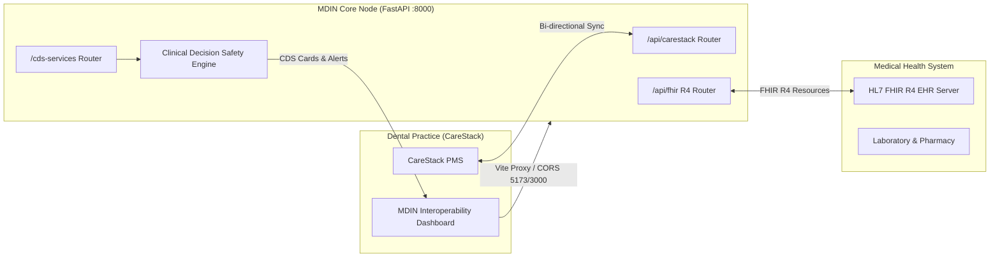

# Medical-Dental Interoperability Node (MDIN)

### **DSOLVE 2026** · DRISHTI · College of Engineering Trivandrum (CET)

**BUILD. SOLVE. DEMONSTRATE.**

|                   |                                           |
| ----------------- | ----------------------------------------- |
| **Problem:**      | Problem 6 — Open Problem Statement (Dental Industry): Medical-Dental Interoperability Node |
| **Team Name:**    | Team Aether                               |
| **Team Members:** | Team Aether Engineers                    |
| **Institution:**  | College of Engineering Trivandrum (CET)   |
| **Backend API:**  | [http://localhost:8000/docs](http://localhost:8000/docs) |
| **Frontend UI:**  | [http://localhost:5173](http://localhost:5173) |

---

## Table of Contents

- [Problem Statement](#problem-statement)
- [Our Solution](#our-solution)
- [System Architecture](#system-architecture)
- [Key Features](#key-features)
- [Tech Stack](#tech-stack)
- [Getting Started](#getting-started)
- [API & CDS Hooks Specification](#api--cds-hooks-specification)
- [Usage / Demo Script](#usage--demo-script)
- [Limitations & Future Scope](#limitations--future-scope)
- [Submission Checklist](#submission-checklist)

---

## Problem Statement

### Problem 6: Open Problem Statement — Dental Industry

> Identify and solve a real-world problem within the dental industry across markets such as the UK, Australia, and the US.
> The problem relates to clinical workflows, patient safety, practice operations, insurance, billing, diagnostics, communication, or automation.

### Why this matters

In modern healthcare systems across the US, UK, and Australia, **dental and medical care operate in severe clinical silos**. 
- Dentists using Practice Management Systems (PMS) like **CareStack** rarely have real-time visibility into their patients' medical records (hospital EHRs).
- Patients receiving oral surgeries or periodontal procedures often have critical systemic contraindications:
  - **Medication-Related Osteonecrosis of the Jaw (MRONJ)**: Patients on IV bisphosphonates for osteoporosis risk jaw necrosis if invasive extractions (CDT D7140) are performed without oncologic coordination.
  - **Infective Endocarditis**: Patients with prosthetic heart valves require AHA-guided antibiotic prophylaxis prior to gingival manipulation.
  - **Coagulopathies & Anticoagulants**: Patients on Warfarin/DOACs with elevated INR face life-threatening oral hemorrhage.
  - **Periodontitis & Diabetes**: Elevated HbA1c (>8.0%) dramatically impairs surgical healing and osseointegration.

Manual faxing, phone calls, and paper questionnaires delay treatment by days, cost practices millions in administrative overhead, and lead to preventable adverse events.

---

## Our Solution

**Medical-Dental Interoperability Node (MDIN)** is a bi-directional clinical data bridge and Clinical Decision Support (CDS Hooks v1.0) engine connecting **CareStack Dental Practice Management** with hospital Electronic Health Records via **HL7 FHIR R4**.

When a dentist opens a patient record in CareStack, MDIN automatically:
1. Reconciles patient identity across CareStack and hospital EHRs.
2. Evaluates real-time CDS Hooks (`patient-view` & `order-select`) to detect cross-specialty contraindications.
3. Renders instant clinical safety cards with guidance from the AAOMS and AHA.
4. Provides bi-directional synchronization, updating the medical record with dental procedures while supplying the dental chair with vital labs and allergies.

---

## System Architecture



---

## Key Features

- **Bi-Directional CareStack Sync**: Mounts `/api/carestack` for patient retrieval, CDT procedural tracking (e.g. D7140, D4341, D2750), and synchronization.
- **HL7 FHIR R4 Standard REST Server**: Mounts `/api/fhir` exposing `Patient`, `Condition`, `Observation`, `AllergyIntolerance`, and `CapabilityStatement` resources.
- **CDS Hooks v1.0 Clinical Decision Engine**: Exposes `/cds-services` discovery and automated risk evaluation hooks (`patient-view`, `order-select`) for instant contraindication detection.
- **Dual-Domain Clinical Record Viewer**: Unified side-by-side dashboard comparing dental chair plans with medical diagnoses, labs (HbA1c, INR), and allergies (Penicillin, Latex).
- **Interactive Endpoint Tester**: One-click REST and CDS tester built for hackathon judges to trigger backend endpoints with real-time latency and formatted payloads.
- **Dual Frontend CORS Support**: Full cross-origin access configured out-of-the-box for development servers on ports `3000` and `5173`.

---

## Tech Stack

| Layer | Technology | Why we chose it |
|---|---|---|
| **Frontend** | React 18 + Vite | Blazing-fast hot module replacement, modular component architecture |
| **Styling** | Tailwind CSS | Rapid, modern clinical interface styling with clean typography |
| **Icons** | Lucide React | Consistent healthcare and navigation iconography |
| **Backend** | FastAPI (Python 3.10+) | High performance asynchronous REST API with automatic OpenAPI generation |
| **Validation** | Pydantic v2 & Pydantic-Settings | Strict typing, FHIR R4 data models, and environment loading |
| **Standards** | HL7 FHIR R4 & CDS Hooks v1.0 | Official international healthcare and clinical decision support standards |
| **Testing** | Pytest + FastAPI TestClient | Comprehensive automated verification of endpoints, CORS, and hooks |

---

## Getting Started

### Prerequisites

- Python ≥ 3.10
- Node.js ≥ 18.0 & npm

### Automated Setup

Run the included all-in-one setup script:

```bash
chmod +x setup.sh
./setup.sh
```

This will:
1. Create a Python virtual environment (`.venv`).
2. Install all backend dependencies from `backend/requirements.txt`.
3. Install frontend node modules from `frontend/package.json`.
4. Run the automated Pytest suite to verify the installation.

---

### Manual Setup & Execution

#### 1. Backend Server

```bash
# Activate virtual environment
source .venv/bin/activate

# Install requirements
pip install -r backend/requirements.txt

# Start backend (runnable from project root)
python backend/run.py
```

- API Base: `http://localhost:8000`
- Interactive OpenAPI Docs: `http://localhost:8000/docs`
- Health Check: `http://localhost:8000/health`

#### 2. Frontend Development Server

```bash
cd frontend
npm install
npm run dev
```

- Web UI: `http://localhost:5173`

---

## API & CDS Hooks Specification

### Core Endpoints

- `GET /health` — Node health and telemetry
- `GET /api/carestack/status` — CareStack PMS synchronization status
- `GET /api/carestack/patients` — List CareStack dental patients
- `POST /api/carestack/sync` — Trigger bi-directional reconciliation
- `GET /api/fhir/metadata` — FHIR CapabilityStatement
- `GET /api/fhir/Patient` — FHIR Patient demographics
- `GET /api/fhir/Condition?patient={id}` — Medical conditions
- `GET /api/fhir/Observation?patient={id}` — Medical observations (HbA1c, INR)
- `GET /api/fhir/AllergyIntolerance?patient={id}` — Drug & latex allergies
- `GET /cds-services` — CDS Hooks v1.0 discovery endpoint
- `POST /cds-services/med-dental-risk-evaluator` — Real-time cross-specialty risk evaluator

---

## Usage / Demo Script

1. **Boot**: Run `python backend/run.py` in one terminal and `cd frontend && npm run dev` in another.
2. **Topology Inspection**: Open `http://localhost:5173`. Verify that all three nodes (CareStack PMS, Medical EHR, and CDS Hooks Engine) show green active status.
3. **Clinical Interoperability Demo**:
   - Select **Eleanor Vance** (CareStack: `CS-1001` / Medical: `EHR-88201`).
   - Notice the **CRITICAL MRONJ ALERT**: Eleanor is on IV Bisphosphonates for Osteoporosis and has a planned surgical tooth extraction (D7140). The CDS Hooks engine surfaces an immediate safety warning with AAOMS guidelines and endodontic preservation recommendation.
   - Also note the documented **Severe Latex Allergy** preventing latex dental dam exposure.
4. **Cardiology & Hematology Demo**:
   - Select **Robert Taylor** (`CS-1003` / `EHR-99342`).
   - Notice the **CRITICAL AHA Antibiotic Prophylaxis Alert** due to a prosthetic heart valve, with non-penicillin regimen recommendations (Azithromycin/Clindamycin) for his severe Penicillin allergy.
   - Notice the **Elevated INR 3.2 warning** advising local hemostatic agents.
5. **Interactive Endpoint Tester**:
   - Switch to the "API & CDS Hook Tester" tab.
   - Execute `/api/carestack/status`, `/api/fhir/metadata`, and `/cds-services` directly to demonstrate live REST responses to the hackathon judges.

---

## Limitations & Future Scope

### Known Limitations
- Current EHR and CareStack integrations use simulated standard data fixtures conforming strictly to HL7 FHIR R4 and CDT standards.
- Authentication relies on preconfigured API keys rather than full SMART on FHIR OAuth2 flows.

### Future Scope
- **SMART on FHIR Launch**: Direct embedding of MDIN as an iframe app inside the CareStack PMS clinical chart.
- **AI-Powered Medical Reconciliation**: LLM clinical summarizer to convert unstructured medical physician notes into dental-chair considerations.
- **Bi-Directional CDT to CPT/ICD-10 Crosswalk**: Automated medical billing claims generation for medically necessary dental care.

---

## Submission Checklist

- [x] Clean, runnable source code committed to this repository
- [x] `backend/requirements.txt` with `fastapi`, `uvicorn[standard]`, `pydantic>=2.0`, `httpx`, `pytest`
- [x] `backend/app/main.py` with CORS for ports `3000` & `5173` and `/api/carestack`, `/api/fhir`, `/cds-services` routers
- [x] `backend/app/config.py` with basic application settings
- [x] Runnable backend via `python backend/run.py`
- [x] Vite + React + Tailwind frontend skeleton in `frontend/` with ready-to-run setup scripts
- [x] Full test suite passing with Pytest
- [x] Quick-start verified from fresh environment
