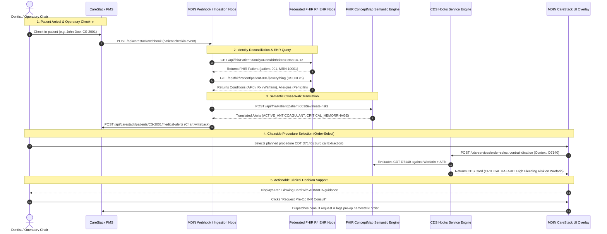

# MDIN: Medical-Dental Interoperability Node for CareStack

### **DSOLVE 2026** · DRISHTI · College of Engineering Trivandrum (CET)
**Problem 6: Open Problem Statement (US / Global Dental Industry)**

[](backend/tests)
[-cyan?style=flat-square)](https://developer.carestack.com/documentation)
[-blue?style=flat-square&logo=fire)](https://hl7.org/fhir/R4/)
[](https://cds-hooks.hl7.org/)
[](https://www.healthit.gov/topic/laws-regulation-and-policy/health-data-technology-and-interoperability-certification-program)
[](LICENSE)

---

## Executive Summary

| Category | Information |
|---|---|
| **Project Title** | **MDIN: Medical-Dental Interoperability Node for CareStack** |
| **Hackathon** | DSOLVE 2026 (36-Hour Hackathon) · DRISHTI · CET |
| **Problem Statement** | **Problem 6 — Open Problem Statement (US & Global Dental Industry)** |
| **Team Name** | **Team Aether** |
| **Target EHRs** | **CareStack PMS** (Dental) $\leftrightarrow$ **Epic / Cerner / MEDITECH** (Medical Hospital EHRs) |
| **Clinical Interoperability Standards** | **CareStack Web API V1** (VendorKey, AccountKey, AccountId), HL7® FHIR® R4, USCDI v5, CDS Hooks™ v1.0/v2.0, FHIR ConceptMap ($translate) |
| **Medical Terminologies Mapped** | ICD-10-CM, SNOMED CT, RxNorm, LOINC $\rightarrow$ ADA CDT Dental Procedure Codes |
| **Production Web UI & Gateway** | `http://localhost:80` (or `http://localhost`) · Nginx SPA & Reverse Proxy |
| **Backend API Endpoint** | `http://localhost:8000` · [Interactive Swagger Docs](http://localhost:8000/docs) |
| **CareStack API Endpoint** | `http://localhost:8000/api/v1.0` (CareStack-V1-shaped simulator) |
| **Development Clinical Interface** | `http://localhost:5173` (Vite Hot-Reloading Dev Server) |

---

## Table of Contents

1. [The Two-System Problem](#the-two-system-problem)
2. [Solution Architecture](#solution-architecture)
3. [Architectural Diagram](#architectural-diagram)
4. [Regulatory Alignment & Health Policy](#regulatory-alignment--health-policy)
5. [Step-by-Step Setup & Quickstart Guide](#step-by-step-setup--quickstart-guide)
   - [1-Click Production Deployment (Docker & Compose)](#1-click-production-deployment-docker--compose)
   - [Automated Deployment Helper (`deploy.sh`)](#automated-deployment-helper-deploysh)
   - [Option A: Automated One-Click Local Setup (`setup.sh`)](#option-a-automated-one-click-local-setup)
   - [Option B: Manual Local Setup](#option-b-manual-local-setup)
6. [API Documentation & Sample Requests](#api-documentation--sample-requests)
7. [Demo Guide: Clinical Patient Personas](#demo-guide-clinical-patient-personas)
8. [Frontend Chairside Interface Guide](#frontend-chairside-interface-guide)
9. [Automated Verification & Test Suite](#automated-verification--test-suite)
10. [Hackathon Submission Assets](#hackathon-submission-assets)

---

## The Two-System Problem

### Problem Statement: Problem 6 (Open Problem Statement — Dental Industry)
> *"Identify and solve a real-world problem within the dental industry across markets such as the UK, Australia, and the US. The problem relates to clinical workflows, patient safety, practice operations, insurance, billing, diagnostics, communication, or automation."*

### The Clinical Divide: Dental EHRs Operate Blind

In contemporary healthcare across the United States, the United Kingdom, and Australia, **medical and dental healthcare exist in complete clinical, legal, and technological isolation**. 

```
┌────────────────────────────────────────┐          ┌────────────────────────────────────────┐
│     HOSPITAL ENTERPRISE EHR            │          │      DENTAL PRACTICE MANAGEMENT        │
│          (Epic / Cerner)               │   VOID   │              (CareStack)               │
│                                        │  ══════  │                                        │
│ • Diagnoses (ICD-10-CM / SNOMED CT)    │    ❌    │ • Dental Charting & Odontograms        │
│ • Active Prescriptions (RxNorm)        │          │ • CDT Procedure Codes (e.g., D7140)    │
│ • Diagnostic Labs (LOINC - HbA1c, INR) │          │ • Paper/Tablet Self-Reported Questionnaires│
│ • Anaphylaxis & Drug Allergies         │          │ • Blind to Hospital Diagnoses & Labs   │
└────────────────────────────────────────┘          └────────────────────────────────────────┘
```

When a patient sits in a dental operatory chair for an invasive surgical or periodontal procedure, the dentist using a Practice Management System (PMS) like **CareStack** is blind to the patient's hospital electronic health record. Dental offices typically rely on:
1. **Self-reported medical history clipboards or tablet forms**: Frequently omitted, forgotten, or misunderstood by patients (e.g., failing to distinguish aspirin from high-potency anticoagulants like Warfarin or Eliquis).
2. **Manual telephone calls and paper faxes**: Requests for physician clearances take an average of 48 to 72 hours, delaying urgent treatment and inflating administrative overhead.
3. **No sub-second automated decision support**: Dentists have no automated mechanism to cross-reference proposed Code on Dental Procedures and Nomenclature (CDT) codes against active medical therapies.

### Life-Threatening Chairside Risks

| Clinical Scenario | Medical Condition & Therapy | Planned Dental Procedure (CDT) | Preventable Adverse Event / Chairside Risk |
|---|---|---|---|
| **Coagulation Hazard** | Atrial Fibrillation on **Warfarin Sodium** or DOACs | **D7140** (Simple Extraction) / **D7210** (Surgical Extraction) | Uncontrolled, life-threatening post-extraction oral hemorrhage without verified INR (<3.5) and local hemostatic preparation. |
| **Infective Endocarditis** | **Prosthetic Cardiac Valve** or prior Endocarditis | **D1110** (Adult Prophylaxis) / **D4341** (Periodontal Scaling) | Transient bacteremia caused by mucosal/gingival instrumentation seeds prosthetic valves, leading to bacterial endocarditis (up to 30% mortality). |
| **Fatal Drug Hypersensitivity** | Documented **Penicillin Anaphylaxis** (Type 1 Hypersensitivity) | Pre-op Antibiotic Prophylaxis | Prescribing standard first-line Amoxicillin 2g induces fatal anaphylactic shock in the dental chair. |
| **Severe Osteonecrosis (MRONJ)** | Osteoporosis / Bone Metastases on **IV Bisphosphonates** (Zoledronic Acid) | **D7140** / **D7210** (Tooth Extraction) | Medication-Related Osteonecrosis of the Jaw (MRONJ): irreversible exposed avascular necrotic bone requiring radical resection. |
| **Impaired Glycemic Healing** | Type 2 Diabetes Mellitus with **HbA1c = 9.2%** | **D7210** (Surgical Tooth Extraction) | Severe hyperglycemia impairs neutrophil chemotaxis, destroys microvasculature, causes alveolar osteitis (dry socket), and triggers rampant secondary infection. |

---

## Solution Architecture

The **Medical-Dental Interoperability Node (MDIN)** is an open-standard, federated interoperability gateway built specifically for **CareStack**. It bridges CareStack PMS with hospital Electronic Health Records (Epic, Cerner, MEDITECH) using **HL7® FHIR® R4**, semantic terminology translation, and real-time **CDS Hooks™ v1.0/v2.0**.

```
                      MDIN ARCHITECTURAL STACK
  ┌─────────────────────────────────────────────────────────────┐
  │                    CareStack UI Overlay                     │
  │     (Odontogram, Procedure Toolbar, Real-Time CDS Cards)    │
  └──────────────▲───────────────────────────────▲──────────────┘
                 │                               │
        CDS Guidance Cards              Webhook Ingestion /
        (Indicators & Actions)          Demographic Payload
                 │                               │
  ┌──────────────┴───────────────────────────────┴──────────────┐
  │         MDIN Core Node (FastAPI / Asynchronous Python)      │
  │                                                             │
  │  ┌───────────────────────┐       ┌────────────────────────┐ │
  │  │   CDS Hooks Engine    │       │  CareStack Ingestion   │ │
  │  │ (patient-view/order)  │       │ (Webhook & Writeback)  │ │
  │  └───────────▲───────────┘       └───────────▲────────────┘ │
  │              │                               │              │
  │  ┌───────────┴───────────┐       ┌───────────┴────────────┐ │
  │  │  ConceptMap Engine    │       │   Demographic Matcher  │ │
  │  │ ($translate Semantics)│       │ (Probabilistic / MRN)  │ │
  │  └───────────▲───────────┘       └───────────▲────────────┘ │
  │              │                               │              │
  │  ┌───────────┴───────────────────────────────┴────────────┐ │
  │  │     HL7 FHIR R4 Federated EHR Client (USCDI v5)        │ │
  │  └───────────────────────────▲────────────────────────────┘ │
  └──────────────────────────────┼──────────────────────────────┘
                                 │
                         HL7 FHIR R4 Query
                     (US Core Profiles / OAuth2)
                                 │
  ┌──────────────────────────────┴──────────────────────────────┐
  │            Hospital Enterprise EHR (Epic / Cerner)          │
  │        Patient • Condition • MedicationRequest • Observation │
  └─────────────────────────────────────────────────────────────┘
```

### Core Engineering Pillars

#### 1. CareStack Web API Integration & Three-Key Header Authentication

> **Integration status.** MDIN ships a **bundled CareStack simulator** serving synthetic
> data, and a real HTTP client (`CareStackClient`) that can target a live account.
> The endpoint shapes are *modeled on* CareStack's publicly described Web API V1
> conventions but have **not** been validated against a live account or the published
> specification at `developer.carestack.com`, which requires a partner login we do not
> have. Expect to reconcile paths and payload shapes against the real spec before
> production use. Set `USE_LIVE_CARESTACK=true` with credentials to switch targets.

- **Modeled on CareStack Web API V1**: Endpoint surface and models follow the V1 conventions described publicly; fidelity is unverified pending partner-docs access.
- **Three-Key Header Authentication**: Secures requests using the three mandatory CareStack API headers:
  - `VendorKey`: Secret vendor authorization key
  - `AccountKey`: Secret account authorization key
  - `AccountId`: Unique account/practice identifier
- **CareStack-V1-shaped Endpoints (`/api/v1.0`)**: Supports `PatientViewModel`, `SearchRequest` $\rightarrow$ `PatientSearchResponseModel`, full-mouth periodontal probing examinations (`PeriodontalChart`), CDT procedure codes (`ProcedureCodeBasicApiResponseModel`), chairside appointments (`AppointmentDetailModel`), and incremental synchronization (`/sync/patients`, `/sync/treatment-procedures`).
- **Production HTTP Client (`CareStackClient`)**: Asynchronous HTTP client service (`backend/app/services/carestack_client.py`) with automatic credential header attachment and standard HTTP status code error handling (2xx, 4xx, 5xx).
- **Bi-Directional Interoperability & Webhook Ingestion**: Listens for CareStack appointment and chairside check-in events (`patient.checkin`), executes exact MRN & probabilistic demographic matching against hospital EHR master patient indices (MPI), caches context in-memory (`SYNCED_CLINICAL_CACHE`), and writes high-priority alerts back to CareStack charts (`POST /api/carestack/patients/{id}/medical-alerts`).

#### 2. HL7 FHIR R4 Federated EHR Integration (Public Test Servers & USCDI v5)
- Directly integrated with official **HL7 FHIR Public Test Servers** listed on [HL7 Confluence Public Test Servers](https://confluence.hl7.org/spaces/FHIR/pages/35718859/Public+Test+Servers):
  - Primary: **HAPI FHIR Reference Server** (`https://hapi.fhir.org/baseR4`)
  - Alternative: **NLM HAPI FHIR Server** (`https://lforms-fhir.nlm.nih.gov/baseR4`)
  - Alternative: **Firely Server** (`https://server.fire.ly/r4`)
- Real asynchronous **`FHIRClient`** (`backend/app/services/fhir_client.py`) executing live HTTP requests to public test servers, replacing in-memory mock datasets and dummy placeholders.
- Real-time diagnostic endpoint (`GET /api/fhir/server-status`) reporting live connection health, round-trip ping latency, FHIR version (4.0.1), and remote server software.
- Strictly conforms to HL7 FHIR Release 4.0.1 and **USCDI v5** (United States Core Data for Interoperability) standards.
- Serves standard `/api/fhir` endpoints for `Patient`, `Condition`, `MedicationRequest`, `AllergyIntolerance`, `Observation`, and `CapabilityStatement`.
- Exposes `$everything` patient-scoped bundle export aggregating conditions, medications, allergies, and diagnostic labs (HbA1c, INR).

#### 3. FHIR ConceptMap Semantic Translation Engine
- Solves the semantic vocabulary gap between medicine and dentistry using standard HL7 FHIR `ConceptMap` specifications.
- Translates medical coding systems into actionable dental clinical alert concepts:
  - **ICD-10-CM** (`I48.91` Atrial Fibrillation) $\rightarrow$ `BLEED_RISK_ELEVATED`
  - **RxNorm** (`855332` Warfarin Sodium 5 MG) $\rightarrow$ `ACTIVE_ANTICOAGULANT`
  - **SNOMED CT** (`315215002` Prosthetic Cardiac Valve) $\rightarrow$ `AHA_PROPHYLAXIS_REQUIRED`
  - **SNOMED CT** (`70618001` Allergy to Penicillin) $\rightarrow$ `CONTRAINDICATION_PENICILLIN`
  - **LOINC** (`4548-4` HbA1c) $\rightarrow$ `DELAYED_HEALING_RISK`
  - **SNOMED CT** (`64859006` Osteoporosis / Bisphosphonates) $\rightarrow$ `MRONJ_RISK_ELEVATED`
- **Multi-Factor Clinical Risk Synthesis**: Dynamically evaluates co-occurring risks (e.g., Warfarin + Atrial Fibrillation triggers `CRITICAL_HEMORRHAGE_HAZARD`; Prosthetic Valve + Penicillin Allergy automatically suppresses Amoxicillin and recommends Clindamycin/Azithromycin alternatives).

#### 4. CDS Hooks v1.0 / v2.0 Real-Time Clinical Guidance Engine
- Fully implements the official HL7 CDS Hooks specification:
  - `GET /cds-services`: Discovery catalog describing available hooks and prefetch queries.
  - `patient-view` Hook (`/cds-services/patient-view-alert`): Fires upon opening a patient record in CareStack, returning warning/info cards for active systemic diseases.
  - `order-select` Hook (`/cds-services/order-select-contraindication`): Fires in real time when a dentist selects or drafts a CDT procedure (e.g., D7140, D7210, D4341, D1110).
- Emits standard CDS Cards with:
  - Strict $\le 140$ character summaries.
  - Color-coded indicators (`critical`, `warning`, `info`).
  - Evidence-based markdown detail citing American Dental Association (ADA), American Heart Association (AHA), and American Association of Oral and Maxillofacial Surgeons (AAOMS) guidelines.
  - Actionable suggestions: *"Order Pre-Op INR Lab Verification & MD Consult"* and *"Append Alert to CareStack Chart"*.
  - Prefetch acceleration eliminating secondary network round-trips.

---

## Architectural Diagram

The complete end-to-end data flow from patient check-in at CareStack to real-time CDS decision cards:



---

## Regulatory Alignment & Health Policy

MDIN is architected from the ground up to comply with federal health IT mandates, data privacy laws, and artificial intelligence safety regulations:

### 1. HIPAA Privacy Rule — Treatment, Payment, and Operations (TPO) Exception
Under **45 CFR § 164.506**, HIPAA-covered entities (both hospital health systems and dental practices) are explicitly permitted to share Protected Health Information (PHI) without patient consent when the disclosure is for **Treatment** activities. MDIN exchanges medical history, active pharmacotherapy, and allergy status specifically to safeguard the patient from intraoperative dental emergencies.

### 2. 21st Century Cures Act & ONC Interoperability Rule (45 CFR Part 171)
The Cures Act mandates that healthcare entities must not engage in **Information Blocking**. Certified EHRs must provide open, standardized RESTful FHIR APIs using the US Core Implementation Guide without proprietary gatekeeping. MDIN implements this federal requirement by ingesting standardized **USCDI v5** data sets directly from hospital FHIR endpoints.

### 3. ONC HTI-1 Final Rule — Decision Support Interventions (DSI)
The ONC **Health Data, Technology, and Interoperability (HTI-1)** Final Rule establishes rigorous transparency standards for clinical decision support. MDIN satisfies all HTI-1 DSI criteria:
- **No Black-Box Logic**: CDS recommendations are derived from deterministic, transparent clinical guidelines (AHA, ADA, AAOMS).
- **Source Attribution**: Every CDS Card explicitly declares its authoritative clinical source (`source.label`, `source.url`).
- **Explainability**: Cards clearly state the exact clinical input (e.g., *"Patient on Warfarin Sodium 5 MG (RxNorm: 855332) with Atrial Fibrillation (ICD-10: I48.91)"*) that triggered the alert.

---

## Step-by-Step Setup & Quickstart Guide

### Prerequisites
- **Python**: $\ge 3.10$
- **Node.js**: $\ge 18.0$ and **npm** $\ge 9.0$
- **Operating System**: Linux, macOS, or Windows WSL2

### 1-Click Production Deployment (Docker & Compose)

Deploy the entire MDIN production stack—FastAPI ASGI backend, Nginx reverse proxy, and Vite React SPA—in a single command using Docker and Docker Compose.

#### Prerequisites
- **Docker Engine**: $\ge 24.0$ ([Install Docker Engine](https://docs.docker.com/engine/install/))
- **Docker Compose**: $\ge v2.20$ (included in modern Docker Desktop or Docker Compose plugin)
- **Available Ports**: Port `80` (Frontend & Reverse Proxy) and Port `8000` (Direct Backend API)

#### Execution

Execute the single standard Compose command from the project root:

```bash
docker compose up --build
```

To run in detached background mode:
```bash
docker compose up -d --build
```

#### Automated Deployment Helper (`deploy.sh`)

For convenience, MDIN includes an automated pre-flight verification and clean-build script:

```bash
chmod +x deploy.sh
./deploy.sh
```

The script automatically:
1. **Pre-flight verification**: Checks that Docker CLI, Docker Daemon, and Docker Compose are installed and operational.
2. **Clean-cache build**: Executes `docker compose build --no-cache` to ensure clean container bundles.
3. **Endpoint health check**: Probes `/health`, `/cds-services`, `/api/carestack/status`, and `/api/fhir/metadata` with `curl`.
4. **Endpoint status banner**: Outputs local URLs for the chairside app, API endpoints, and interactive docs.

#### Production Access & Endpoint Routing

All requests on port `80` are handled by the production Nginx server, which serves the React SPA and reverse-proxies API requests to the backend container (`backend:8000`) over the isolated `mdin-network` bridge:

| Service / Interface | URL | Description |
|---|---|---|
| **Chairside Clinical UI** | `http://localhost:80` (or `http://localhost`) | Production React SPA with client-side routing |
| **CareStack & FHIR APIs** | `http://localhost:80/api/` | Reverse-proxied to `backend:8000/api/` |
| **CDS Hooks Service** | `http://localhost:80/cds-services` | Discovery and clinical decision support cards |
| **Interactive Swagger Docs** | `http://localhost:80/docs` (or `:8000/docs`) | OpenAPI interactive endpoint documentation |
| **Health Check Telemetry** | `http://localhost:80/health` (or `:8000/health`) | Container orchestrator health probe |
| **Direct Backend Service** | `http://localhost:8000` | FastAPI ASGI backend container |

To tear down the containers:
```bash
docker compose down
```

---

### Option A: Automated One-Click Local Setup (`setup.sh`)
Run the included all-in-one setup script from the root repository:

```bash
chmod +x setup.sh
./setup.sh
```
*This script provisions the Python virtual environment, installs backend and frontend dependencies, and executes the automated test suite.*

---

### Option B: Manual Local Setup

#### 1. Backend Server Setup
From the root directory:

```bash
# 1. Create and activate a Python virtual environment
python3 -m venv .venv
source .venv/bin/activate

# 2. Install backend dependencies
pip install -r backend/requirements.txt

# 3. (Optional) Copy environment template
cp backend/.env.example backend/.env

# 4. Start the FastAPI ASGI server with hot-reload
python backend/run.py
# Or run directly via uvicorn:
# uvicorn backend.app.main:app --host 0.0.0.0 --port 8000 --reload
```

- **Backend API Base**: `http://localhost:8000`
- **Interactive OpenAPI (Swagger UI)**: `http://localhost:8000/docs`
- **Alternative ReDoc Docs**: `http://localhost:8000/redoc`
- **Health Check Endpoint**: `http://localhost:8000/health`

#### 2. Frontend Development Server Setup
Open a separate terminal:

```bash
# 1. Navigate to frontend directory
cd frontend

# 2. Install Node dependencies
npm install

# 3. (Optional) Copy frontend environment template
cp .env.example .env

# 4. Launch Vite development server
npm run dev
```

- **Interactive Clinical UI**: `http://localhost:5173`
- *The Vite server automatically proxies all `/api`, `/cds-services`, and `/health` requests to port `8000`.*

---

## API Documentation & Sample Requests

The backend exposes fully standardized endpoints across CareStack PMS, HL7 FHIR R4, and CDS Hooks.

### API Summary Table

#### CareStack Web API V1-shaped Endpoints (`/api/v1.0`)
All CareStack Web API V1 requests authenticate using three header keys: `VendorKey`, `AccountKey`, and `AccountId`.

| Category | Method | Endpoint | Description |
|---|---|---|---|
| **CareStack Auth** | `GET` | `/api/v1.0/auth/verify` | Verify 3-key CareStack credentials |
| **CareStack Patients** | `GET` | `/api/v1.0/patients/{id}` | Read single patient record (`PatientViewModel`) |
| **CareStack Patients** | `POST` | `/api/v1.0/patients/search` | Search patients with `SearchRequest` |
| **CareStack Patients** | `POST` | `/api/v1.0/patients` | Create new dental patient record |
| **CareStack Patients** | `PUT` | `/api/v1.0/patients` | Update existing dental patient record |
| **CareStack Perio** | `GET` | `/api/v1.0/patients/{id}/periodontal-charting` | Full-mouth periodontal probing examination |
| **CareStack Procedures**| `GET` | `/api/v1.0/procedure-codes` | List ADA CDT dental procedure codes |
| **CareStack Treatments**| `GET` | `/api/v1.0/treatments/appointment-procedures/{id}` | Get procedure codes assigned to appointment |
| **CareStack Appts** | `POST` | `/api/v1.0/appointments` | Book new chairside appointment |
| **CareStack Appts** | `GET` | `/api/v1.0/appointments/{id}` | Read appointment details |
| **CareStack Appts** | `PUT` | `/api/v1.0/appointments/{id}/modify-status` | Modify status (`Scheduled`, `InChair`, etc.) |
| **CareStack Appts** | `PUT` | `/api/v1.0/appointments/{id}/checkout` | Checkout appointment post-procedure |
| **CareStack Appts** | `PUT` | `/api/v1.0/appointments/{id}/cancel` | Cancel chairside appointment |
| **CareStack Appts** | `GET` | `/api/v1.0/appointment-status` | List all available appointment statuses |
| **CareStack Sync** | `GET` | `/api/v1.0/sync/patients` | Incremental patient synchronization |
| **CareStack Sync** | `GET` | `/api/v1.0/sync/treatment-procedures` | Incremental dental treatment procedure synchronization |
| **CareStack Practice** | `GET` | `/api/v1.0/locations` | List clinic practice locations |
| **CareStack Practice** | `GET` | `/api/v1.0/operatories` | List practice operatories / chairs |

#### MDIN Core, FHIR R4 & CDS Hooks Endpoints

| Category | Method | Endpoint | Description |
|---|---|---|---|
| **System** | `GET` | `/health` | Node health status and version telemetry |
| **CareStack MDIN** | `GET` | `/api/carestack/status` | Connectivity and sync status with CareStack PMS |
| **CareStack MDIN** | `GET` | `/api/carestack/patients` | List CareStack dental patients & active treatment plans |
| **CareStack MDIN** | `POST` | `/api/carestack/webhook` | Ingest appointment/check-in events and trigger sync |
| **CareStack MDIN** | `POST` | `/api/carestack/patients/{id}/medical-alerts` | Write medical contraindication back to CareStack chart |
| **CareStack MDIN** | `GET` | `/api/carestack/patients/{id}/medical-alerts` | Retrieve posted medical alerts for a patient chart |
| **CareStack MDIN** | `POST` | `/api/carestack/sync` | Trigger bi-directional PMS $\leftrightarrow$ EHR sync |
| **FHIR R4** | `GET` | `/api/fhir/metadata` | HL7 FHIR R4 `CapabilityStatement` |
| **FHIR R4** | `GET` | `/api/fhir/Patient` | Probabilistic demographic search for patients |
| **FHIR R4** | `GET` | `/api/fhir/Patient/{id}` | Read single FHIR Patient by ID or MRN |
| **FHIR R4** | `GET` | `/api/fhir/Patient/{id}/$everything` | **USCDI v5** comprehensive medical record bundle export |
| **FHIR R4** | `POST` | `/api/fhir/ConceptMap/$translate` | Translate medical code (ICD/SNOMED/RxNorm) to dental alert |
| **FHIR R4** | `POST` | `/api/fhir/Patient/{id}/$evaluate-risks` | Synthesize multi-factor dental risks from patient EHR |
| **CDS Hooks** | `GET` | `/cds-services` | CDS Hooks v1.0/v2.0 discovery catalog |
| **CDS Hooks** | `POST` | `/cds-services/patient-view-alert` | Evaluate `patient-view` hook when opening patient chart |
| **CDS Hooks** | `POST` | `/cds-services/order-select-contraindication` | Evaluate `order-select` hook on CDT procedure selection |

---

### Sample `curl` Commands & Responses

#### 1. System Health Check
```bash
curl -s http://localhost:8000/health
```
```json
{
  "status": "healthy",
  "service": "Medical-Dental Interoperability Node (MDIN)",
  "version": "1.0.0",
  "timestamp": "2026-09-18T00:00:00.000000+00:00"
}
```

---

#### 2. CareStack Web API V1 Patient Retrieval (`GET /api/v1.0/patients/{id}`)
Demonstrates the three-key header authentication flow against the bundled simulator (the same client and headers are used when `USE_LIVE_CARESTACK=true` targets a real account):

```bash
curl -s http://localhost:8000/api/v1.0/patients/2001 \
  -H "VendorKey: demo-vendor-key" \
  -H "AccountKey: demo-account-key" \
  -H "AccountId: demo-account-001" \
  -H "Accept: application/json"
```
```json
{
  "Id": 2001,
  "PatientIdentifier": "CS-2001",
  "Prefix": "NotSet",
  "FirstName": "John",
  "MiddleName": null,
  "LastName": "Doe",
  "Suffix": null,
  "DOB": "1968-04-12",
  "Gender": "Male",
  "MaritalStatus": "Single",
  "Status": "Active",
  "Email": "john.doe@example.com",
  "Mobile": "555-0101",
  "AddressDetail": {
    "Line1": "123 Dental Way",
    "City": "Boston",
    "State": "MA",
    "Zip": "02115",
    "Country": "United States"
  }
}
```

---

#### 3. CareStack Web API V1 Patient Search (`POST /api/v1.0/patients/search`)
Searches registered dental patients using standard CareStack `SearchRequest`:

```bash
curl -s -X POST http://localhost:8000/api/v1.0/patients/search \
  -H "VendorKey: demo-vendor-key" \
  -H "AccountKey: demo-account-key" \
  -H "AccountId: demo-account-001" \
  -H "Content-Type: application/json" \
  -d '{
    "SearchTerm": "Smith",
    "Offset": 0,
    "Limit": 10
  }'
```
```json
[
  {
    "PatientId": 2002,
    "PatientIdentifier": "CS-2002",
    "FirstName": "Jane",
    "MiddleName": null,
    "LastName": "Smith",
    "NickName": null,
    "Email": "jane.smith@example.com",
    "PhoneWithExt": "555-0102",
    "LocationName": "Main Operatory",
    "IsActive": true
  }
]
```

---

#### 4. CareStack Periodontal Charting (`GET /api/v1.0/patients/{id}/periodontal-charting`)
Retrieves periodontal probing pocket depths across teeth:

```bash
curl -s http://localhost:8000/api/v1.0/patients/2001/periodontal-charting \
  -H "VendorKey: demo-vendor-key" \
  -H "AccountKey: demo-account-key" \
  -H "AccountId: demo-account-001"
```
```json
{
  "id": "PERIO-2001",
  "PatientID": 2001,
  "Date": "2026-09-18",
  "ExamName": "Comprehensive Full-Mouth Periodontal Probing",
  "Status": "Active",
  "Dentition": "Permanent",
  "teeth": [
    {
      "tooth_number": "30",
      "buccal_depths": [5, 4, 6],
      "lingual_depths": [5, 5, 6],
      "bleeding_on_probing": true,
      "furcation": 2,
      "mobility": 1
    }
  ]
}
```

---

#### 5. CareStack Webhook Ingestion (`patient.checkin`)
Simulates CareStack firing an automated check-in webhook when John Doe arrives at the clinic desk:

```bash
curl -s -X POST http://localhost:8000/api/carestack/webhook \
  -H "Content-Type: application/json" \
  -d '{
    "event_type": "patient.checkin",
    "patient": {
      "id": "CS-2001",
      "first_name": "John",
      "last_name": "Doe",
      "birth_date": "1968-04-12",
      "gender": "male",
      "mrn": "MRN-10001"
    }
  }'
```
```json
{
  "status": "synchronized",
  "message": "Patient John Doe successfully resolved and synchronized with Medical EHR (patient-001).",
  "carestack_patient_id": "CS-2001",
  "matched_ehr_patient_id": "patient-001",
  "match_confidence": 1.0,
  "match_type": "exact_mrn",
  "cached": true,
  "alerts_generated": 2,
  "alerts": [
    {
      "alert_type": "critical",
      "category": "coagulation",
      "title": "CRITICAL: Anticoagulation / Hemorrhage Risk (Warfarin Therapy)",
      "details": "Patient is actively prescribed Warfarin Sodium 5 MG for Atrial Fibrillation. Planned dental surgical extraction carries substantial postoperative hemorrhage risk. Verify recent INR (<3.5 within 24-48 hours) and prepare local hemostatic agents (Surgicel, tranexamic acid rinse).",
      "action_required": "Confirm INR level and deploy local hemostatic measures."
    },
    {
      "alert_type": "critical",
      "category": "allergy",
      "title": "CRITICAL: Severe Penicillin Allergy (Anaphylaxis Risk)",
      "details": "Patient has documented Type 1 anaphylactic hypersensitivity to Penicillin. Strict contraindication for Amoxicillin/Penicillin V. Prescribe Clindamycin or Azithromycin if antibiotic indicated.",
      "action_required": "Avoid all beta-lactam antibiotics. Use Clindamycin or Azithromycin alternative."
    }
  ],
  "synchronized_at": "2026-09-18T00:00:00.000000+00:00"
}
```

---

#### 3. FHIR ConceptMap Semantic `$translate` Operation
Translates RxNorm code `855332` (Warfarin Sodium 5 MG Oral Tablet) into a dental clinical alert:

```bash
curl -s -X POST http://localhost:8000/api/fhir/ConceptMap/\$translate \
  -H "Content-Type: application/json" \
  -d '{
    "system": "http://www.nlm.nih.gov/research/umls/rxnorm",
    "code": "855332"
  }'
```
```json
{
  "resourceType": "Parameters",
  "result": true,
  "message": "1 match(es) found for http://www.nlm.nih.gov/research/umls/rxnorm|855332",
  "match": [
    {
      "equivalence": "equivalent",
      "concept": {
        "system": "http://carestack.com/fhir/ValueSet/dental-clinical-alerts",
        "code": "ACTIVE_ANTICOAGULANT",
        "display": "Active anticoagulant therapy, mandatory INR monitoring"
      },
      "source": "medical-to-dental-contraindications"
    }
  ]
}
```

---

#### 4. Semantic Risk Synthesis (`$evaluate-risks`) for Dental Procedure
Synthesizes clinical risks for John Doe undergoing planned surgical extraction CDT `D7140`:

```bash
curl -s -X POST http://localhost:8000/api/fhir/Patient/patient-001/\$evaluate-risks \
  -H "Content-Type: application/json" \
  -d '{
    "procedureCode": "D7140",
    "procedureSystem": "http://www.ada.org/cdt"
  }'
```
```json
{
  "resourceType": "Parameters",
  "patientId": "patient-001",
  "procedure": {
    "system": "http://www.ada.org/cdt",
    "code": "D7140"
  },
  "alertCount": 4,
  "alerts": [
    {
      "code": "BLEED_RISK_ELEVATED",
      "display": "Elevated bleeding risk, evaluate anticoagulants",
      "equivalence": "relatedto",
      "priority": "CRITICAL_HEMORRHAGE_HAZARD",
      "source": {
        "type": "Condition",
        "system": "http://hl7.org/fhir/sid/icd-10-cm",
        "code": "I48.91",
        "resourceId": "cond-afib-001"
      }
    },
    {
      "code": "ACTIVE_ANTICOAGULANT",
      "display": "Active anticoagulant therapy, mandatory INR monitoring",
      "equivalence": "equivalent",
      "priority": "CRITICAL_HEMORRHAGE_HAZARD",
      "source": {
        "type": "MedicationRequest",
        "system": "http://www.nlm.nih.gov/research/umls/rxnorm",
        "code": "855332",
        "resourceId": "med-warfarin-001"
      }
    },
    {
      "code": "CONTRAINDICATION_PENICILLIN",
      "display": "Avoid Amoxicillin; suggest Clindamycin / Azithromycin",
      "equivalence": "equivalent",
      "priority": "standard",
      "source": {
        "type": "AllergyIntolerance",
        "system": "http://snomed.info/sct",
        "code": "70618001",
        "resourceId": "alg-penicillin-001"
      }
    },
    {
      "code": "CRITICAL_HEMORRHAGE_HAZARD",
      "display": "Active anticoagulant therapy combined with cardiovascular diagnosis - critical hemorrhage risk for invasive dental procedures",
      "equivalence": "relatedto",
      "priority": "CRITICAL_HEMORRHAGE_HAZARD",
      "source": {
        "type": "synthesis",
        "rule": "anticoagulant+cardiovascular"
      }
    }
  ]
}
```

---

#### 5. CDS Hooks Discovery
```bash
curl -s http://localhost:8000/cds-services
```
```json
{
  "services": [
    {
      "hook": "patient-view",
      "title": "Medical-Dental Patient View Alert Service",
      "description": "Cross-references medical EHR diagnoses, medications, and laboratory values against dental risk factors upon opening a patient chart in CareStack.",
      "id": "patient-view-alert",
      "prefetch": {
        "patient": "Patient/{{context.patientId}}",
        "conditions": "Condition?patient={{context.patientId}}&clinical-status=active",
        "medications": "MedicationRequest?patient={{context.patientId}}&status=active",
        "allergies": "AllergyIntolerance?patient={{context.patientId}}",
        "observations": "Observation?patient={{context.patientId}}"
      }
    },
    {
      "hook": "order-select",
      "title": "Dental Order Select Contraindication Service",
      "description": "Evaluates proposed dental procedures (e.g., extractions D7140, scaling D4341) against active anticoagulant therapy (Warfarin), cardiac status (Prosthetic Heart Valve), and penicillin allergies.",
      "id": "order-select-contraindication",
      "prefetch": {
        "patient": "Patient/{{context.patientId}}",
        "conditions": "Condition?patient={{context.patientId}}&clinical-status=active",
        "medications": "MedicationRequest?patient={{context.patientId}}&status=active",
        "allergies": "AllergyIntolerance?patient={{context.patientId}}"
      }
    }
  ]
}
```

---

#### 6. CDS Hook Evaluation: `order-select` (John Doe + D7140 Extraction)
Evaluates contraindications when the dentist clicks Tooth Extraction (`D7140`) on the chart:

```bash
curl -s -X POST http://localhost:8000/cds-services/order-select-contraindication \
  -H "Content-Type: application/json" \
  -d '{
    "hook": "order-select",
    "hookInstance": "hook-req-001",
    "context": {
      "patientId": "patient-001",
      "procedureCode": "D7140",
      "selections": ["D7140"]
    }
  }'
```
```json
{
  "cards": [
    {
      "summary": "High Bleeding Hazard: Patient on Anticoagulant (Warfarin)",
      "detail": "Clinical guidance citing AHA/ADA guidelines: Verify latest INR (target 2.0-3.0 before invasive dental surgery). Prepare local hemostatic agents (e.g., absorbable gelatin sponge, sutures, 4.8% tranexamic acid mouthwash). Routine anticoagulant cessation is not recommended for minor oral surgery without consulting the prescribing physician.",
      "indicator": "critical",
      "source": {
        "label": "MDIN Hematology Surveillance Node",
        "url": "https://www.heart.org"
      },
      "suggestions": [
        {
          "label": "Order Pre-Op INR Lab Verification & MD Consult",
          "uuid": "sugg-inr-001",
          "actions": [
            {
              "type": "create",
              "description": "Order INR Lab Verification or request MD consult",
              "resource": {
                "resourceType": "ServiceRequest",
                "code": {
                  "coding": [
                    {
                      "system": "http://loinc.org",
                      "code": "6301-6",
                      "display": "INR in Blood"
                    }
                  ]
                }
              }
            }
          ]
        }
      ],
      "links": [
        {
          "label": "ADA Anticoagulant Guidelines",
          "url": "https://www.ada.org",
          "type": "absolute"
        }
      ]
    }
  ]
}
```

---

## Demo Guide: Clinical Patient Personas

MDIN is pre-seeded with 3 standardized clinical personas designed to demonstrate the critical need for medical-dental interoperability in invasive dentistry.

### Persona Matrix

| Patient Persona | Identifiers | Medical Diagnoses & Labs | Active Medications & Allergies | Dental Chair Plan (CareStack) | Interoperability Finding & CDS Action |
|---|---|---|---|---|---|
| **1. John Doe** | **CS-2001**<br>`MRN-10001`<br>`patient-001` | Atrial Fibrillation (`I48.91`) | **Warfarin Sodium 5 MG** (`855332`)<br>⚠️ **Penicillin Anaphylaxis** (`70618001`) | **D7140** (Extraction #30)<br>**D4341** (Scaling LL) | 🔴 **CRITICAL HAZARD**: Uncontrolled post-extraction bleeding on Warfarin. Requires pre-op INR check (<3.5) and local hemostatics. Strictly prohibits Amoxicillin. |
| **2. Jane Smith** | **CS-2002**<br>`MRN-10002`<br>`patient-002` | **Prosthetic Heart Valve** (`315215002`)<br>Prior Endocarditis (`I33.0`) | Aspirin 81 MG (`243670`)<br>No known drug allergies | **D1110** (Adult Prophylaxis)<br>**D2740** (Crown #14) | 🟡 **WARNING / MANDATORY**: AHA guidelines require prophylactic antibiotic premedication (Amoxicillin 2g PO 30-60 min prior) to prevent fatal Infective Endocarditis. |
| **3. Robert Taylor** | **CS-1003**<br>`MRN-10003`<br>`patient-003` | Type 2 Diabetes Mellitus (`E11.9`)<br>🧪 **HbA1c = 9.2%** (`4548-4`) | Metformin 1000 MG<br>No known drug allergies | **D7210** (Surgical Extraction #32) | 🟡 **WARNING**: Severe Glycemic Dysregulation (HbA1c 9.2%). Impaired collagen synthesis, risk of alveolar osteitis (dry socket) & rampant infection. Recommend morning visit and chlorhexidine rinse. |

---

### Step-by-Step Live Walkthrough

#### Scenario 1: John Doe — The Anticoagulation & Anaphylaxis Hazard
1. Open the UI at `http://localhost:5173`.
2. In the **CareStack Dental Chart** panel, select **John Doe (CS-2001)**.
3. Click **Simulate Webhook Sync** in the header. Notice the instant check-in reconciliation message confirming exact match against hospital EHR `patient-001`.
4. Observe the live banner displaying two high-priority chart alerts:
   - *CRITICAL: Anticoagulation / Hemorrhage Risk (Warfarin Therapy)*
   - *CRITICAL: Severe Penicillin Allergy (Anaphylaxis Risk)*
5. On the CDT procedure toolbar, click **D7140: Extraction, Erupted Tooth**.
6. The sub-second **CDS Decision Overlay** lights up with a glowing red **CRITICAL HAZARD** card:
   - Details AHA/ADA guidelines for managing Warfarin without unnecessary drug discontinuation.
   - Click **Request Pre-Op INR Consult** to post an automated INR laboratory consultation directly into the patient's record.
7. Switch to the **EHR Interoperability Trace** on the right. Toggle **Show ConceptMap Translation Trace** to observe the real-time translation of RxNorm `855332` into `ACTIVE_ANTICOAGULANT`.

#### Scenario 2: Jane Smith — The AHA Antibiotic Prophylaxis Protocol
1. Select **Jane Smith (CS-2002)** from the patient selector.
2. In the procedure toolbar, click **D1110: Prophylaxis (Adult Cleaning)**.
3. Because scaling induces transient bacteremia across gingival margins, the **CDS Decision Overlay** immediately fires a warning card:
   - *"AHA Antibiotic Prophylaxis Required: Prosthetic Heart Valve"*
   - Cites AHA guidelines mandating 2g Amoxicillin 30-60 minutes prior to instrumentation.
4. Click **Append Alert to CareStack Chart** to ensure the entire dental team verifies premedication prior to placing the patient in the operatory chair.

#### Scenario 3: Robert Taylor — Diabetic Healing Impairment
1. Select **Robert Taylor (CS-1003)**.
2. Inspect the **Federated Medical EHR** panel:
   - Active Diagnosis: Type 2 Diabetes Mellitus (`E11.9`)
   - Diagnostic Lab: **HbA1c = 9.2%** (Reference: 4.0% - 5.6%)
3. Review the **patient-view** evaluation card:
   - *"Severe Glycemic Dysregulation (HbA1c 9.2%) — Delayed Surgical Healing"*
   - Explains the pathophysiology of hyperglycemia on neutrophil phagocytosis and wound epithelialization.
   - Advises scheduling surgery in the morning and prescribing 0.12% Chlorhexidine gluconate post-op rinses.

---

## Frontend Chairside Interface Guide

The frontend application (`frontend/src/App.jsx`) is engineered as an interactive split-screen clinical workstation modeled after the **CareStack Dental Practice Management** operatory workflow:

```
┌────────────────────────────────────────────────────────────────────────────────────────┐
│ [Activity] CareStack MDIN — Medical-Dental Interoperability Node    [● Backend Live]   │
│                                           [Simulate Webhook Sync] [Swagger Docs]       │
├───────────────────────────────────────────┬────────────────────────────────────────────┤
│         LEFT COLUMN: CARESTACK CHART      │    RIGHT COLUMN: CDS DECISION & EHR TRACE  │
│                                           │                                            │
│ Patient Selector: [John Doe (CS-2001)  ▼] │ LIVE CDS DECISION OVERLAY                  │
│ • Demographics: Male, 58 yrs (1968-04-12) │ ┌────────────────────────────────────────┐ │
│ • Active Alerts Banner (Warfarin, Allergy)│ │ 🔴 CRITICAL HAZARD                     │ │
│                                           │ │ High Bleeding Hazard: Patient on       │ │
│ CDT PROCEDURE TOOLBAR (Odontogram)        │ │ Anticoagulant (Warfarin)               │ │
│ [D0120 Periodic Oral Evaluation]          │ │ • Verify INR target 2.0-3.0            │ │
│ [D1110 Adult Prophylaxis (Cleaning)]      │ │ • Prepare local hemostatics (Surgicel) │ │
│ [D4341 Periodontal Scaling]               │ │ [Append Alert] [Request INR Consult]   │ │
│ [D7140 Extraction, Erupted Tooth] ← Click │ └────────────────────────────────────────┘ │
│ [D7210 Surgical Extraction]               │                                            │
│                                           │ FEDERATED MEDICAL EHR (Epic / Cerner)      │
│ ACTIVE DENTAL TREATMENT PLAN              │ • Conditions: Atrial Fibrillation (I48.91) │
│ • D7140: Tooth #30 - Proposed ($250.00)   │ • Meds: Warfarin Sodium 5 MG (RxNorm)      │
│ • D4341: LL Quadrant - Scheduled ($320.00)│ • Allergies: Penicillin (Anaphylaxis)      │
│                                           │ [Toggle ConceptMap Translation Trace]      │
└───────────────────────────────────────────┴────────────────────────────────────────────┘
```

### Component Breakdown
- **`CareStackChart.jsx`**: Manages patient selection, displays demographic headers, renders the CDT procedure toolbar with risk color-coding, and displays synchronized high-priority medical chart alerts.
- **`CDSHookCard.jsx`**: Renders CDS Hooks cards conforming to indicator styling (`critical` red pulsing, `warning` amber, `info` blue), renders clinical guidance markdown, and provides one-click action dispatchers.
- **`MedicalEHRViewer.jsx`**: Renders raw HL7 FHIR R4 resources (`Condition`, `MedicationRequest`, `AllergyIntolerance`, `Observation`) directly from the hospital EHR, with an interactive toggle to view the live ConceptMap `$translate` transformation trace.
- **`services/api.js`**: Clean API abstraction connecting all UI components to FastAPI endpoints with automated error handling and proxying.

---

## Automated Verification & Test Suite

The project includes an exhaustive automated test suite written with **Pytest** and the **FastAPI TestClient**, covering **81 discrete test cases** across all phases of implementation and CareStack Web API V1-shaped simulator coverage:

```bash
# Activate virtual environment
source .venv/bin/activate

# Execute all tests with detailed verbosity
pytest backend/tests/ -v
```

### Test Coverage Highlights
- **`test_carestack_api.py` (18 tests)**: Three-key header authentication validation (`VendorKey`, `AccountKey`, `AccountId`), `PatientViewModel` retrieval & lifecycle, `SearchRequest` patient queries, periodontal probing examination depth charting, CDT procedure codes, appointment scheduling lifecycle (create, get, modify status, checkout, cancel), practice infrastructure (locations, operatories), and asynchronous `CareStackClient` execution and error mapping.
- **`test_main.py` (10 tests)**: Root metadata discovery, health check telemetry, CORS headers verification across ports `3000` and `5173`, router mounting.
- **`test_phase2_mdin.py` (11 tests)**: Synthetic EHR bundle loading, probabilistic demographic patient search, USCDI v5 `$everything` bundle exports, CareStack webhook ingestion, demographic matching confidence scoring, chart alert write-backs.
- **`test_phase3_terminology.py` (13 tests)**: ConceptMap `$translate` operations for ICD-10, SNOMED, and RxNorm, multi-factor risk synthesis (`$evaluate-risks`), anticoagulant + cardiovascular hemorrhage escalation, prophylaxis + penicillin allergy conflict warnings.
- **`test_phase4_cds_hooks.py` (16 tests)**: CDS discovery specification compliance, summary character limits ($\le 140$ chars), `patient-view` and `order-select` evaluations, prefetch payload optimizations, high hemorrhage warnings on Warfarin, AHA antibiotic prophylaxis on prosthetic valve, legacy endpoint backwards-compatibility.

```
============================== test session starts ==============================
backend/tests/test_carestack_api.py ..................                   [ 26%]
backend/tests/test_main.py ..........                                    [ 41%]
backend/tests/test_phase2_mdin.py ...........                            [ 57%]
backend/tests/test_phase3_terminology.py .............                   [ 76%]
backend/tests/test_phase4_cds_hooks.py ................                  [100%]
======================== 81 passed, 1 warning in 0.87s ========================
```

---

## Hackathon Submission Assets

In accordance with the **DSOLVE 2026** submission guidelines, the repository provides comprehensive demo scripts, walkthrough guides, and pitch materials:

- **Automated CLI Demo Script**: [`assets/demo/demo_api_walkthrough.sh`](assets/demo/demo_api_walkthrough.sh) — Run `./assets/demo/demo_api_walkthrough.sh` to execute a live, colorful terminal demonstration of all API endpoints and clinical scenarios.
- **Live Presentation Guide**: [`assets/demo/DEMO_WALKTHROUGH.md`](assets/demo/DEMO_WALKTHROUGH.md) — 3–5 minute step-by-step presentation script and live demo cheat sheet.
- **Social Pitch Video Script**: [`assets/pitch/PITCH_SCRIPT.md`](assets/pitch/PITCH_SCRIPT.md) — >30 second elevator pitch thesis for social video submission tagging `@Drishti` and `@CareStack`.
- **Submission Readiness Checklist**: [`SUBMISSION_CHECKLIST.md`](SUBMISSION_CHECKLIST.md) — Official DSOLVE 2026 verification checklist.

---

## Built by Team Aether

Developed for **DSOLVE 2026** · DRISHTI · College of Engineering Trivandrum (CET).
*Dedicated to bridging medical and dental healthcare to ensure no patient suffers a preventable surgical complication.*
