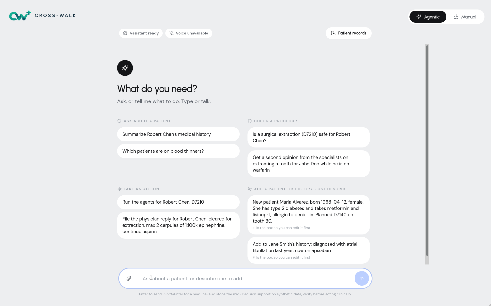
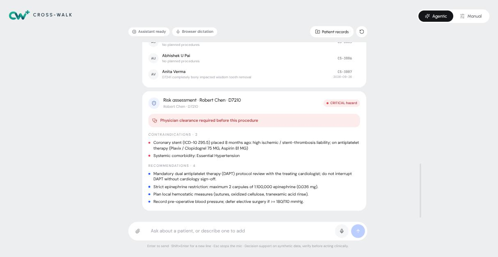
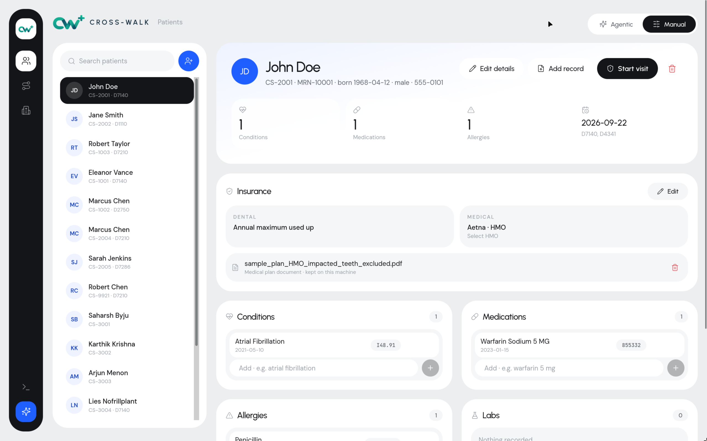
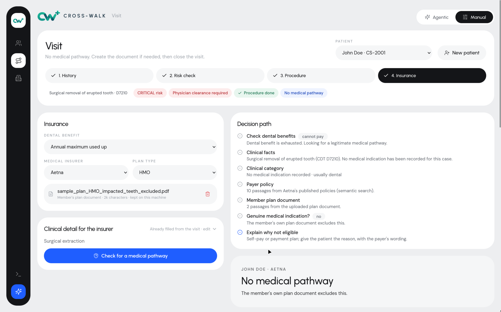
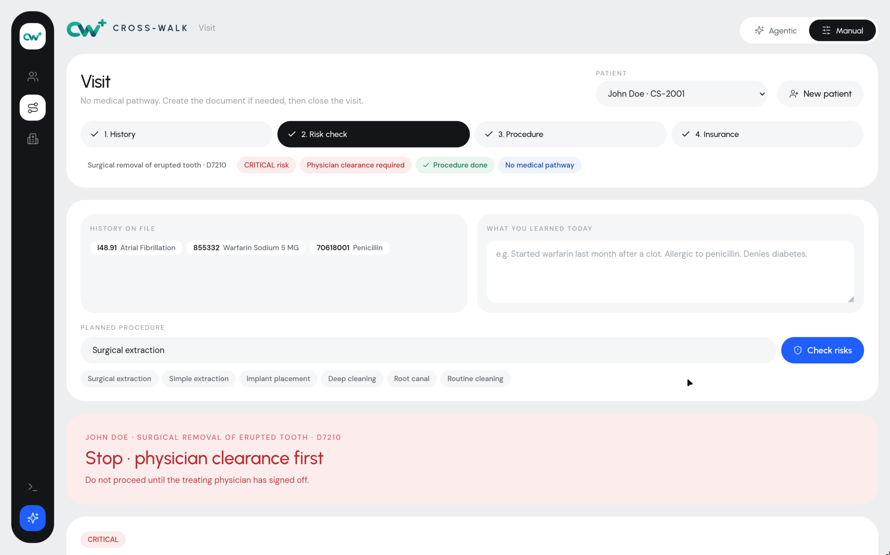
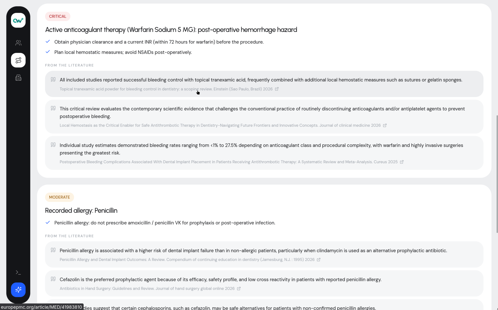

# CrossWalk

### **DSOLVE 2026** · DRISHTI · College of Engineering Trivandrum (CET)

**BUILD. SOLVE. DEMONSTRATE.**

|                   |                                                                                   |
| ----------------- | --------------------------------------------------------------------------------- |
| **Problem:**      | Problem 6 — Open Problem Statement                                                |
| **Team Name:**    | Team Aether                                                                       |
| **Team Members:** | Anand Rodriguez Menon · Abhishek U Pai · Saharsh Baiju · U Karthik Krishna        |
| **Institution:**  | Amrita Vishwa Vidyapeetham                                                        |
| **Live Demo:**    | https://youtu.be/gDHaO-PF92o                                                      |
| **Pitch Video:**  | https://www.instagram.com/reel/Ddcutn4zKHJ/?stkn=dmFxaG8wYnFtaXY4                 |

---

## Table of Contents

- [Problem Statement](#problem-statement)
- [Our Solution](#our-solution)
- [Key Features](#key-features)
- [Screenshots & Demo](#screenshots--demo)
- [Tech Stack](#tech-stack)
- [Getting Started](#getting-started)
- [Usage / Demo Script](#usage--demo-script)
- [Limitations & Future Scope](#limitations--future-scope)
- [Team](#team)
- [Submission Checklist](#submission-checklist)

---

## Problem Statement

> ## Problem 6: Open Problem Statement — Dental Industry
>
> Identify and solve a real-world problem within the dental industry across markets
> such as the UK, Australia, and the US.
>
> Participants are encouraged to explore challenges faced by dental practices,
> dentists, clinical teams, patients, or dental organisations and propose a
> technology-driven solution. The problem can relate to areas such as clinical
> workflows, patient experience, practice operations, insurance, billing, marketing,
> diagnostics, communication, or automation.
>
> The solution should clearly define the problem being addressed, demonstrate how
> the proposed technology can solve it, and showcase a working prototype or proof of
> concept.
>
> > Open problem statements must focus on the dental practice industry, specifically
> > targeting markets like the US and UK. For inspiration, explore platforms like
> > **G2** and **Capterra**, or research **Y Combinator** startups in this domain.

**The problem we chose: a dentist treats the mouth, but the risk lives in the rest of the body.**
A patient's heart stent, blood thinner or bone drug sits in a hospital record the dental office never sees. The
dental chart and the medical record are two separate worlds, joined today by paper forms, phone calls and fax.

### Why this matters

- **The risk is common.** About 8 million Americans take blood thinners, and in published dental clinic studies 16% to
  46% of patients had a relevant medical condition. A missed fact can mean an uncontrolled bleed, jaw-bone death after
  an extraction, or the wrong antibiotic for an allergic patient.
- **Dentists want the data and cannot get it.** In one study of clinics sharing a building with medical providers, 100%
  of dental providers wanted the patient's medical information; fewer than half could use the shared system.
- **Clearance is slow.** A physician's sign-off means days of phone tag while the chair sits empty.
- **Dental benefits run out fast.** The typical annual maximum is $1,000 to $1,500. Some oral surgery genuinely belongs
  to medical insurance (jaw fractures, tumours, some impacted teeth), but front desks either never check, or guess.

Sources for every figure are listed in [`docs/PITCH_DECK_CONTENT.md`](./docs/PITCH_DECK_CONTENT.md).

---

## Our Solution

**CrossWalk is a medical-dental co-pilot for CareStack.** It brings the patient's medical history into the dental
visit, warns before the procedure, gets the physician's clearance, and answers the insurance question honestly. One
visit runs through one guided workflow, or entirely by chat and voice:

```
Add patient → Medical history → Risk check → Physician clearance → Procedure → Insurance
```

1. **History.** Add a patient by form, by chat, by voice, or by uploading an old record as a PDF. CrossWalk reads it and
   files conditions, medications, allergies and labs with standard codes (ICD-10, RxNorm, SNOMED, LOINC).
2. **Risk check.** Type the planned procedure in plain words. Fixed clinical rules check it against the history and show
   the hazards, the precautions and verbatim quotes from peer-reviewed research.
3. **Clearance.** If the risk is critical, the patient's physician is asked, and the free-text reply becomes clear
   restrictions on the chart. An unclear or negative reply never clears the patient.
4. **Insurance.** If the dental benefit is active, bill dental. If not, CrossWalk searches the insurers' own published
   policies for a genuine medical pathway and quotes the exact wording and **finds if there is possibility for the current case can be claimed under medical insurance** (we don't claim we provide the possibilities). It also says "no" when the answer is no.

**What makes it different**

- **Rules decide, AI explains.** Clinical risk comes from deterministic rules, so the same patient always gets the same
  warning and every warning names its rule. Language models listen, route and explain.
- **AI that cannot invent facts.** Every item read from a document must quote the sentence it came from, and the server
  checks that the quote exists. Medical codes come from a dictionary, never from the model.
- **No coverage rule is hardcoded.** The only insurance data we author is a list of URLs. The app downloads the payers'
  published policies and quotes them. It never says "covered", never picks a billing code, never invents a dollar figure.
- **It does not convert dental claims into medical claims.** Routine care and "risky patient" cases come back
  "No medical pathway", in the insurer's own words.

Full explanation in plain language: [`docs/PROJECT_GUIDE.md`](./docs/PROJECT_GUIDE.md) ·
technical reference: [`docs/MAO_PLATFORM.md`](./docs/MAO_PLATFORM.md).

---

## Key Features

- **Agentic chat (typed or spoken)** — one assistant with 24 tools that can run the whole visit: add patients, chart
  history, check risk, run the agents, file the physician's reply, check insurance, create the paperwork, close the visit.
- **Intelligent record import** — upload a discharge summary or referral letter (PDF, including scans). Items are
  classified and coded; denied or stopped items ("no history of diabetes") are listed as *not charted*.
- **Procedure risk check** — blood thinners, recent stents, bone drugs, heart valves, allergies and systemic conditions,
  with precautions and quotes from Europe PMC literature. Spelling is auto-corrected; off-topic input asks for confirmation.
- **Physician clearance loop** — LangGraph agents (Intake → Clinical Risk → Medical Clearance) find the physician, send
  the request, escalate after 48 hours, and turn the reply into restrictions.
- **Dental Coverage Recovery** — retrieval over 12 published payer policies (Aetna, Cigna, UnitedHealthcare, Blue Cross,
  Medicare) using code matching, AI embeddings and keyword search. Outcomes: *use the dental benefit*, *potential medical
  pathway*, *no medical pathway*, *needs human review*. Upload the member's own plan document for a plan-level answer.
- **Editable patient chart** — every detail, history item and insurance field can be edited or removed, by hand or by
  the assistant. Destructive actions always ask first.
- **Resilient AI** — works with one provider or three (Gemini, Groq, NVIDIA NIM), fails over between them, and the core
  rule-based checks still run with none.
- **Standards-based** — HL7 FHIR R4, CDS Hooks, CDT / ICD-10 / RxNorm / SNOMED / LOINC, with a bundled CareStack simulator.

---

## Screenshots & Demo

| Screenshot                                                                          | Description                                                                                  |
| ----------------------------------------------------------------------------------- | -------------------------------------------------------------------------------------------- |
| [Agentic chat](./assets/screenshots/01-agentic-chat-home.jpg)                       | Landing page: the assistant, with the Agentic / Manual switch                                |
| [Risk answer in chat](./assets/screenshots/02-chat-risk-answer.jpg)                 | "Is a surgical extraction safe for Robert Chen?" → critical hazard card with recommendations |
| [Patient chart](./assets/screenshots/03-patient-chart-insurance.jpg)                | Manual mode: coded conditions and medications, insurance and the member's plan document      |
| [Visit · insurance step](./assets/screenshots/04-visit-insurance-step.jpg)          | The guided visit (History → Risk check → Procedure → Insurance) and the policy library       |
| [Live demo video](https://youtu.be/gDHaO-PF92o)                                     | Full walkthrough of the working prototype                                                    |
| [Pitch Video](https://www.instagram.com/reel/Ddcutn4zKHJ/?stkn=dmFxaG8wYnFtaXY4)    | Social pitch video (script: [`assets/pitch`](./assets/pitch/PITCH_SCRIPT.md))                |







---

## Tech Stack

| Layer           | Technology                                                                                       | Why we chose it                                                                                                   |
| --------------- | ------------------------------------------------------------------------------------------------ | ----------------------------------------------------------------------------------------------------------------- |
| Frontend        | React 18, Vite 5, Tailwind CSS 3, lucide-react                                                   | Fast to build a clean, uncluttered clinical UI; static build served by nginx                                      |
| Backend         | Python, FastAPI, Pydantic v2, httpx, LangGraph                                                   | Async API with typed schemas and automatic docs; LangGraph gives an explicit, inspectable agent graph             |
| Database        | JSON files on a Docker volume (patients, visits, plans) + ChromaDB (vector index of policy text) | Zero setup for a prototype with synthetic data; the FHIR-shaped store can be swapped for PostgreSQL / a FHIR server |
| ML / AI         | Gemini, Groq, NVIDIA NIM (chat + tool calling, embeddings, Nemotron Parse OCR, Whisper speech)   | Provider fail-over and parallel second opinions; models explain, deterministic rules decide                       |
| Standards       | HL7 FHIR R4, CDS Hooks, CDT, ICD-10, RxNorm, SNOMED CT, LOINC                                    | What hospitals and payers already use, so data arrives as coded facts                                             |
| Infra / Hosting | Docker Compose (nginx + FastAPI) on **AWS EC2**                                                  | One command to deploy on any Linux VM; only the web port is public                                                |

---

## Getting Started

### Prerequisites

- **Docker route (recommended):** a Linux machine with Docker Engine and the Compose plugin (the setup script offers
  to install Docker), 2 GB RAM, about 5 GB of free disk.
- **Local development route:** Python ≥ 3.12, Node.js ≥ 20.
- **One AI key** (any one is enough): [Gemini](https://aistudio.google.com/apikey) (recommended, free tier) ·
  [Groq](https://console.groq.com/keys) · [NVIDIA NIM](https://build.nvidia.com).
  Without a key the app still runs; the chat agent and AI document reading are off.

### Installation

**Option A — Docker (server, VM or laptop)**

```bash
git clone https://github.com/flykrth/team-aether.git && cd team-aether
./setup-vps.sh
```

The script asks for the required settings (one AI key, the web port), writes `.env`, builds and starts the containers,
verifies the site and the API, and downloads the insurers' published policies. Details: [`docs/DEPLOY_VPS.md`](./docs/DEPLOY_VPS.md).

**Option B — Local development**

```bash
# backend
python3 -m venv .venv && source .venv/bin/activate
pip install -r backend/requirements.txt
cp backend/.env.example backend/.env          # add your AI key
cd backend && uvicorn app.main:app --reload --port 8000

# frontend (second terminal)
cd frontend && npm install
cp .env.example .env
npm run dev                                   # http://localhost:5173
```

Run the tests: `cd backend && pytest tests -q` (345 tests).
Check everything before a demo: `./docs/demo/preflight.sh`.

### Environment Variables

| Variable                                   | Description                                                                          | Example                         |
| ------------------------------------------ | ------------------------------------------------------------------------------------ | ------------------------------- |
| `GEMINI_API_KEY`                           | Gemini key: chat agent, document reading, policy embeddings                          | `AIza...`                       |
| `GROQ_API_KEY`                             | Groq key: fail-over model and Whisper voice input                                    | `gsk_...`                       |
| `NVIDIA_API_KEY`                           | NVIDIA NIM key: fail-over model, scanned-PDF OCR, embeddings                         | `nvapi-...`                     |
| `WEB_PORT`                                 | Docker only: public port of the website                                              | `80`                            |
| `BACKEND_PORT`                             | Docker only: API port, published on `127.0.0.1`                                      | `8000`                          |
| `ASSISTANT_MASTER_PROVIDER`                | Force the master model: `gemini`, `groq` or `nvidia` (empty = first configured)      | `gemini`                        |
| `USE_LIVE_CARESTACK`                       | `false` = bundled simulator with synthetic patients                                  | `false`                         |
| `CARESTACK_BASE_URL` / `_VENDOR_KEY` / `_ACCOUNT_KEY` / `_ACCOUNT_ID` | Only when `USE_LIVE_CARESTACK=true`                       | `https://...`                   |
| `FHIR_SERVER_URL`                          | FHIR R4 server for medical records                                                   | `https://hapi.fhir.org/baseR4`  |
| `VITE_API_BASE_URL` (frontend)             | Local development only: where the browser finds the API                              | `http://localhost:8000`         |

> At least one of the three AI keys is needed for the assistant. Never commit real keys: `.env` files are gitignored,
> and `.env.example` / `backend/.env.example` / `frontend/.env.example` list every option.

---

## Usage / Demo Script

_Live demo runbook (about 5 minutes). Ready-to-paste data for every step: [`docs/demo/FULL_WALKTHROUGH.md`](./docs/demo/FULL_WALKTHROUGH.md)._

1. **Boot** — `./setup-vps.sh` (or backend + frontend locally), then `./docs/demo/preflight.sh`. The site opens on the chat.
2. **It already knows the patient** — ask *"Is a surgical extraction safe for Robert Chen?"*. A critical hazard card
   appears in the chat: recent stent, do not stop the antiplatelets, physician clearance required.
3. **A new high-risk patient from a document** — Manual → Patients → **+**, drop in
   `docs/demo/margaret_ellis_discharge_summary.pdf`. The judge sees 15 coded items, each with its source sentence, and
   the denied items listed as *not charted*.
4. **Risk check** — Start visit, type `surgcal extracton of a lower molar`. Spelling is corrected, then: *Stop ·
   physician clearance first*, including "antibiotic cover needed, **and not amoxicillin**, because she is penicillin-allergic".
5. **Clearance** — in chat: *"Run the agents for Robert Chen, D7210"*, then file the physician's free-text reply. It
   becomes structured restrictions and the appointment is cleared.
6. **Highlight: the insurance answer that says no** — mark the procedure done; the Insurance step is already filled
   in. An impacted wisdom tooth with recurrent infection → *Potential medical pathway*, quoting Aetna. Upload the two
   sample plans in `docs/demo/plans/`: same patient, same tooth, same insurer, opposite answers. A routine crown → *No
   medical pathway*, in the insurer's own words.
7. **Wrap-up** — the whole flow again by chat only (six messages). In production the simulator is replaced by the real
   CareStack API, staff-entered benefit status by an X12 270/271 eligibility feed, and the paperwork by FHIR prior authorisation.

More: [`docs/demo/DEMO_GUIDE.md`](./docs/demo/DEMO_GUIDE.md) · [`docs/demo/COVERAGE_DEMO.md`](./docs/demo/COVERAGE_DEMO.md).

---

## Limitations & Future Scope

### Known Limitations

- **Simulated systems.** CareStack, the hospital record and the physician inbox are simulators with synthetic patients.
  The payer policies, the research quotes, the AI calls and the standards are real.
- **No login or roles.** The prototype has no user accounts, so it must hold synthetic data only.
- **File-based storage.** JSON files and a local vector index suit one practice on one server, not concurrent multi-site use.
- **Insurance.** Dental benefit status is selected by staff (no live eligibility feed); only US payers are indexed (UK and
  Australia say "not supported yet"); results are a pathway to verify with the insurer, never a coverage promise. The AI
  chooses which policy sentences to quote, so wording can differ between runs; anything it cannot prove is discarded.
- **Compliance.** Real use needs HIPAA business associate agreements with each AI provider.
- **Voice input** needs HTTPS (or localhost) in the browser.

### Future Scope

- Real CareStack API integration and a pilot clinic.
- Live eligibility (X12 270/271) and prior-authorisation submission (FHIR Da Vinci PAS, required of US payers from 2027).
- PostgreSQL / a FHIR server, user accounts, audit trail, role-based access.
- UK and Australia policy sources; more payers.
- SMART on FHIR launch from inside the practice-management system.

---

## Team

| Name                  | Role(s)    | GitHub                                           | Email                          |
| --------------------- | ---------- | ------------------------------------------------ | ------------------------------ |
| Anand Rodriguez Menon | Full-stack | [@anand-r-m](https://github.com/anand-r-m)       | anandrodriguezmenon@gmail.com  |
| Abhishek U Pai        | Full-stack | [@ABHISHEKUPAI](https://github.com/ABHISHEKUPAI) | abhishekupai6055@gmail.com     |
| Saharsh Baiju         | Full-stack | [@saharshbaiju](https://github.com/saharshbaiju) | saharshbaiju@gmail.com         |
| U Karthik Krishna     | Full-stack | [@flykrth](https://github.com/flykrth)           | karthikkrishnau10@gmail.com    |

---

## Submission Checklist

**Before 6:00 AM (Code Freeze) – Sat, Sept 19th:**

- [x] Clean, runnable source code committed to this **public** repo
- [x] `README.md` fully filled in (all sections above)
- [x] Pitch video (>30s, English) posted on team member's social profile
      tagging **@DrishtiCET** & **@CareStack** and link added above
- [x] All secrets/API keys removed from the repo
- [x] Quick-start verified from a fresh clone (`git clone` → run)

---

**[Problem Statements](./docs/problem-statements.md)** ·
**[Submission Checklist](./SUBMISSION_CHECKLIST.md)** ·
**DSOLVE 2026 Guidelines**
