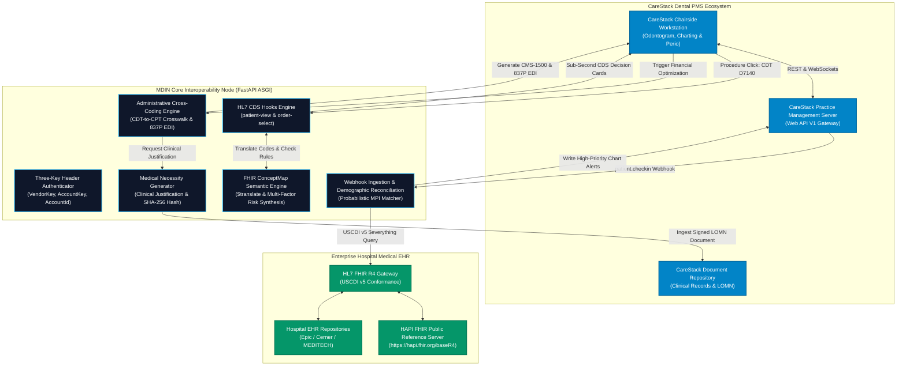
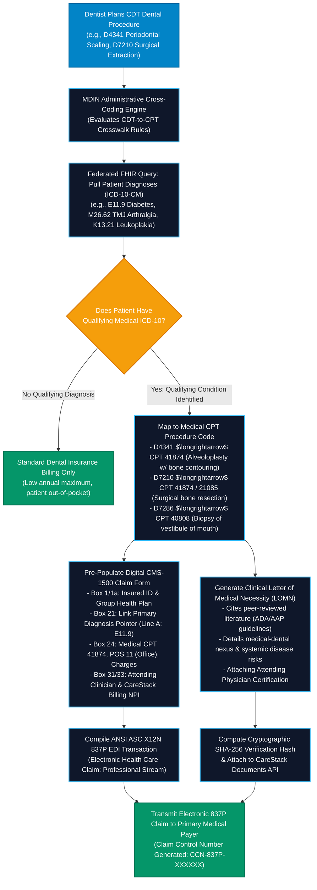
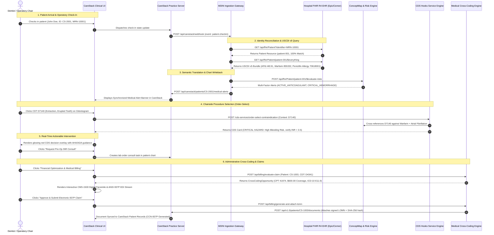

# MDIN: Medical-Dental Interoperability Node for CareStack

### **DSOLVE 2026** · DRISHTI · College of Engineering Trivandrum (CET)
**Problem 6: Open Problem Statement (US & Global Dental Industry)**

[-emerald?style=flat-square&logo=pytest)](backend/tests)
[](https://developer.carestack.com/documentation)
[-blue?style=flat-square&logo=fire)](https://hl7.org/fhir/R4/)
[](https://cds-hooks.hl7.org/)
[](backend/app/routers/billing.py)
[](https://www.healthit.gov/topic/laws-regulation-and-policy/health-data-technology-and-interoperability-certification-program)
[](LICENSE)

---

## Executive Summary

| Dimension | Specification / Value |
|---|---|
| **Project Title** | **MDIN: Medical-Dental Interoperability Node for CareStack** |
| **Hackathon** | **DSOLVE 2026** (36-Hour National Physical Hackathon) · DRISHTI · CET |
| **Problem Statement** | **Problem 6 — Open Problem Statement (US & Global Dental Industry)** |
| **Team Name** | **Team Aether** |
| **Target Platforms** | **CareStack Practice Management System (PMS)** $\longleftrightarrow$ **Enterprise Medical EHRs (Epic, Cerner, MEDITECH, HAPI FHIR)** |
| **Health IT Standards** | **CareStack Web API V1** (Three-Key Header Auth), **HL7® FHIR® R4.0.1 (USCDI v5)**, **CDS Hooks™ v1.0 / v2.0**, **FHIR ConceptMap ($translate)** |
| **Billing & Claims Standards** | **ANSI ASC X12N 837P (Health Care Claim: Professional)**, **NUCC CMS-1500 (Form 1500 02-12)**, **ADA CDT-to-AMA CPT Crosswalk** |
| **Medical Terminologies Mapped** | **ICD-10-CM**, **SNOMED CT**, **RxNorm**, **LOINC** $\longrightarrow$ **ADA CDT Dental Procedure Codes** |
| **Automated Test Suite** | **132 / 132 Tests Passing** (`pytest backend/tests/ -v`) across 10 test modules |
| **Production Web Application** | `http://localhost:80` (or `http://localhost`) · Nginx SPA Reverse Proxy Gateway |
| **Direct Backend REST API** | `http://localhost:8000` · [Interactive Swagger UI](http://localhost:8000/docs) · [ReDoc Documentation](http://localhost:8000/redoc) |
| **CareStack Web API V1 Surface** | `http://localhost:8000/api/v1.0` (PatientViewModel, Appointments, Periodontal Charting, Procedure Codes, Documents) |
| **Development Clinical Interface** | `http://localhost:5173` (Vite Hot-Reloading React Chairside Dashboard) |

---

## Table of Contents

1. [The Two-System Problem: Clinical, Operational & Financial Pain Points](#the-two-system-problem-clinical-operational--financial-pain-points)
   - [The Systemic & Technological Chasm](#the-systemic--technological-chasm)
   - [Life-Threatening Chairside Risks](#life-threatening-chairside-risks)
   - [Operational & Administrative Failures](#operational--administrative-failures)
   - [The Financial Cross-Coding Barrier](#the-financial-cross-coding-barrier)
2. [The Proposed Solution: MDIN Architecture](#the-proposed-solution-mdin-architecture)
   - [Core Engineering Pillars](#core-engineering-pillars)
3. [Architectural & Clinical Flowcharts](#architectural--clinical-flowcharts)
   - [1. System Architecture & Interoperability Gateway Flowchart](#1-system-architecture--interoperability-gateway-flowchart)
   - [2. Clinical Decision Support Logic Flowchart](#2-clinical-decision-support-logic-flowchart)
   - [3. Administrative Medical Cross-Coding & Claims Flowchart](#3-administrative-medical-cross-coding--claims-flowchart)
   - [4. End-to-End Interoperability Sequence Diagram](#4-end-to-end-interoperability-sequence-diagram)
4. [Regulatory Alignment & Health Policy](#regulatory-alignment--health-policy)
5. [Step-by-Step Setup & Quickstart Guide](#step-by-step-setup--quickstart-guide)
   - [1-Click Production Deployment (Docker & Compose)](#1-click-production-deployment-docker--compose)
   - [Automated Deployment Helper (`deploy.sh`)](#automated-deployment-helper-deploysh)
   - [Option A: Automated One-Click Local Setup (`setup.sh`)](#option-a-automated-one-click-local-setup-setupsh)
   - [Option B: Manual Local Setup](#option-b-manual-local-setup)
6. [API Reference & Sample Requests](#api-reference--sample-requests)
   - [Endpoint Summary Table](#endpoint-summary-table)
   - [Sample `curl` Commands & Payloads](#sample-curl-commands--payloads)
7. [Clinical Patient Personas & Live Demonstration Matrix](#clinical-patient-personas--live-demonstration-matrix)
8. [Frontend Chairside Interface Guide](#frontend-chairside-interface-guide)
   - [Split-Screen Chairside Ergonomics](#split-screen-chairside-ergonomics)
   - [Financial Optimization & CMS-1500 / 837P Facsimile Modal](#financial-optimization--cms-1500--837p-facsimile-modal)
9. [Automated Verification & Test Suite](#automated-verification--test-suite)
10. [Hackathon Submission Assets](#hackathon-submission-assets)

---

## The Two-System Problem: Clinical, Operational & Financial Pain Points

### The Systemic & Technological Chasm

In contemporary healthcare across the United States, the United Kingdom, and Australia, **dentistry and medicine exist in complete operational, legal, and technological isolation**. 

When modern hospital systems invested billions into certified enterprise Electronic Health Records (EHRs) such as **Epic, Cerner, and MEDITECH**—interconnecting them via the **HL7® FHIR®** standard—dental practices remained isolated inside specialized Practice Management Systems (PMS) such as **CareStack**. 

```
┌─────────────────────────────────────────────────────────┐          ┌─────────────────────────────────────────────────────────┐
│              ENTERPRISE MEDICAL HOSPITAL EHR            │          │             DENTAL PRACTICE MANAGEMENT SYSTEM           │
│                 (Epic / Cerner / MEDITECH)              │          │                       (CareStack)                       │
│                                                         │   VOID   │                                                         │
│ • Systemic Diagnoses (ICD-10-CM / SNOMED CT)            │  ══════  │ • Odontogram & Tooth Charting (FDI / Universal)         │
│ • Active Pharmacotherapy & Regimens (RxNorm)            │    ❌    │ • ADA CDT Procedure Codes (e.g., D7140, D4341)          │
│ • Diagnostic Laboratory Panels (LOINC: HbA1c, INR, PT)  │          │ • Paper/Tablet Self-Reported Health Questionnaires      │
│ • Documented Allergies & Drug Hypersensitivity Events   │          │ • Blind to Hospital Diagnoses, Active Meds & Blood Labs │
└─────────────────────────────────────────────────────────┘          └─────────────────────────────────────────────────────────┘
```

Dentists routinely perform invasive, aerosol-generating, bone-altering, and mucosal-penetrating surgical interventions without real-time knowledge of active pharmacotherapy, cardiac valvular implants, bleeding disorders, or organ-system dysfunctions.

---

### Life-Threatening Chairside Risks

The clinical divide directly triggers preventable, catastrophic medical emergencies in the dental operatory chair:

| Clinical Hazard | Medical Etiology & Therapy | Proposed Dental Procedure (CDT) | Preventable Adverse Event / Pathophysiological Hazard |
|---|---|---|---|
| **Severe Intraoperative Hemorrhage** | Atrial Fibrillation (`I48.91`) on **Warfarin Sodium** (`RxNorm: 855332`) or DOACs (Eliquis, Xarelto) | **D7140** (Simple Tooth Extraction) / **D7210** (Surgical Extraction) | Uncontrolled, life-threatening post-extraction oral hemorrhage. Safe surgical intervention mandates verifiable recent INR (<3.5 within 24–48 hours) and preparation of local hemostatic agents (oxidized regenerated cellulose, tranexamic acid mouthwash). |
| **Fatal Bacterial Endocarditis** | **Prosthetic Cardiac Valve** (`SNOMED: 315215002`) or history of Infective Endocarditis (`I33.0`) | **D1110** (Adult Prophylaxis) / **D4341** (Periodontal Scaling) | Subgingival mucosal manipulation induces transient bacteremia. Circulating oral bacteria (e.g., *Streptococcus viridans*) seed prosthetic valve leaflets, triggering subacute bacterial endocarditis with up to **30% mortality**. Mandates AHA 2g Amoxicillin premedication 30–60 min prior. |
| **Fatal Anaphylactic Shock** | Documented Type 1 IgE-Mediated **Penicillin Anaphylaxis** (`SNOMED: 70618001`) | Prophylactic Antibiotic Premedication | Prescribing standard empirical first-line Amoxicillin triggers sudden chairside respiratory collapse, angioedema, cardiovascular collapse, and death. Mandates immediate substitution with Clindamycin or Azithromycin. |
| **Medication-Related Osteonecrosis of the Jaw (MRONJ)** | Osteoporosis or Bone Metastases on **IV Bisphosphonates** (Zoledronic Acid) or **RANKL Inhibitors** (Denosumab) | **D7140** / **D7210** (Tooth Extractions), **D4260** (Osseous Surgery) | Suppression of osteoclastic remodeling leads to intractable, non-healing avascular bone exposure, severe chronic infection, and permanent disfiguring jaw resection. |
| **Impaired Glycemic Healing & Alveolar Osteitis** | Type 2 Diabetes Mellitus (`E11.9`) with **HbA1c = 9.2%** (`LOINC: 4548-4`) | **D7210** (Surgical Extraction) / **D4341** (Periodontal Scaling) | Severe hyperglycemia impairs neutrophil chemotaxis and microvascular perfusion, causing rampant surgical breakdown, severe dry socket (alveolar osteitis), and secondary deep-space fascial infections. |

---

### Operational & Administrative Failures

1. **Failure of Patient Self-Reporting (Recall Bias)**:
   - Dental intake relies on clipboards or tablet forms.
   - Clinical literature proves that **over 40% to 50% of patients fail to accurately report their complete medication regimen**.
   - Patients frequently omit anticoagulants (confusing high-potency Warfarin or Apixaban with over-the-counter vitamins or aspirin) and rarely know their exact glycated hemoglobin (HbA1c) lab values or prosthetic valve specifications.
2. **The 48-to-72 Hour Phone and Fax Chasm**:
   - When dentists recognize a potential risk, they must call or fax the patient's primary care physician for "medical clearance".
   - This process takes **48 to 72 hours** of administrative back-and-forth, causing cancelled appointments, stalled emergency treatment, lost practice revenue, and immense patient frustration.
3. **Absence of Sub-Second Clinical Decision Support**:
   - Unlike hospital clinicians who receive real-time EHR alerts, dentists have had no automated mechanism to cross-reference proposed Code on Dental Procedures and Nomenclature (CDT) codes against hospital medical records at chairside.

---

### The Financial Cross-Coding Barrier

- **The Dental-Medical Insurance Chasm**: Many surgical, biopsy, and complex periodontal procedures performed in dental practices have direct medical necessity roots (e.g., treating periodontitis in uncontrolled diabetics to reduce HbA1c, performing oral biopsies for suspected neoplastic leukoplakia, or alveoloplasty for reconstructive jaw disorders).
- **Lost Revenue & High Patient Out-of-Pocket Burden**: Because dental insurance has low annual caps (typically $1,000–$1,500/year), patients often delay vital treatments. Meanwhile, medical insurance provides comprehensive surgical coverage—but dental practices rarely submit medical claims due to the sheer complexity of translating CDT codes into **AMA CPT** codes and generating **CMS-1500** forms or **ANSI ASC X12N 837P** EDI transactions.
- **Burden of Medical Necessity Letters**: Medical payers routinely deny dental-surgical claims unless accompanied by an exhaustive, clinician-signed **Letter of Medical Necessity (LOMN)** proving systemic medical etiology. Drafting these manually requires 30–45 minutes of clinician time per patient.

---

## The Proposed Solution: MDIN Architecture

The **Medical-Dental Interoperability Node (MDIN)** is an open-standard, federated interoperability gateway engineered specifically for **CareStack**. It bridges CareStack PMS with enterprise hospital Electronic Health Records (Epic, Cerner, MEDITECH) using **HL7® FHIR® R4 (USCDI v5)**, semantic terminology translation, real-time **CDS Hooks™ v1.0/v2.0**, and an automated administrative **Medical Cross-Coding Engine**.

### Core Engineering Pillars

```
┌───────────────────────────────────────────────────────────────────────────────────────────────────┐
│                                     MDIN CORE INTEROPERABILITY NODE                               │
├───────────────────────────────┬───────────────────────────────────┬───────────────────────────────┤
│    CLINICAL DECISION SUPPORT  │      FEDERATED INTEROPERABILITY   │      ADMINISTRATIVE BILLING   │
│ • HL7 CDS Hooks v1.0 / v2.0   │ • CareStack Web API V1 (3-Key)    │ • CDT-to-CPT Medical Crosswalk│
│ • patient-view Hook Service   │ • HL7 FHIR R4 (USCDI v5)          │ • CMS-1500 Digital Facsimile  │
│ • order-select Hook Service   │ • HAPI FHIR Public Test Server    │ • ANSI ASC X12N 837P EDI Gen  │
│ • Prefetch Optimization       │ • USCDI v5 $everything Bundles    │ • Automated LOMN Generator    │
│ • Multi-Factor Risk Synthesis │ • Probabilistic Demographic MPI   │ • CareStack Document Ingestion│
└───────────────────────────────┴───────────────────────────────────┴───────────────────────────────┘
```

#### 1. CareStack Web API V1 Integration & Three-Key Authentication
- **Three-Key Header Authentication**: Directly enforces CareStack's enterprise security architecture using the mandatory authorization header keys:
  - `VendorKey`: Secret software vendor credential
  - `AccountKey`: Secret clinical practice account authorization key
  - `AccountId`: Practice tenant identifier
- **CareStack Web API V1 Surface (`/api/v1.0`)**: Implements production-grade models and endpoints for `PatientViewModel`, `SearchRequest` $\to$ `PatientSearchResponseModel`, full-mouth periodontal probing depth charting (`PeriodontalChart`), ADA CDT procedure codes (`ProcedureCodeBasicApiResponseModel`), chairside appointments (`AppointmentDetailModel`), and incremental synchronization (`/sync/patients`, `/sync/treatment-procedures`).
- **Bi-Directional Webhook Ingestion & Chart Write-Back**: Listens for CareStack operatory check-in events (`patient.checkin`), reconciles patient identity against hospital Master Patient Indices (MPI), and writes critical contraindication alerts back to CareStack patient charts (`POST /api/carestack/patients/{id}/medical-alerts`).
- **CareStack Document Repository Ingestion**: Exposes `/api/v1.0/patients/{id}/documents` supporting both JSON payload and multipart/form-data attachments, storing clinician-signed documentation with SHA-256 cryptographic verification hashes.

#### 2. HL7 FHIR R4 Federated EHR Integration & USCDI v5
- **Live HL7 Public Test Server Integration**: Connects asynchronously via `FHIRClient` (`backend/app/services/fhir_client.py`) to official public HL7 FHIR reference servers:
  - **HAPI FHIR Reference Server**: `https://hapi.fhir.org/baseR4`
  - **NLM HAPI FHIR Server**: `https://lforms-fhir.nlm.nih.gov/baseR4`
- **Diagnostic Telemetry (`GET /api/fhir/server-status`)**: Actively probes remote FHIR endpoints, measuring ping latency, capability conformance, and software versioning.
- **USCDI v5 Standard Conformance**: Queries standard FHIR R4 resources conforming to United States Core Data for Interoperability (USCDI v5):
  - `Patient`: Demographics, identifiers, and cross-system MRN aliases.
  - `Condition`: Systemic diagnoses coded in **ICD-10-CM** and **SNOMED CT**.
  - `MedicationRequest`: Active pharmacotherapy coded in **RxNorm**.
  - `AllergyIntolerance`: Documented drug hypersensitivities (substances, severity, manifestations).
  - `Observation`: Diagnostic laboratory values coded in **LOINC** (HbA1c, INR, Platelets).
  - `$everything`: Patient-scoped comprehensive bundle export.

#### 3. FHIR ConceptMap Semantic Translation Engine
- Bridges the semantic vocabulary gap between medicine and dentistry using HL7 FHIR `ConceptMap` specifications.
- Implements standard FHIR `POST /api/fhir/ConceptMap/$translate` operations:
  - **ICD-10-CM** `I48.91` (Atrial Fibrillation) $\longrightarrow$ `BLEED_RISK_ELEVATED`
  - **RxNorm** `855332` (Warfarin Sodium 5 MG Oral Tablet) $\longrightarrow$ `ACTIVE_ANTICOAGULANT`
  - **SNOMED CT** `315215002` (Prosthetic Cardiac Valve) $\longrightarrow$ `AHA_PROPHYLAXIS_REQUIRED`
  - **SNOMED CT** `70618001` (Allergy to Penicillin) $\longrightarrow$ `CONTRAINDICATION_PENICILLIN`
  - **LOINC** `4548-4` (HbA1c in Blood) $\longrightarrow$ `DELAYED_HEALING_RISK`
  - **SNOMED CT** `64859006` (Osteoporosis on Bisphosphonates) $\longrightarrow$ `MRONJ_RISK_ELEVATED`
- **Multi-Factor Clinical Risk Synthesis**: Dynamically calculates compound risks (e.g., Warfarin + Atrial Fibrillation escalates into `CRITICAL_HEMORRHAGE_HAZARD`; Prosthetic Heart Valve + Penicillin Allergy automatically suppresses Amoxicillin and recommends Clindamycin/Azithromycin).

#### 4. HL7 CDS Hooks v1.0 / v2.0 Decision Support Engine
- Fully implements the official HL7 CDS Hooks specification:
  - `GET /cds-services`: Discovery catalog declaring supported hooks and prefetch queries.
  - `patient-view` Hook (`/cds-services/patient-view-alert`): Fires upon opening a chart in CareStack, evaluating underlying systemic diseases.
  - `order-select` Hook (`/cds-services/order-select-contraindication`): Fires sub-second when a dentist clicks a CDT procedure code on the odontogram.
- **Evidence-Based Decision Cards**:
  - Indicator badges: `critical` (red glowing), `warning` (amber), `info` (blue).
  - Strict $\le 140$ character summaries for immediate chairside absorption.
  - Detailed guideline citations (AHA, ADA, AAOMS).
  - One-click chairside action suggestions (e.g., *"Order Pre-Op INR Lab Verification & MD Consult"*, *"Append Alert to CareStack Chart"*).

#### 5. Administrative Decision Support & Medical Cross-Coding Engine
- Evaluates planned dental CDT procedures against active systemic ICD-10 medical diagnoses to identify primary medical insurance reimbursement opportunities.
- **CDT-to-CPT Mapping Matrix**:
  - Periodontal Scaling (`D4341`) $\longrightarrow$ CPT `41874` (Alveoloplasty w/ bone contouring) when linked to Type 2 Diabetes (`E11.9`) or severe systemic disease.
  - Surgical Extraction (`D7210`) $\longrightarrow$ CPT `41874` or `21085` when linked to TMJ Arthralgia (`M26.62`) or jaw osteitis.
  - Incisional Biopsy (`D7286`) $\longrightarrow$ CPT `40808` (Biopsy of vestibule of mouth) when linked to Oral Leukoplakia (`K13.21`).
- **CMS-1500 Digital Claim Facsimile**: Automatically populates standard NUCC Form 1500 (02-12) claim boxes (Box 1, 1a, 2, 3, 5, 21 diagnoses pointers, 24 service line CPT, 31 physician signature, 33 NPI billing provider).
- **ANSI ASC X12N 837P EDI Generation**: Compiles standard HIPAA Title II Electronic Health Care Claim Professional transaction envelopes (`ISA`, `GS`, `ST*837*0001*005010X222A1`, `BHT`, `NM1`, `CLM`, `HI`, `SV1`, `SE`).

#### 6. Automated Letter of Medical Necessity (LOMN) Generator
- Synthesizes formal, peer-reviewed clinical justification letters citing clinical guidelines (ADA, AAP) linking dental surgery directly to systemic disease control.
- Automatically persists the generated document into the CareStack patient chart repository with cryptographic SHA-256 validation.

#### 7. Modern Split-Screen Chairside Clinical Interface
- Engineered with **React 18, Vite, and Tailwind CSS**.
- Replicates CareStack's operatory charting workflow with interactive procedure toolbar, real-time glowing CDS decision overlay, live FHIR provenance trace, and a Financial Optimization modal with an authentic CMS-1500 red-ink digital facsimile.

---

## Architectural & Clinical Flowcharts

### 1. System Architecture & Interoperability Gateway Flowchart



---

### 2. Clinical Decision Support Logic Flowchart


---

### 3. Administrative Medical Cross-Coding & Claims Flowchart



---

### 4. End-to-End Interoperability Sequence Diagram



---

## Regulatory Alignment & Health Policy

MDIN is architected from the ground up to comply with federal health IT mandates, patient privacy laws, and artificial intelligence safety regulations:

### 1. HIPAA Privacy Rule — Treatment, Payment, and Operations (TPO) Exception
Under **45 CFR § 164.506**, HIPAA-covered entities (both hospital health systems and dental practices) are explicitly permitted to disclose Protected Health Information (PHI) without patient consent when the disclosure is for **Treatment** activities. MDIN exchanges medical history, active pharmacotherapy, and allergy status specifically to safeguard the patient from intraoperative dental emergencies.

### 2. 21st Century Cures Act & ONC Interoperability Rule (45 CFR Part 171)
The Cures Act prohibits **Information Blocking**. Certified EHRs must provide open, standardized RESTful FHIR APIs using standard US Core profiles without proprietary gatekeeping. MDIN implements this federal requirement by ingesting standardized **USCDI v5** clinical datasets directly from hospital FHIR endpoints.

### 3. ONC HTI-1 Final Rule — Decision Support Interventions (DSI)
The ONC **Health Data, Technology, and Interoperability (HTI-1)** Final Rule establishes rigorous transparency criteria for clinical decision support. MDIN satisfies all HTI-1 DSI requirements:
- **No Black-Box Logic**: CDS recommendations are derived from deterministic, transparent clinical guidelines (AHA, ADA, AAOMS).
- **Source Attribution**: Every CDS Card explicitly declares its authoritative clinical source (`source.label`, `source.url`).
- **Explainability**: Cards clearly state the exact clinical inputs (e.g., *"Patient on Warfarin Sodium 5 MG (RxNorm: 855332) with Atrial Fibrillation (ICD-10: I48.91)"*) that triggered the alert.

### 4. HIPAA Title II Electronic Transaction & Code Sets Rule
Under **45 CFR Part 162**, health care claims transmitted electronically must conform to the **ANSI ASC X12N 837 Professional (Version 005010X222A1)** format. MDIN's administrative billing engine generates syntactically valid 837P electronic claim envelopes, ensuring full compliance for electronic medical claim submission.

---

## Step-by-Step Setup & Quickstart Guide

### Prerequisites
- **Python**: $\ge 3.10$
- **Node.js**: $\ge 18.0$ and **npm** $\ge 9.0$
- **Docker Engine**: $\ge 24.0$ and **Docker Compose** $\ge v2.20$ (for containerized deployment)
- **Operating System**: Linux, macOS, or Windows WSL2

---

### 1-Click Production Deployment (Docker & Compose)

Deploy the entire MDIN production stack—FastAPI ASGI backend, production Nginx reverse proxy, and Vite React SPA—in a single command:

```bash
docker compose up --build
```

To run in detached background mode:
```bash
docker compose up -d --build
```

#### Production Access & Endpoint Routing

| Service / Interface | URL | Description |
|---|---|---|
| **Chairside Clinical UI** | `http://localhost:80` (or `http://localhost`) | Production React SPA with client-side routing |
| **CareStack Web API V1** | `http://localhost:80/api/v1.0/` | CareStack Web API V1 compatible gateway |
| **MDIN Core & FHIR APIs** | `http://localhost:80/api/` | Reverse-proxied to `backend:8000/api/` |
| **CDS Hooks Service** | `http://localhost:80/cds-services` | Discovery and clinical decision support cards |
| **Interactive Swagger UI** | `http://localhost:80/docs` (or `:8000/docs`) | OpenAPI interactive endpoint documentation |
| **Health Check Telemetry** | `http://localhost:80/health` (or `:8000/health`) | Container orchestrator health probe |
| **Direct Backend Service** | `http://localhost:8000` | FastAPI ASGI backend container |

To tear down the containers:
```bash
docker compose down
```

---

### Automated Deployment Helper (`deploy.sh`)

MDIN includes an automated pre-flight verification and clean-build script:

```bash
chmod +x deploy.sh
./deploy.sh
```

The script automatically executes pre-flight checks, builds clean images, probes endpoint health with `curl`, and prints a formatted status banner.

---

### Option A: Automated One-Click Local Setup (`setup.sh`)

```bash
chmod +x setup.sh
./setup.sh
```
*Provisions the Python virtual environment, installs backend and frontend dependencies, and executes the automated test suite.*

---

### Option B: Manual Local Setup

#### 1. Backend Server Setup
From the repository root:

```bash
# 1. Create and activate a Python virtual environment
python3 -m venv .venv
source .venv/bin/activate

# 2. Install backend dependencies
pip install -r backend/requirements.txt

# 3. Copy environment template
cp backend/.env.example backend/.env

# 4. Start the FastAPI ASGI server with hot-reload
python backend/run.py
```

- **Backend API Base**: `http://localhost:8000`
- **Interactive OpenAPI (Swagger UI)**: `http://localhost:8000/docs`
- **Alternative ReDoc UI**: `http://localhost:8000/redoc`
- **Health Check Endpoint**: `http://localhost:8000/health`

#### 2. Frontend Development Server Setup
In a separate terminal:

```bash
# 1. Navigate to frontend directory
cd frontend

# 2. Install Node dependencies
npm install

# 3. Copy frontend environment template
cp .env.example .env

# 4. Launch Vite development server
npm run dev
```

- **Interactive Clinical UI**: `http://localhost:5173`
- *The Vite dev server automatically proxies all `/api`, `/cds-services`, and `/health` requests to port `8000`.*

---

## API Reference & Sample Requests

### Endpoint Summary Table

#### CareStack Web API V1 Endpoints (`/api/v1.0`)
All CareStack Web API V1 requests authenticate using three header keys: `VendorKey`, `AccountKey`, and `AccountId`.

| Category | Method | Endpoint | Description |
|---|---|---|---|
| **CareStack Auth** | `GET` | `/api/v1.0/auth/verify` | Verify 3-key CareStack credentials |
| **CareStack Patients** | `GET` | `/api/v1.0/patients/{id}` | Read single patient record (`PatientViewModel`) |
| **CareStack Patients** | `POST` | `/api/v1.0/patients/search` | Search patients with `SearchRequest` |
| **CareStack Patients** | `POST` | `/api/v1.0/patients` | Create new dental patient record |
| **CareStack Patients** | `PUT` | `/api/v1.0/patients` | Update existing dental patient record |
| **CareStack Perio** | `GET` | `/api/v1.0/patients/{id}/periodontal-charting` | Full-mouth periodontal probing examination |
| **CareStack Procedures**| `GET` | `/api/v1.0/procedure-codes` | List ADA CDT dental procedure codes |
| **CareStack Treatments**| `GET` | `/api/v1.0/treatments/appointment-procedures/{id}` | Get procedure codes assigned to appointment |
| **CareStack Appts** | `POST` | `/api/v1.0/appointments` | Book new chairside appointment |
| **CareStack Appts** | `GET` | `/api/v1.0/appointments/{id}` | Read appointment details |
| **CareStack Appts** | `PUT` | `/api/v1.0/appointments/{id}/modify-status` | Modify status (`Scheduled`, `InChair`, etc.) |
| **CareStack Appts** | `PUT` | `/api/v1.0/appointments/{id}/checkout` | Checkout appointment post-procedure |
| **CareStack Appts** | `PUT` | `/api/v1.0/appointments/{id}/cancel` | Cancel chairside appointment |
| **CareStack Appts** | `GET` | `/api/v1.0/appointment-status` | List all available appointment statuses |
| **CareStack Sync** | `GET` | `/api/v1.0/sync/patients` | Incremental patient synchronization |
| **CareStack Sync** | `GET` | `/api/v1.0/sync/treatment-procedures` | Incremental dental treatment procedure synchronization |
| **CareStack Practice** | `GET` | `/api/v1.0/locations` | List clinic practice locations |
| **CareStack Practice** | `GET` | `/api/v1.0/operatories` | List practice operatories / chairs |
| **CareStack Docs** | `GET` | `/api/v1.0/patients/{id}/documents` | Retrieve clinical documents & LOMN attached to chart |
| **CareStack Docs** | `POST` | `/api/v1.0/patients/{id}/documents` | Attach signed clinical document/LOMN with SHA-256 |

#### MDIN Core, FHIR R4, CDS Hooks & Billing Endpoints

| Category | Method | Endpoint | Description |
|---|---|---|---|
| **System** | `GET` | `/health` | Node health status and version telemetry |
| **System** | `GET` | `/` | Service directory and metadata links |
| **CareStack MDIN** | `GET` | `/api/carestack/status` | Connectivity and sync status with CareStack PMS |
| **CareStack MDIN** | `GET` | `/api/carestack/patients` | List CareStack dental patients & active treatment plans |
| **CareStack MDIN** | `POST` | `/api/carestack/webhook` | Ingest appointment/check-in events and trigger sync |
| **CareStack MDIN** | `POST` | `/api/carestack/patients/{id}/medical-alerts` | Write medical contraindication back to CareStack chart |
| **CareStack MDIN** | `GET` | `/api/carestack/patients/{id}/medical-alerts` | Retrieve posted medical alerts for a patient chart |
| **CareStack MDIN** | `POST` | `/api/carestack/sync` | Trigger bi-directional PMS $\leftrightarrow$ EHR sync |
| **FHIR R4** | `GET` | `/api/fhir/metadata` | HL7 FHIR R4 `CapabilityStatement` |
| **FHIR R4** | `GET` | `/api/fhir/server-status` | Probe live HL7 public test server ping latency |
| **FHIR R4** | `GET` | `/api/fhir/Patient` | Probabilistic demographic search for patients |
| **FHIR R4** | `GET` | `/api/fhir/Patient/{id}` | Read single FHIR Patient by ID or MRN |
| **FHIR R4** | `GET` | `/api/fhir/Patient/{id}/$everything` | **USCDI v5** comprehensive medical record bundle export |
| **FHIR R4** | `POST` | `/api/fhir/ConceptMap/$translate` | Translate medical code (ICD/SNOMED/RxNorm) to dental alert |
| **FHIR R4** | `POST` | `/api/fhir/Patient/{id}/$evaluate-risks` | Synthesize multi-factor dental risks from patient EHR |
| **CDS Hooks** | `GET` | `/cds-services` | CDS Hooks v1.0/v2.0 discovery catalog |
| **CDS Hooks** | `POST` | `/cds-services/patient-view-alert` | Evaluate `patient-view` hook when opening patient chart |
| **CDS Hooks** | `POST` | `/cds-services/order-select-contraindication` | Evaluate `order-select` hook on CDT procedure selection |
| **Medical Billing**| `POST` | `/api/billing/evaluate-claim` | Evaluate dental CDT for medical CPT cross-coding |
| **Medical Billing**| `GET` | `/api/billing/crosswalk-rules` | Get active FHIR ConceptMap CDT-to-CPT crosswalk rules |
| **Medical Billing**| `POST` | `/api/billing/generate-837p` | Convert CMS-1500 claim into ANSI ASC X12N 837P EDI |
| **Medical Billing**| `POST` | `/api/billing/generate-and-attach-lomn` | Generate Letter of Medical Necessity & attach to CareStack |

---

### Sample `curl` Commands & Payloads

#### 1. CareStack Web API V1 Authentication & Patient Retrieval
```bash
curl -s http://localhost:8000/api/v1.0/patients/2001 \
  -H "VendorKey: demo-vendor-key" \
  -H "AccountKey: demo-account-key" \
  -H "AccountId: demo-account-001" \
  -H "Accept: application/json"
```
```json
{
  "Id": 2001,
  "PatientIdentifier": "CS-2001",
  "Prefix": "NotSet",
  "FirstName": "John",
  "MiddleName": null,
  "LastName": "Doe",
  "Suffix": null,
  "DOB": "1968-04-12",
  "Gender": "Male",
  "MaritalStatus": "Single",
  "Status": "Active",
  "Email": "john.doe@example.com",
  "Mobile": "555-0101",
  "AddressDetail": {
    "Line1": "123 Dental Way",
    "City": "Boston",
    "State": "MA",
    "Zip": "02115",
    "Country": "United States"
  }
}
```

---

#### 2. CareStack Webhook Check-In Ingestion (`patient.checkin`)
```bash
curl -s -X POST http://localhost:8000/api/carestack/webhook \
  -H "Content-Type: application/json" \
  -d '{
    "event_type": "patient.checkin",
    "patient": {
      "id": "CS-2001",
      "first_name": "John",
      "last_name": "Doe",
      "birth_date": "1968-04-12",
      "gender": "male",
      "mrn": "MRN-10001"
    }
  }'
```
```json
{
  "status": "synchronized",
  "message": "Patient John Doe successfully resolved and synchronized with Medical EHR (patient-001).",
  "carestack_patient_id": "CS-2001",
  "matched_ehr_patient_id": "patient-001",
  "match_confidence": 1.0,
  "match_type": "exact_mrn",
  "cached": true,
  "alerts_generated": 2,
  "alerts": [
    {
      "alert_type": "critical",
      "category": "coagulation",
      "title": "CRITICAL: Anticoagulation / Hemorrhage Risk (Warfarin Therapy)",
      "details": "Patient is actively prescribed Warfarin Sodium 5 MG for Atrial Fibrillation. Planned dental surgical extraction carries substantial postoperative hemorrhage risk. Verify recent INR (<3.5 within 24-48 hours) and prepare local hemostatic agents (Surgicel, tranexamic acid rinse).",
      "action_required": "Confirm INR level and deploy local hemostatic measures."
    },
    {
      "alert_type": "critical",
      "category": "allergy",
      "title": "CRITICAL: Severe Penicillin Allergy (Anaphylaxis Risk)",
      "details": "Patient has documented Type 1 anaphylactic hypersensitivity to Penicillin. Strict contraindication for Amoxicillin/Penicillin V. Prescribe Clindamycin or Azithromycin if antibiotic indicated.",
      "action_required": "Avoid all beta-lactam antibiotics. Use Clindamycin or Azithromycin alternative."
    }
  ],
  "synchronized_at": "2026-09-18T00:00:00.000000+00:00"
}
```

---

#### 3. FHIR ConceptMap Semantic `$translate`
Translates RxNorm code `855332` (Warfarin Sodium 5 MG Oral Tablet) into a dental clinical alert concept:

```bash
curl -s -X POST http://localhost:8000/api/fhir/ConceptMap/\$translate \
  -H "Content-Type: application/json" \
  -d '{
    "system": "http://www.nlm.nih.gov/research/umls/rxnorm",
    "code": "855332"
  }'
```
```json
{
  "resourceType": "Parameters",
  "result": true,
  "message": "1 match(es) found for http://www.nlm.nih.gov/research/umls/rxnorm|855332",
  "match": [
    {
      "equivalence": "equivalent",
      "concept": {
        "system": "http://carestack.com/fhir/ValueSet/dental-clinical-alerts",
        "code": "ACTIVE_ANTICOAGULANT",
        "display": "Active anticoagulant therapy, mandatory INR monitoring"
      },
      "source": "medical-to-dental-contraindications"
    }
  ]
}
```

---

#### 4. CDS Hook: `order-select` (John Doe + CDT D7140 Tooth Extraction)
Fires sub-second when the clinician selects extraction CDT `D7140`:

```bash
curl -s -X POST http://localhost:8000/cds-services/order-select-contraindication \
  -H "Content-Type: application/json" \
  -d '{
    "hook": "order-select",
    "hookInstance": "hook-req-001",
    "context": {
      "patientId": "patient-001",
      "procedureCode": "D7140",
      "selections": ["D7140"]
    }
  }'
```
```json
{
  "cards": [
    {
      "summary": "High Bleeding Hazard: Patient on Anticoagulant (Warfarin)",
      "detail": "Clinical guidance citing AHA/ADA guidelines: Verify latest INR (target 2.0-3.0 before invasive dental surgery). Prepare local hemostatic agents (e.g., absorbable gelatin sponge, sutures, 4.8% tranexamic acid mouthwash). Routine anticoagulant cessation is not recommended for minor oral surgery without consulting the prescribing physician.",
      "indicator": "critical",
      "source": {
        "label": "MDIN Hematology Surveillance Node",
        "url": "https://www.heart.org"
      },
      "suggestions": [
        {
          "label": "Order Pre-Op INR Lab Verification & MD Consult",
          "uuid": "sugg-inr-001",
          "actions": [
            {
              "type": "create",
              "description": "Order INR Lab Verification or request MD consult",
              "resource": {
                "resourceType": "ServiceRequest",
                "code": {
                  "coding": [
                    {
                      "system": "http://loinc.org",
                      "code": "6301-6",
                      "display": "INR in Blood"
                    }
                  ]
                }
              }
            }
          ]
        }
      ],
      "links": [
        {
          "label": "ADA Anticoagulant Guidelines",
          "url": "https://www.ada.org",
          "type": "absolute"
        }
      ]
    }
  ]
}
```

---

#### 5. Medical Cross-Coding Evaluation (`POST /api/billing/evaluate-claim`)
Evaluates periodontal scaling (`D4341`) for Robert Taylor (`CS-1003`) with Type 2 Diabetes (`E11.9`):

```bash
curl -s -X POST http://localhost:8000/api/billing/evaluate-claim \
  -H "Content-Type: application/json" \
  -d '{
    "patient_id": "CS-1003",
    "cdt_code": "D4341"
  }'
```
```json
{
  "is_eligible": true,
  "cdt_code": "D4341",
  "cdt_display": "Periodontal scaling and root planing - four or more teeth per quadrant",
  "suggested_cpt": "41874",
  "cpt_display": "Alveoloplasty, each quadrant (with bone contouring)",
  "reimbursement_category": "Periodontal Osseous & Scaling Cross-Coding",
  "estimated_coverage": 600.0,
  "justifying_icd10": ["E11.9"],
  "narrative_justification": "Periodontal disease management directly modulates systemic glycemic control in patients with Type 2 Diabetes Mellitus (ICD-10 E11.9). Without surgical intervention, severe infection exacerbates systemic insulin resistance. Medical primary coverage recommended.",
  "claim_preview": {
    "insurance_type": "GROUP_HEALTH_PLAN",
    "insured_id": "MED-10003",
    "patient_name": "TAYLOR, ROBERT",
    "diagnosis_codes": [
      {
        "pointer": "A",
        "code": "E11.9",
        "description": "Type 2 Diabetes Mellitus without complications"
      }
    ],
    "service_lines": [
      {
        "cpt_code": "41874",
        "diagnosis_pointer": "A",
        "charges": 600.0,
        "days_or_units": 1
      }
    ],
    "total_charge": 600.0
  }
}
```

---

#### 6. Automated Letter of Medical Necessity & CareStack Document Ingestion
```bash
curl -s -X POST http://localhost:8000/api/billing/generate-and-attach-lomn \
  -H "Content-Type: application/json" \
  -d '{
    "patient_id": "CS-1003",
    "cdt_code": "D4341"
  }'
```
```json
{
  "status": "success",
  "document_id": "DOC-LOMN-CS-1003-D4341",
  "preview_content": "# LETTER OF MEDICAL NECESSITY...",
  "claim_opportunity": {
    "is_eligible": true,
    "suggested_cpt": "41874",
    "estimated_coverage": 600.0
  },
  "verification_hash": "e3b0c44298fc1c149afbf4c8996fb92427ae41e4649b934ca495991b7852b855"
}
```

---

## Clinical Patient Personas & Live Demonstration Matrix

MDIN includes 5 standardized, evidence-based clinical personas demonstrating real-world cross-specialty clinical and administrative interoperability:

| Persona | Identifiers | Hospital Diagnoses & Lab Panels | Active Pharmacotherapy & Allergies | CareStack Planned Treatment | Interoperability Finding & Action |
|---|---|---|---|---|---|
| **1. John Doe** | **CS-2001**<br>`MRN-10001`<br>`patient-001` | Atrial Fibrillation (`I48.91`) | **Warfarin Sodium 5 MG** (`855332`)<br>⚠️ **Penicillin Anaphylaxis** (`70618001`) | **D7140** (Extraction Tooth #30)<br>**D4341** (Scaling LL Quadrant) | 🔴 **CRITICAL HAZARD**: Anticoagulant bleeding risk. CDS Hook enforces pre-op INR verification (<3.5) and local hemostatics. Strictly contraindicates Amoxicillin; recommends Clindamycin. |
| **2. Jane Smith** | **CS-2002**<br>`MRN-10002`<br>`patient-002` | **Prosthetic Cardiac Valve** (`315215002`)<br>Prior Endocarditis (`I33.0`) | Aspirin 81 MG (`243670`)<br>No known drug allergies | **D1110** (Adult Prophylaxis Cleaning)<br>**D2740** (Crown #14) | 🟡 **WARNING / MANDATORY**: Routine scaling induces bacteremia. AHA guidelines require prophylactic Amoxicillin 2g PO 30–60 min prior to prevent fatal Infective Endocarditis. |
| **3. Robert Taylor** | **CS-1003**<br>`MRN-10003`<br>`patient-003` | Type 2 Diabetes Mellitus (`E11.9`)<br>🧪 **HbA1c = 9.2%** (`4548-4`) | Metformin 1000 MG<br>No known drug allergies | **D4341** (Periodontal Scaling)<br>**D7210** (Surgical Extraction) | 🟢 **FINANCIAL CROSS-CODING**: Severe glycemic dysregulation (HbA1c 9.2%). Medical cross-coding links D4341 to CPT `41874` ($600 medical coverage), auto-generates CMS-1500 & 837P EDI, and attaches clinician-signed LOMN. |
| **4. Marcus Chen** | **CS-2004**<br>`MRN-10004`<br>`patient-004` | TMJ Arthralgia (`M26.62`)<br>Impacted Tooth Pain | NSAIDs PRN<br>No known drug allergies | **D7210** (Surgical Extraction #17) | 🟢 **SURGICAL CROSS-CODING**: Bony impaction with joint pathology cross-codes to CPT `41874` / `21085`, generating medical reimbursement documentation. |
| **5. Sarah Jenkins** | **CS-2005**<br>`MRN-10005`<br>`patient-005` | Oral Leukoplakia (`K13.21`)<br>Suspected Dysplasia | Topical Corticosteroid<br>No known drug allergies | **D7286** (Incisional Biopsy) | 🟢 **PATHOLOGY CROSS-CODING**: Neoplastic biopsy cross-codes directly to medical CPT `40808` (Biopsy of vestibule of mouth), pre-populating CMS-1500 claim form. |

---

## Frontend Chairside Interface Guide

The frontend application (`frontend/src/App.jsx`) is engineered as an interactive split-screen clinical workstation modeled after the **CareStack Dental Practice Management** operatory workflow:

```
┌────────────────────────────────────────────────────────────────────────────────────────┐
│ [Activity] CareStack MDIN — Medical-Dental Interoperability Node    [● Backend Live]   │
│                                           [Trigger Webhook Sync] [Interactive Docs]    │
├───────────────────────────────────────────┬────────────────────────────────────────────┤
│         LEFT COLUMN: CARESTACK CHART      │    RIGHT COLUMN: CDS DECISION & EHR TRACE  │
│                                           │                                            │
│ Patient Selector: [John Doe (CS-2001)  ▼] │ LIVE CDS DECISION OVERLAY                  │
│ • Demographics: Male, 58 yrs (1968-04-12) │ ┌────────────────────────────────────────┐ │
│ • Active Alerts Banner (Warfarin, Allergy)│ │ 🔴 CRITICAL HAZARD                     │ │
│                                           │ │ High Bleeding Hazard: Patient on       │ │
│ CDT PROCEDURE TOOLBAR (Odontogram)        │ │ Anticoagulant (Warfarin)               │ │
│ [D0120 Periodic Oral Evaluation]          │ │ • Verify INR target 2.0-3.0            │ │
│ [D1110 Adult Prophylaxis (Cleaning)]      │ │ • Prepare local hemostatics (Surgicel) │ │
│ [D4341 Periodontal Scaling]               │ │ [Append Alert] [Request INR Consult]   │ │
│ [D7140 Extraction, Erupted Tooth] ← Click │ └────────────────────────────────────────┘ │
│ [D7210 Surgical Extraction]               │                                            │
│                                           │ FEDERATED MEDICAL EHR (Epic / Cerner)      │
│ FINANCIAL OPTIMIZATION                    │ • Conditions: Atrial Fibrillation (I48.91) │
│ [Open CMS-1500 & 837P Billing Dashboard]  │ • Meds: Warfarin Sodium 5 MG (RxNorm)      │
│                                           │ • Allergies: Penicillin (Anaphylaxis)      │
│ ACTIVE DENTAL TREATMENT PLAN              │ [Toggle ConceptMap Translation Trace]      │
│ • D7140: Tooth #30 - Proposed ($250.00)   │                                            │
│ • D4341: LL Quadrant - Scheduled ($320.00)│                                            │
└───────────────────────────────────────────┴────────────────────────────────────────────┘
```

### Split-Screen Chairside Ergonomics
- **`CareStackChart.jsx`**: Handles patient selection, renders the CDT procedure toolbar with real-time risk indicators, and displays synchronized high-priority medical chart alerts.
- **`CDSHookCard.jsx`**: Renders CDS Hooks decision cards conforming to standard indicator styling (`critical` red pulsing, `warning` amber, `info` blue) with one-click chairside action dispatchers.
- **`MedicalEHRViewer.jsx`**: Displays raw HL7 FHIR R4 resources (`Condition`, `MedicationRequest`, `AllergyIntolerance`, `Observation`) directly from the hospital EHR, with an interactive toggle for the live ConceptMap `$translate` transformation trace.

### Financial Optimization & CMS-1500 / 837P Facsimile Modal
- **`FinancialOptimizationModal.jsx`**: A full-featured modal providing:
  1. **Authentic CMS-1500 Form Facsimile**: Pixel-perfect digital facsimile with authentic red-border styling conforming to NUCC OMB-0938-1197 Form 1500 (02-12).
  2. **Letter of Medical Necessity (LOMN) Live Viewer**: Formally structured clinical narrative with attending clinician signature block, hospital MRN, and cryptographic SHA-256 verification hash badge.
  3. **ANSI ASC X12N 837P EDI Stream**: Formatted, copyable 837 Professional electronic claim transaction stream.
  4. **Action Bar**: "Approve & Submit Electronic 837P Claim" (dispatches transaction, generates Claim Control Number, and attaches document to CareStack).

---

## Automated Verification & Test Suite

MDIN features an exhaustive automated test suite written with **Pytest** and the **FastAPI TestClient**, covering **132 discrete test cases** across 10 test modules with a 100% pass rate:

```bash
# Activate virtual environment
source .venv/bin/activate

# Execute all tests with detailed verbosity
pytest backend/tests/ -v
```

### Test Suite Execution Output

```
============================== test session starts ==============================
platform linux -- Python 3.14.3, pytest-9.1.1, pluggy-1.6.0
rootdir: <project-root>
collected 132 items

backend/tests/test_carestack_api.py ..................                   [ 13%]
backend/tests/test_fhir_public_server.py ........                        [ 19%]
backend/tests/test_main.py ..........                                    [ 27%]
backend/tests/test_mdin_e2e_full.py .............                        [ 37%]
backend/tests/test_mdin_suite.py .............                           [ 46%]
backend/tests/test_phase2_mdin.py ...........                            [ 55%]
backend/tests/test_phase3_terminology.py .............                   [ 65%]
backend/tests/test_phase4_cds_hooks.py ................                  [ 77%]
backend/tests/test_step8_cross_coding.py .................               [ 90%]
backend/tests/test_step9_lomn.py .............                           [100%]

======================= 132 passed, 2 warnings in 28.46s =======================
```

### Test Coverage Highlights
- **`test_carestack_api.py` (18 tests)**: Three-key header authentication validation (`VendorKey`, `AccountKey`, `AccountId`), `PatientViewModel` retrieval & lifecycle, `SearchRequest` queries, periodontal probing depth charting, CDT procedure codes, appointment scheduling lifecycle (create, get, modify status, checkout, cancel), practice infrastructure (locations, operatories), and asynchronous `CareStackClient` execution.
- **`test_fhir_public_server.py` (8 tests)**: Live connectivity to HAPI FHIR reference server, fallback URL handling, ping latency diagnostics, and USCDI v5 reference profile synchronization.
- **`test_main.py` (10 tests)**: Root metadata discovery, health check telemetry, CORS headers verification across ports `3000` and `5173`, router mounting.
- **`test_mdin_e2e_full.py` (13 tests)**: Complete end-to-end clinical workflow from check-in webhook to CDS card rendering and chart write-back.
- **`test_mdin_suite.py` (13 tests)**: Cross-system MPI correlation, probabilistic search, and prefetch query evaluation.
- **`test_phase2_mdin.py` (11 tests)**: USCDI v5 `$everything` bundle exports, CareStack webhook ingestion, demographic matching confidence scoring, chart alert write-backs.
- **`test_phase3_terminology.py` (13 tests)**: ConceptMap `$translate` operations for ICD-10, SNOMED, and RxNorm, multi-factor risk synthesis (`$evaluate-risks`), anticoagulant + cardiovascular hemorrhage escalation, prophylaxis + penicillin allergy conflict warnings.
- **`test_phase4_cds_hooks.py` (16 tests)**: CDS discovery specification compliance, summary character limits ($\le 140$ chars), `patient-view` and `order-select` evaluations, prefetch payload optimizations, high hemorrhage warnings on Warfarin, AHA antibiotic prophylaxis on prosthetic valve.
- **`test_step8_cross_coding.py` (17 tests)**: Administrative cross-coding engine, CDT-to-CPT mapping rules, CMS-1500 model validation, ANSI ASC X12N 837P EDI compilation, custom diagnostic overrides.
- **`test_step9_lomn.py` (13 tests)**: Clinical Letter of Medical Necessity synthesis, peer-reviewed medical-dental nexus citations, CareStack Document Management API (JSON and multipart attachments), SHA-256 cryptographic verification.

---

## Hackathon Submission Assets

In accordance with the **DSOLVE 2026** submission guidelines, the repository provides complete presentation scripts, walkthrough guides, and pitch materials:

- **Automated CLI Demo Script**: [`assets/demo/demo_api_walkthrough.sh`](assets/demo/demo_api_walkthrough.sh) — Run `./assets/demo/demo_api_walkthrough.sh` to execute a live, colorful terminal demonstration of all API endpoints and clinical scenarios.
- **Live Presentation Guide**: [`assets/demo/DEMO_WALKTHROUGH.md`](assets/demo/DEMO_WALKTHROUGH.md) — 3–5 minute step-by-step presentation script and live demo cheat sheet.
- **Social Pitch Video Script**: [`assets/pitch/PITCH_SCRIPT.md`](assets/pitch/PITCH_SCRIPT.md) — >30 second elevator pitch thesis for social video submission tagging `@Drishti` and `@CareStack`.
- **Submission Readiness Checklist**: [`SUBMISSION_CHECKLIST.md`](SUBMISSION_CHECKLIST.md) — Official DSOLVE 2026 verification checklist with 132/132 tests verified.
- **Pitch Deck Outline**: [`docs/pitch-deck-outline.md`](docs/pitch-deck-outline.md) — 7-slide presentation structure for the technical judging panel.

---

## Built by Team Aether

Developed for **DSOLVE 2026** · DRISHTI · College of Engineering Trivandrum (CET).  
*Dedicated to bridging medical and dental healthcare to ensure no patient suffers a preventable surgical complication.*
