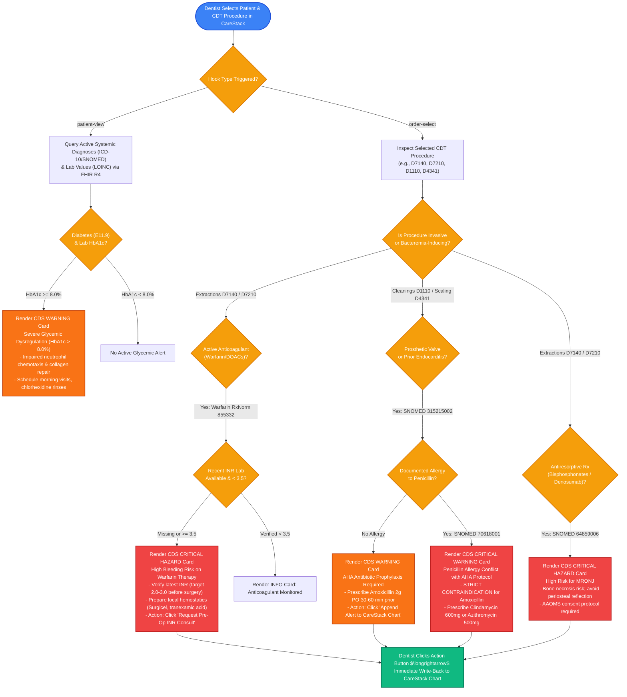
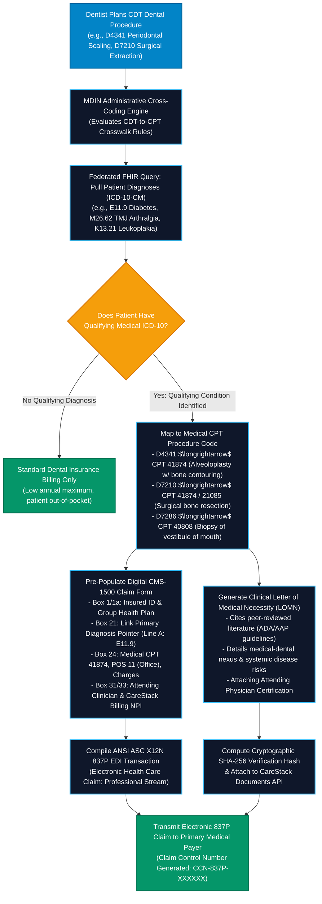
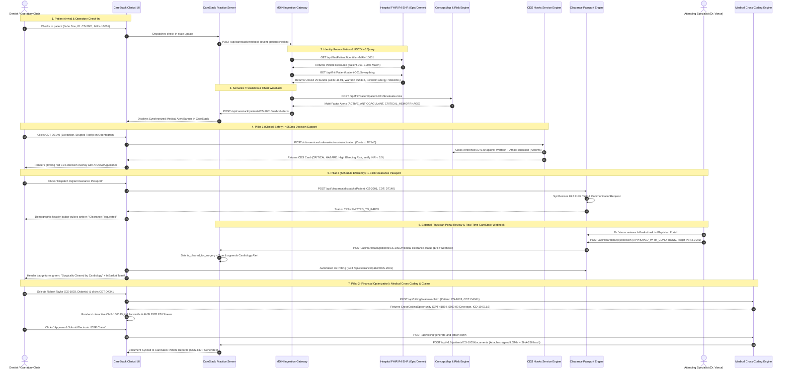

# Medical-Dental Interoperability Node (MDIN) for CareStack

### **DSOLVE 2026** · DRISHTI · College of Engineering Trivandrum (CET)
**Problem 6: Open Problem Statement (US & Global Dental Industry)**

[-emerald?style=flat-square&logo=pytest)](backend/tests)
[](https://developer.carestack.com/documentation)
[-blue?style=flat-square&logo=fire)](https://hl7.org/fhir/R4/)
[](https://cds-hooks.hl7.org/)
[](backend/app/routers/billing.py)
[](https://www.healthit.gov/topic/laws-regulation-and-policy/health-data-technology-and-interoperability-certification-program)
[](LICENSE)

---

## Executive Summary

| Dimension | Specification / Value |
|---|---|
| **System Name** | **Medical-Dental Interoperability Node (MDIN) for CareStack** |
| **Submission Track** | **Problem 6 — Open Problem Statement (US & Global Dental Industry)** |
| **Hackathon** | **DSOLVE 2026** (36-Hour National Physical Hackathon) · DRISHTI · CET |
| **Team Name** | **Team Aether** |
| **Target Platforms** | **CareStack Practice Management System (PMS)** $\longleftrightarrow$ **Enterprise Medical EHRs (Epic, Cerner, MEDITECH, HAPI FHIR)** |
| **Health IT Standards** | **CareStack Web API V1** (Three-Key Header Auth), **HL7® FHIR® R4.0.1 (USCDI v5)**, **CDS Hooks™ v1.0 / v2.0**, **FHIR ConceptMap ($translate)** |
| **Clearance Protocol** | **HL7 FHIR R4 Task & CommunicationRequest** $\longleftrightarrow$ **Hospital EHR InBasket Review & CareStack Webhook Callback** |
| **Billing & Claims Standards** | **ANSI ASC X12N 837P (Health Care Claim: Professional)**, **NUCC CMS-1500 (Form 1500 02-12)**, **ADA CDT-to-AMA CPT Crosswalk** |
| **Medical Terminologies Mapped** | **ICD-10-CM**, **SNOMED CT**, **RxNorm**, **LOINC** $\longrightarrow$ **ADA CDT Dental Procedure Codes** |
| **Automated Test Suite** | **146 / 146 Tests Passing** (`pytest backend/tests/ -v`) across 12 test modules (100% pass rate) |
| **Production Web Application** | `http://localhost:80` (or `http://localhost`) · Nginx SPA Reverse Proxy Gateway |
| **Direct Backend REST API** | `http://localhost:8000` · [Interactive Swagger UI](http://localhost:8000/docs) · [ReDoc Documentation](http://localhost:8000/redoc) |
| **CareStack Web API V1 Surface** | `http://localhost:8000/api/v1.0` (PatientViewModel, Appointments, Periodontal Charting, Procedure Codes, Documents) |
| **Development Clinical Interface** | `http://localhost:5173` (Vite Hot-Reloading React Chairside Dashboard) |

---

## The Three-Pillar Value Proposition Architecture

MDIN transforms dental care delivery by eliminating the operational, financial, and clinical silos dividing CareStack dental practices from hospital medical systems:

```
┌───────────────────────────────────────────────────────────────────────────────────────────────────┐
│                                   MDIN THREE-PILLAR ARCHITECTURE                                  │
├───────────────────────────────┬───────────────────────────────────┬───────────────────────────────┤
│    PILLAR 1: CLINICAL SAFETY  │    PILLAR 2: FINANCIAL SUPPORT    │   PILLAR 3: SCHEDULE DENSITY  │
│                               │                                   │                               │
│ • Sub-Second CDS Hooks        │ • Automated CDT-to-CPT Crosswalk  │ • 1-Click Clearance Passport  │
│   (<250ms Response SLA)       │ • Interactive CMS-1500 Compiler   │ • Replaces 5-7 Day Fax Cycles │
│ • High-Hemorrhage Alerts      │ • ANSI ASC X12N 837P EDI Stream   │ • Real-Time InBasket Portal   │
│   (Warfarin / DOACs + D7140)  │ • Auto-Generated Signed LOMN      │ • Authenticated Webhook Loop  │
│ • AHA Endocarditis Prophylaxis│ • Proof of Medical Necessity      │ • CareStack Chairside Polling │
│ • Cross-Allergy Interception  │ • $400 - $800+ Coverage Recovery  │ • Zero Wasted Chair Time      │
└───────────────────────────────┴───────────────────────────────────┴───────────────────────────────┘
```

### Pillar 1: Clinical Safety (Sub-Second Decision Support)
- **Problem**: Over 40–50% of dental patients fail to accurately report systemic medications on intake forms. Dentists routinely perform invasive extractions blind to active high-potency anticoagulants (causing catastrophic hemorrhage) or prosthetic heart valves (causing bacteremic bacterial endocarditis with up to 30% mortality).
- **MDIN Solution**: Real-time pre-procedural contraindication alerts powered by **HL7® FHIR® R4 (USCDI v5)**, semantic **FHIR ConceptMap** translations, and **CDS Hooks™ v1.0/v2.0** (`patient-view` and `order-select`).
- **Performance SLA**: Complete decision support evaluation executes in **< 250 milliseconds** at chairside, providing immediate AHA, ADA, and AAOMS clinical guideline citations.

### Pillar 2: Financial Decision Support (Medical Cross-Coding & Claims)
- **Problem**: Dental insurance has an archaic annual benefit cap of $1,000–$1,500/year, forcing patients to delay or reject medically necessary surgeries (e.g., periodontal treatment in uncontrolled diabetics, biopsy of oral lesions, surgical osseous recontouring). Meanwhile, primary medical insurance provides comprehensive coverage—but dental practices rarely cross-code due to Byzantine billing rules and the 45-minute burden of drafting Letters of Medical Necessity.
- **MDIN Solution**: Automated semantic mapping of ADA CDT codes to AMA CPT procedure codes linked directly to justifying systemic ICD-10-CM diagnoses. Generates an interactive, red-ink digital **CMS-1500** facsimile, an electronic **ANSI ASC X12N 837P EDI** claim transaction stream, and an automated, clinician-signed **Letter of Medical Necessity (LOMN)** with SHA-256 cryptographic verification auto-attached to CareStack's Document Repository.

### Pillar 3: Schedule Efficiency (The Digital Clearance Passport)
- **Problem**: When dentists identify medically fragile patients requiring specialist sign-off, obtaining clearance requires **5 to 7 business days** of manual phone calls, voicemails, and unreadable faxes. Practice schedules are disrupted, operatory chairs sit empty, emergency treatments are delayed, and patient care stalls.
- **MDIN Solution**: A 1-click **Digital Clearance Passport** that condenses a 7-day administrative nightmare into a **5-minute bidirectional digital workflow**. Dispatches standards-based **HL7 FHIR R4 Task** (code: `medical-clearance-request`) and **CommunicationRequest** resources straight to the attending specialist's hospital EHR InBasket (Epic / Cerner). External physicians review ConceptMap clinical justifications, specify target INR thresholds (e.g., `2.0 - 2.5`), and digitally sign off. CareStack receives an authenticated webhook callback (`POST /api/carestack/patients/{id}/medical-clearance-status`), instantly clearing the patient for surgery on the operatory odontogram.

---

## Table of Contents

1. [The Two-System Problem: Clinical, Operational & Financial Pain Points](#the-two-system-problem-clinical-operational--financial-pain-points)
2. [The Proposed Solution: MDIN Architecture](#the-proposed-solution-mdin-architecture)
   - [Pillar 1: Clinical Decision Support & CDS Hooks](#pillar-1-clinical-decision-support--cds-hooks)
   - [Pillar 2: Financial Cross-Coding & Claim Compilation](#pillar-2-financial-cross-coding--claim-compilation)
   - [Pillar 3: The Digital Clearance Passport & Webhook Callback](#pillar-3-the-digital-clearance-passport--webhook-callback)
3. [Architectural & Clinical Flowcharts](#architectural--clinical-flowcharts)
   - [1. Complete System Architecture & Interoperability Gateway](#1-complete-system-architecture--interoperability-gateway)
   - [2. Clinical Decision Support Logic Flowchart](#2-clinical-decision-support-logic-flowchart)
   - [3. Administrative Medical Cross-Coding & Claims Flowchart](#3-administrative-medical-cross-coding--claims-flowchart)
   - [4. End-to-End Interoperability & Clearance Sequence Diagram](#4-end-to-end-interoperability--clearance-sequence-diagram)
4. [Regulatory Compliance Matrix](#regulatory-compliance-matrix)
5. [Step-by-Step Setup & Quickstart Guide](#step-by-step-setup--quickstart-guide)
   - [1-Click Production Deployment (Docker & Compose)](#1-click-production-deployment-docker--compose)
   - [Automated Deployment Helper (`deploy.sh`)](#automated-deployment-helper-deploysh)
   - [Local Development Setup](#local-development-setup)
6. [API Reference & Sample Requests](#api-reference--sample-requests)
   - [Complete Endpoint Summary Table](#complete-endpoint-summary-table)
   - [Sample `curl` Commands & Payloads](#sample-curl-commands--payloads)
7. [Clinical Patient Personas & Live Demonstration Guide](#clinical-patient-personas--live-demonstration-guide)
8. [Automated Verification & Test Suite](#automated-verification--test-suite)
9. [Hackathon Submission Assets](#hackathon-submission-assets)

---

## The Two-System Problem: Clinical, Operational & Financial Pain Points

### The Systemic & Technological Chasm

In contemporary healthcare across the United States, the United Kingdom, and Australia, **dentistry and medicine exist in complete operational, legal, and technological isolation**. 

When modern hospital systems invested billions into certified enterprise Electronic Health Records (EHRs) such as **Epic, Cerner, and MEDITECH**—interconnecting them via the **HL7® FHIR®** standard—dental practices remained isolated inside specialized Practice Management Systems (PMS) such as **CareStack**. 

```
┌─────────────────────────────────────────────────────────┐          ┌─────────────────────────────────────────────────────────┐
│              ENTERPRISE MEDICAL HOSPITAL EHR            │          │             DENTAL PRACTICE MANAGEMENT SYSTEM           │
│                 (Epic / Cerner / MEDITECH)              │          │                       (CareStack)                       │
│                                                         │   VOID   │                                                         │
│ • Systemic Diagnoses (ICD-10-CM / SNOMED CT)            │  ══════  │ • Odontogram & Tooth Charting (FDI / Universal)         │
│ • Active Pharmacotherapy & Regimens (RxNorm)            │    ❌    │ • ADA CDT Procedure Codes (e.g., D7140, D4341)          │
│ • Diagnostic Laboratory Panels (LOINC: HbA1c, INR, PT)  │          │ • Paper/Tablet Self-Reported Health Questionnaires      │
│ • Documented Allergies & Drug Hypersensitivity Events   │          │ • Blind to Hospital Diagnoses, Active Meds & Blood Labs │
└─────────────────────────────────────────────────────────┘          └─────────────────────────────────────────────────────────┘
```

Dentists routinely perform invasive, aerosol-generating, bone-altering, and mucosal-penetrating surgical interventions without real-time knowledge of active pharmacotherapy, cardiac valvular implants, bleeding disorders, or organ-system dysfunctions.

---

### Life-Threatening Chairside Risks

The clinical divide directly triggers preventable, catastrophic medical emergencies in the dental operatory chair:

| Clinical Hazard | Medical Etiology & Therapy | Proposed Dental Procedure (CDT) | Preventable Adverse Event / Pathophysiological Hazard |
|---|---|---|---|
| **Severe Intraoperative Hemorrhage** | Atrial Fibrillation (`I48.91`) on **Warfarin Sodium** (`RxNorm: 855332`) or DOACs (Eliquis, Xarelto) | **D7140** (Simple Tooth Extraction) / **D7210** (Surgical Extraction) | Uncontrolled, life-threatening post-extraction oral hemorrhage. Safe surgical intervention mandates verifiable recent INR (<3.5 within 24–48 hours) and preparation of local hemostatic agents (oxidized regenerated cellulose, tranexamic acid mouthwash). |
| **Fatal Bacterial Endocarditis** | **Prosthetic Cardiac Valve** (`SNOMED: 315215002`) or history of Infective Endocarditis (`I33.0`) | **D1110** (Adult Prophylaxis) / **D4341** (Periodontal Scaling) | Subgingival mucosal manipulation induces transient bacteremia. Circulating oral bacteria (e.g., *Streptococcus viridans*) seed prosthetic valve leaflets, triggering subacute bacterial endocarditis with up to **30% mortality**. Mandates AHA 2g Amoxicillin premedication 30–60 min prior. |
| **Fatal Anaphylactic Shock** | Documented Type 1 IgE-Mediated **Penicillin Anaphylaxis** (`SNOMED: 70618001`) | Prophylactic Antibiotic Premedication | Prescribing standard empirical first-line Amoxicillin triggers sudden chairside respiratory collapse, angioedema, cardiovascular collapse, and death. Mandates immediate substitution with Clindamycin or Azithromycin. |
| **Medication-Related Osteonecrosis of the Jaw (MRONJ)** | Osteoporosis or Bone Metastases on **IV Bisphosphonates** (Zoledronic Acid) or **RANKL Inhibitors** (Denosumab) | **D7140** / **D7210** (Tooth Extractions), **D4260** (Osseous Surgery) | Suppression of osteoclastic remodeling leads to intractable, non-healing avascular bone exposure, severe chronic infection, and permanent disfiguring jaw resection. |
| **Impaired Glycemic Healing & Alveolar Osteitis** | Type 2 Diabetes Mellitus (`E11.9`) with **HbA1c = 9.2%** (`LOINC: 4548-4`) | **D7210** (Surgical Extraction) / **D4341** (Periodontal Scaling) | Severe hyperglycemia impairs neutrophil chemotaxis and microvascular perfusion, causing rampant surgical breakdown, severe dry socket (alveolar osteitis), and secondary deep-space fascial infections. |

---

### Operational & Administrative Failures

1. **Failure of Patient Self-Reporting (Recall Bias)**: Over 40% to 50% of dental patients fail to report complete medication regimens. Patients routinely omit anticoagulants, rarely recall exact HbA1c values, and forget cardiac surgical dates.
2. **The 5-to-7 Day Phone and Fax Chasm**: Traditional physician medical clearance requires 5–7 days of manual phone calls, voicemails, and unreadable faxes, causing empty operatory chairs, cancelled surgeries, and revenue leakage.
3. **Absence of Sub-Second Decision Support**: Dentists have lacked automated chairside decision engines that evaluate proposed CDT codes against hospital records in real time.

---

### The Financial Cross-Coding Barrier

- **The Dental-Medical Insurance Chasm**: Many surgical, biopsy, and complex periodontal procedures performed in dental practices have direct medical necessity roots (e.g., treating periodontitis in uncontrolled diabetics to reduce HbA1c, performing oral biopsies for suspected neoplastic leukoplakia, or alveoloplasty for reconstructive jaw disorders).
- **Lost Revenue & High Patient Out-of-Pocket Burden**: Because dental insurance has low annual caps (typically $1,000–$1,500/year), patients often delay vital treatments. Meanwhile, medical insurance provides comprehensive surgical coverage—but dental practices rarely submit medical claims due to the sheer complexity of translating CDT codes into **AMA CPT** codes and generating **CMS-1500** forms or **ANSI ASC X12N 837P** EDI transactions.
- **Burden of Medical Necessity Letters**: Medical payers routinely deny dental-surgical claims unless accompanied by an exhaustive, clinician-signed **Letter of Medical Necessity (LOMN)** proving systemic medical etiology. Drafting these manually requires 30–45 minutes of clinician time per patient.

---

## The Proposed Solution: MDIN Architecture

The **Medical-Dental Interoperability Node (MDIN)** is an open-standard, federated interoperability gateway engineered specifically for **CareStack**. It bridges CareStack PMS with enterprise hospital Electronic Health Records (Epic, Cerner, MEDITECH) using **HL7® FHIR® R4 (USCDI v5)**, semantic terminology translation, real-time **CDS Hooks™ v1.0/v2.0**, an automated administrative **Medical Cross-Coding Engine**, and an asynchronous **Digital Clearance Passport**.

### Pillar 1: Clinical Decision Support & CDS Hooks
- **CareStack Web API V1 Integration & Three-Key Authentication**: Direct compatibility with CareStack's enterprise security headers: `VendorKey`, `AccountKey`, and `AccountId`.
- **USCDI v5 Standard Conformance**: Queries standard FHIR R4 resources conforming to United States Core Data for Interoperability: `Patient`, `Condition` (ICD-10-CM / SNOMED CT), `MedicationRequest` (RxNorm), `AllergyIntolerance`, and `Observation` (LOINC).
- **FHIR ConceptMap Semantic Translation Engine**: Translates complex medical diagnoses into actionable dental risk categories via standard `$translate` endpoints, compound-evaluating multi-factor clinical risks.
- **HL7 CDS Hooks v1.0 / v2.0 Decision Support Engine**: Evaluates `patient-view` and `order-select` hooks sub-second (<250ms), surfacing concise evidence-based cards with AHA/ADA guideline citations and 1-click chart action dispatchers.

### Pillar 2: Financial Cross-Coding & Claim Compilation
- **CDT-to-CPT Crosswalk Matrix**: Maps CDT dental codes (e.g., `D4341`, `D7210`, `D7286`) to medical CPT codes (`41874`, `40808`, `21085`) linked to justifying ICD-10-CM systemic diagnoses.
- **Interactive CMS-1500 Digital Claim Form**: Pixel-perfect NUCC Form 1500 (02-12) claim facsimile with red-border styling, auto-populated diagnosis pointers, service lines, and billing NPIs.
- **ANSI ASC X12N 837P Electronic Claim Stream**: Generates syntactically valid HIPAA Title II EDI transactions ready for electronic medical clearinghouse transmission.
- **Automated Letter of Medical Necessity (LOMN)**: Synthesizes peer-reviewed medical-dental justifications and persists signed clinical documents with SHA-256 cryptographic verification hashes into CareStack's document repository.

### Pillar 3: The Digital Clearance Passport & Webhook Callback
- **HL7 FHIR R4 Task & CommunicationRequest Engine**: Assembles structured pre-operative clearance requests including patient demographics, dentist NPI, proposed dental procedures, and ConceptMap clinical rationale.
- **External Physician Clearance Portal**: Standalone hospital EHR provider portal (simulating Epic InBasket / Cerner Message Center) where attending specialists review clearance requests and enter explicit coagulation targets (e.g., target INR 2.0-2.5, hold medication directives).
- **Real-Time CareStack Webhook Callback**: Upon physician sign-off, dispatches an authenticated webhook (`POST /api/carestack/patients/{id}/medical-clearance-status`), instantly setting surgical clearance, appending chart alerts, and updating the chairside operatory view in real time.
- **Chairside Polling & Live Header Status Badge**: CareStack operatory polls clearance status every 3 seconds, rendering dynamic status pill badges (`Clearance Requested (InBasket Dispatched)`, `Surgically Cleared by Cardiology`, or `Clearance Denied`) with interactive detail popovers.


---

## Architectural & Clinical Flowcharts

#### 1. Complete System Architecture & Interoperability Gateway

```mermaid
flowchart TB
    subgraph CareStack_Ecosystem["CareStack Dental PMS Ecosystem"]
        CS_UI["CareStack Chairside Workstation\n(Odontogram, Procedure Toolbar & Polling)"]
        CS_PMS["CareStack Practice Management Server\n(Web API V1 Gateway & 3-Key Auth)"]
        CS_DOCS["CareStack Document Repository\n(Clinical Records & Signed LOMN)"]
        CS_ALERT["CareStack Clinical Alert Banner\n(EHR-Synced Contraindications)"]
    end

    subgraph MDIN_Gateway["MDIN Core Interoperability Node (FastAPI ASGI)"]
        AUTH["Three-Key Header Authenticator\n(VendorKey, AccountKey, AccountId)"]
        INGEST["Webhook Ingestion & Demographic Reconciliation\n(Probabilistic MPI Matcher)"]
        CDS_ENG["HL7 CDS Hooks Engine (<250ms)\n(patient-view & order-select)"]
        CONCEPT["FHIR ConceptMap Semantic Engine\n($translate & Multi-Factor Risk Synthesis)"]
        CLEARANCE["Digital Clearance Passport Engine\n(HL7 FHIR Task & CommunicationRequest)"]
        BILLING["Administrative Cross-Coding Engine\n(CDT-to-CPT Crosswalk & 837P EDI)"]
        LOMN_GEN["Medical Necessity Generator\n(Clinical Justification & SHA-256 Hash)"]
    end

    subgraph Enterprise_EHR["Enterprise Hospital Medical EHR Ecosystem"]
        FHIR_API["HL7 FHIR R4 Gateway\n(USCDI v5 Conformance)"]
        HAPI_TEST["HAPI FHIR Public Reference Server\n(https://hapi.fhir.org/baseR4)"]
        EPIC_CERNER["Hospital EHR Repositories\n(Epic / Cerner / MEDITECH)"]
        PHYSICIAN_PORTAL["External Physician Clearance Portal\n(Epic InBasket / Cerner Message Center Simulator)"]
    end

    %% Communications
    CS_UI <-->|REST & WebSockets| CS_PMS
    CS_PMS -->|patient.checkin Webhook| INGEST
    INGEST -->|USCDI v5 $everything Query| FHIR_API
    FHIR_API <--> HAPI_TEST
    FHIR_API <--> EPIC_CERNER

    CS_UI -->|Procedure Click: CDT D7140| CDS_ENG
    CDS_ENG <-->|Translate Codes & Check Rules| CONCEPT
    CDS_ENG -->|Sub-Second Decision Cards (<250ms)| CS_UI

    %% Pillar 3: Clearance Loop
    CS_UI -->|1-Click Clearance Dispatch| CLEARANCE
    CLEARANCE -->|FHIR Task & CommunicationRequest| PHYSICIAN_PORTAL
    PHYSICIAN_PORTAL -->|Sign-Off Decision with Target INR| CLEARANCE
    CLEARANCE -->|Real-Time Webhook Callback| CS_PMS
    CS_PMS -->|Append Alert & Update Clearance| CS_ALERT
    CS_UI <-->|3s Automated Polling| CLEARANCE

    %% Pillar 2: Financial Cross-Coding
    CS_UI -->|Trigger Financial Optimization| BILLING
    BILLING -->|Generate CMS-1500 & 837P EDI| CS_UI
    BILLING -->|Request Clinical Justification| LOMN_GEN
    LOMN_GEN -->|Ingest Signed LOMN Document| CS_DOCS
    INGEST -->|Write High-Priority Chart Alerts| CS_PMS

    classDef carestack fill:#0284c7,stroke:#0369a1,color:#ffffff,stroke-width:2px;
    classDef mdin fill:#0f172a,stroke:#38bdf8,color:#f8fafc,stroke-width:2px;
    classDef ehr fill:#059669,stroke:#047857,color:#ffffff,stroke-width:2px;

    class CS_UI,CS_PMS,CS_DOCS,CS_ALERT carestack;
    class AUTH,INGEST,CDS_ENG,CONCEPT,CLEARANCE,BILLING,LOMN_GEN mdin;
    class FHIR_API,HAPI_TEST,EPIC_CERNER,PHYSICIAN_PORTAL ehr;
```

---

### 2. Clinical Decision Support Logic Flowchart



---

### 3. Administrative Medical Cross-Coding & Claims Flowchart



---

### 4. End-to-End Interoperability & Clearance Sequence Diagram



---

## Regulatory Compliance Matrix

MDIN is architected from the ground up to comply with federal health IT mandates, patient privacy laws, and artificial intelligence safety regulations:

| Regulation / Mandate | Legal Citation | Specific MDIN Architectural Implementation | Compliance & Audit Impact |
|---|---|---|---|
| **HIPAA Privacy Rule: TPO Safe Harbor** | **45 CFR § 164.506(c)(2)** | Covered entities (dentists and hospital EHRs) disclose PHI for **Treatment, Payment, and Operations** without requiring separate patient authorization. | Authorizes real-time querying of active anticoagulants, cardiac implants, and lab results upon patient check-in at the dental practice. Zero breach exposure. |
| **ONC 21st Century Cures Act: Information Blocking** | **45 CFR Part 171** | Consumes standard RESTful **HL7® FHIR® R4 (USCDI v5)** endpoints (`Patient`, `Condition`, `MedicationRequest`, `AllergyIntolerance`, `Observation`). | Eliminates hospital EHR data-hoarding penalties. Certified hospital EHRs are legally required to fulfill MDIN's standardized USCDI queries. |
| **ONC HTI-1: Algorithmic Transparency & FAVES** | **45 CFR § 170.315(b)(11)** | Implements the **FAVES** principles (**Fair, Appropriate, Valid, Effective, Safe**) across all Decision Support Interventions (DSI). | No black-box AI hallucinations. All cards display plain-language clinical justification, source attribution (AHA, ADA, AAOMS), and explicit evidence provenance. |
| **HIPAA Title II: Electronic Claims Transactions** | **45 CFR Part 162** | Compiles compliant **ANSI ASC X12N 837P (005010X222A1)** electronic claim envelopes paired with NUCC Form 1500 (02-12). | Guaranteed clean-claim acceptance by primary medical clearinghouses for medically necessary dental surgeries. |
| **HL7 FHIR Interoperability Protocols** | **HL7 FHIR R4 Task & CDS Hooks v1.0/v2.0** | Standards-based `medical-clearance-request` FHIR Task and `patient-view` / `order-select` hook services. | Completely avoids fragile proprietary scrapers or single-vendor lock-in. Direct compatibility with Epic InBasket and Cerner Message Center. |

### 1. HIPAA Privacy Rule — Treatment, Payment, and Operations (TPO) Exception
Under **45 CFR § 164.506(c)(2)**, a covered entity may disclose protected health information for treatment activities of a health care provider. When a patient arrives at a dental clinic for an invasive procedure, the dental clinician is providing direct health care treatment. Querying the hospital medical record to verify active anticoagulant therapy, antibiotic allergies, or cardiac valve status is legally classified as a direct **Treatment Activity**, exempt from requiring individual HIPAA authorization forms between independent providers.

### 2. 21st Century Cures Act & ONC Interoperability Rule (45 CFR Part 171)
The Cures Act explicitly prohibits **Information Blocking** by Health IT developers and health systems. Certified hospital EHRs (Epic, Cerner, MEDITECH) are mandated by law to provide open, standardized RESTful FHIR APIs using standard US Core profiles without unreasonable fees or delays. MDIN exercises this exact federal right by connecting to public-facing and authenticated FHIR R4 gateways using standardized **USCDI v5** profiles.

### 3. ONC HTI-1 Final Rule — Algorithmic Transparency (FAVES Principles)
Under the ONC **Health Data, Technology, and Interoperability (HTI-1)** Final Rule, any Decision Support Intervention (DSI) must adhere to the **FAVES** governance framework:
- **Fair (F)**: Clinical rules evaluate objective medical evidence without demographic or payer bias.
- **Appropriate (A)**: Alerts fire only when clinical context warrants (e.g., `order-select` filters out routine examinations and targets high-bleeding extractions).
- **Valid (V)**: Built on deterministic clinical guidelines established by the American Heart Association (AHA), American Dental Association (ADA), and American Association of Oral and Maxillofacial Surgeons (AAOMS).
- **Effective (E)**: Every card includes a one-click resolution mechanism (*"Post Medical Alert"*, *"Dispatch Digital Clearance Passport"*), reducing clinician alert fatigue.
- **Safe (S)**: Complete explainability with plain-language diagnostic summaries, eliminating black-box AI risk.

### 4. HIPAA Title II Electronic Transaction & Code Sets Rule
Under **45 CFR Part 162**, health care claims transmitted electronically must conform to the **ANSI ASC X12N 837 Professional (Version 005010X222A1)** format. MDIN's administrative billing engine compiles syntactically validated 837P electronic claim envelopes, ensuring full regulatory and clearinghouse compliance.

---

## Step-by-Step Setup & Quickstart Guide

### Prerequisites
- **Python**: $\ge 3.10$
- **Node.js**: $\ge 18.0$ and **npm** $\ge 9.0$
- **Docker Engine**: $\ge 24.0$ and **Docker Compose** $\ge v2.20$ (for containerized deployment)
- **Operating System**: Linux, macOS, or Windows WSL2

---

### 1-Click Production Deployment (Docker & Compose)

Deploy the entire MDIN production stack—FastAPI ASGI backend, production Nginx reverse proxy, and Vite React SPA—in a single command:

```bash
docker compose up --build
```

To run in detached background mode:
```bash
docker compose up -d --build
```

#### Production Access & Endpoint Routing

| Service / Interface | URL | Description |
|---|---|---|
| **Chairside Clinical UI** | `http://localhost:80` (or `http://localhost`) | Production React SPA with client-side routing |
| **CareStack Web API V1** | `http://localhost:80/api/v1.0/` | CareStack Web API V1 compatible gateway |
| **MDIN Core & FHIR APIs** | `http://localhost:80/api/` | Reverse-proxied to `backend:8000/api/` |
| **CDS Hooks Service** | `http://localhost:80/cds-services` | Discovery and clinical decision support cards |
| **Interactive Swagger UI** | `http://localhost:80/docs` (or `:8000/docs`) | OpenAPI interactive endpoint documentation |
| **Health Check Telemetry** | `http://localhost:80/health` (or `:8000/health`) | Container orchestrator health probe |
| **Direct Backend Service** | `http://localhost:8000` | FastAPI ASGI backend container |

To tear down the containers:
```bash
docker compose down
```

---

### Automated Deployment Helper (`deploy.sh`)

MDIN includes an automated pre-flight verification and clean-build script:

```bash
chmod +x deploy.sh
./deploy.sh
```

The script automatically executes pre-flight checks, builds clean images, probes endpoint health with `curl`, and prints a formatted status banner.

---

### Option A: Automated One-Click Local Setup (`setup.sh`)

```bash
chmod +x setup.sh
./setup.sh
```
*Provisions the Python virtual environment, installs backend and frontend dependencies, and executes the automated test suite.*

---

### Option B: Manual Local Setup

#### 1. Backend Server Setup
From the repository root:

```bash
# 1. Create and activate a Python virtual environment
python3 -m venv .venv
source .venv/bin/activate

# 2. Install backend dependencies
pip install -r backend/requirements.txt

# 3. Copy environment template
cp backend/.env.example backend/.env

# 4. Start the FastAPI ASGI server with hot-reload
python backend/run.py
```

- **Backend API Base**: `http://localhost:8000`
- **Interactive OpenAPI (Swagger UI)**: `http://localhost:8000/docs`
- **Alternative ReDoc UI**: `http://localhost:8000/redoc`
- **Health Check Endpoint**: `http://localhost:8000/health`

#### 2. Frontend Development Server Setup
In a separate terminal:

```bash
# 1. Navigate to frontend directory
cd frontend

# 2. Install Node dependencies
npm install

# 3. Copy frontend environment template
cp .env.example .env

# 4. Launch Vite development server
npm run dev
```

- **Interactive Clinical UI**: `http://localhost:5173`
- *The Vite dev server automatically proxies all `/api`, `/cds-services`, and `/health` requests to port `8000`.*

---

## API Reference & Sample Requests

### Endpoint Summary Table

#### CareStack Web API V1 Endpoints (`/api/v1.0`)
All CareStack Web API V1 requests authenticate using three header keys: `VendorKey`, `AccountKey`, and `AccountId`.

| Category | Method | Endpoint | Description |
|---|---|---|---|
| **CareStack Auth** | `GET` | `/api/v1.0/auth/verify` | Verify 3-key CareStack credentials |
| **CareStack Patients** | `GET` | `/api/v1.0/patients/{id}` | Read single patient record (`PatientViewModel`) |
| **CareStack Patients** | `POST` | `/api/v1.0/patients/search` | Search patients with `SearchRequest` |
| **CareStack Patients** | `POST` | `/api/v1.0/patients` | Create new dental patient record |
| **CareStack Patients** | `PUT` | `/api/v1.0/patients` | Update existing dental patient record |
| **CareStack Perio** | `GET` | `/api/v1.0/patients/{id}/periodontal-charting` | Full-mouth periodontal probing examination |
| **CareStack Procedures**| `GET` | `/api/v1.0/procedure-codes` | List ADA CDT dental procedure codes |
| **CareStack Treatments**| `GET` | `/api/v1.0/treatments/appointment-procedures/{id}` | Get procedure codes assigned to appointment |
| **CareStack Appts** | `POST` | `/api/v1.0/appointments` | Book new chairside appointment |
| **CareStack Appts** | `GET` | `/api/v1.0/appointments/{id}` | Read appointment details |
| **CareStack Appts** | `PUT` | `/api/v1.0/appointments/{id}/modify-status` | Modify status (`Scheduled`, `InChair`, etc.) |
| **CareStack Appts** | `PUT` | `/api/v1.0/appointments/{id}/checkout` | Checkout appointment post-procedure |
| **CareStack Appts** | `PUT` | `/api/v1.0/appointments/{id}/cancel` | Cancel chairside appointment |
| **CareStack Appts** | `GET` | `/api/v1.0/appointment-status` | List all available appointment statuses |
| **CareStack Sync** | `GET` | `/api/v1.0/sync/patients` | Incremental patient synchronization |
| **CareStack Sync** | `GET` | `/api/v1.0/sync/treatment-procedures` | Incremental dental treatment procedure synchronization |
| **CareStack Practice** | `GET` | `/api/v1.0/locations` | List clinic practice locations |
| **CareStack Practice** | `GET` | `/api/v1.0/operatories` | List practice operatories / chairs |
| **CareStack Docs** | `GET` | `/api/v1.0/patients/{id}/documents` | Retrieve clinical documents & LOMN attached to chart |
| **CareStack Docs** | `POST` | `/api/v1.0/patients/{id}/documents` | Attach signed clinical document/LOMN with SHA-256 |

#### MDIN Core, FHIR R4, CDS Hooks & Billing Endpoints

| Category | Method | Endpoint | Description |
|---|---|---|---|
| **System** | `GET` | `/health` | Node health status and version telemetry |
| **System** | `GET` | `/` | Service directory and metadata links |
| **CareStack MDIN** | `GET` | `/api/carestack/status` | Connectivity and sync status with CareStack PMS |
| **CareStack MDIN** | `GET` | `/api/carestack/patients` | List CareStack dental patients & active treatment plans |
| **CareStack MDIN** | `POST` | `/api/carestack/webhook` | Ingest appointment/check-in events and trigger sync |
| **CareStack MDIN** | `POST` | `/api/carestack/patients/{id}/medical-alerts` | Write medical contraindication back to CareStack chart |
| **CareStack MDIN** | `GET` | `/api/carestack/patients/{id}/medical-alerts` | Retrieve posted medical alerts for a patient chart |
| **CareStack MDIN** | `POST` | `/api/carestack/patients/{id}/medical-clearance-status` | Webhook callback for external physician clearance status |
| **CareStack MDIN** | `GET` | `/api/carestack/patients/{id}/medical-clearance-status` | Get CareStack patient's live medical clearance status |
| **CareStack MDIN** | `POST` | `/api/carestack/sync` | Trigger bi-directional PMS $\leftrightarrow$ EHR sync |
| **FHIR R4** | `GET` | `/api/fhir/metadata` | HL7 FHIR R4 `CapabilityStatement` |
| **FHIR R4** | `GET` | `/api/fhir/server-status` | Probe live HL7 public test server ping latency |
| **FHIR R4** | `GET` | `/api/fhir/Patient` | Probabilistic demographic search for patients |
| **FHIR R4** | `GET` | `/api/fhir/Patient/{id}` | Read single FHIR Patient by ID or MRN |
| **FHIR R4** | `GET` | `/api/fhir/Patient/{id}/$everything` | **USCDI v5** comprehensive medical record bundle export |
| **FHIR R4** | `POST` | `/api/fhir/ConceptMap/$translate` | Translate medical code (ICD/SNOMED/RxNorm) to dental alert |
| **FHIR R4** | `POST` | `/api/fhir/Patient/{id}/$evaluate-risks` | Synthesize multi-factor dental risks from patient EHR |
| **CDS Hooks** | `GET` | `/cds-services` | CDS Hooks v1.0/v2.0 discovery catalog |
| **CDS Hooks** | `POST` | `/cds-services/patient-view-alert` | Evaluate `patient-view` hook when opening patient chart |
| **CDS Hooks** | `POST` | `/cds-services/order-select-contraindication` | Evaluate `order-select` hook on CDT procedure selection |
| **Clearance Passport**| `POST` | `/api/clearance/dispatch` | Dispatch Digital Clearance Passport via FHIR Task |
| **Clearance Passport**| `GET` | `/api/clearance/patient/{patient_id}` | Retrieve clearance requests & decisions for a patient |
| **Clearance Passport**| `GET` | `/api/clearance/{request_id}` | Get specific clearance passport by request ID |
| **Clearance Passport**| `POST` | `/api/clearance/{request_id}/decision` | Attending physician signs clearance & triggers webhook |
| **Medical Billing**| `POST` | `/api/billing/evaluate-claim` | Evaluate dental CDT for medical CPT cross-coding |
| **Medical Billing**| `GET` | `/api/billing/crosswalk-rules` | Get active FHIR ConceptMap CDT-to-CPT crosswalk rules |
| **Medical Billing**| `POST` | `/api/billing/generate-837p` | Convert CMS-1500 claim into ANSI ASC X12N 837P EDI |
| **Medical Billing**| `POST` | `/api/billing/generate-and-attach-lomn` | Generate Letter of Medical Necessity & attach to CareStack |

---

### Sample `curl` Commands & Payloads

#### 1. CareStack Web API V1 Authentication & Patient Retrieval
```bash
curl -s http://localhost:8000/api/v1.0/patients/2001 \
  -H "VendorKey: demo-vendor-key" \
  -H "AccountKey: demo-account-key" \
  -H "AccountId: demo-account-001" \
  -H "Accept: application/json"
```
```json
{
  "Id": 2001,
  "PatientIdentifier": "CS-2001",
  "Prefix": "NotSet",
  "FirstName": "John",
  "MiddleName": null,
  "LastName": "Doe",
  "Suffix": null,
  "DOB": "1968-04-12",
  "Gender": "Male",
  "MaritalStatus": "Single",
  "Status": "Active",
  "Email": "john.doe@example.com",
  "Mobile": "555-0101",
  "AddressDetail": {
    "Line1": "123 Dental Way",
    "City": "Boston",
    "State": "MA",
    "Zip": "02115",
    "Country": "United States"
  }
}
```

---

#### 2. CareStack Webhook Check-In Ingestion (`patient.checkin`)
```bash
curl -s -X POST http://localhost:8000/api/carestack/webhook \
  -H "Content-Type: application/json" \
  -d '{
    "event_type": "patient.checkin",
    "patient": {
      "id": "CS-2001",
      "first_name": "John",
      "last_name": "Doe",
      "birth_date": "1968-04-12",
      "gender": "male",
      "mrn": "MRN-10001"
    }
  }'
```
```json
{
  "status": "synchronized",
  "message": "Patient John Doe successfully resolved and synchronized with Medical EHR (patient-001).",
  "carestack_patient_id": "CS-2001",
  "matched_ehr_patient_id": "patient-001",
  "match_confidence": 1.0,
  "match_type": "exact_mrn",
  "cached": true,
  "alerts_generated": 2,
  "alerts": [
    {
      "alert_type": "critical",
      "category": "coagulation",
      "title": "CRITICAL: Anticoagulation / Hemorrhage Risk (Warfarin Therapy)",
      "details": "Patient is actively prescribed Warfarin Sodium 5 MG for Atrial Fibrillation. Planned dental surgical extraction carries substantial postoperative hemorrhage risk. Verify recent INR (<3.5 within 24-48 hours) and prepare local hemostatic agents (Surgicel, tranexamic acid rinse).",
      "action_required": "Confirm INR level and deploy local hemostatic measures."
    },
    {
      "alert_type": "critical",
      "category": "allergy",
      "title": "CRITICAL: Severe Penicillin Allergy (Anaphylaxis Risk)",
      "details": "Patient has documented Type 1 anaphylactic hypersensitivity to Penicillin. Strict contraindication for Amoxicillin/Penicillin V. Prescribe Clindamycin or Azithromycin if antibiotic indicated.",
      "action_required": "Avoid all beta-lactam antibiotics. Use Clindamycin or Azithromycin alternative."
    }
  ],
  "synchronized_at": "2026-09-18T00:00:00.000000+00:00"
}
```

---

#### 3. FHIR ConceptMap Semantic `$translate`
Translates RxNorm code `855332` (Warfarin Sodium 5 MG Oral Tablet) into a dental clinical alert concept:

```bash
curl -s -X POST http://localhost:8000/api/fhir/ConceptMap/\$translate \
  -H "Content-Type: application/json" \
  -d '{
    "system": "http://www.nlm.nih.gov/research/umls/rxnorm",
    "code": "855332"
  }'
```
```json
{
  "resourceType": "Parameters",
  "result": true,
  "message": "1 match(es) found for http://www.nlm.nih.gov/research/umls/rxnorm|855332",
  "match": [
    {
      "equivalence": "equivalent",
      "concept": {
        "system": "http://carestack.com/fhir/ValueSet/dental-clinical-alerts",
        "code": "ACTIVE_ANTICOAGULANT",
        "display": "Active anticoagulant therapy, mandatory INR monitoring"
      },
      "source": "medical-to-dental-contraindications"
    }
  ]
}
```

---

#### 4. CDS Hook: `order-select` (John Doe + CDT D7140 Tooth Extraction)
Fires sub-second when the clinician selects extraction CDT `D7140`:

```bash
curl -s -X POST http://localhost:8000/cds-services/order-select-contraindication \
  -H "Content-Type: application/json" \
  -d '{
    "hook": "order-select",
    "hookInstance": "hook-req-001",
    "context": {
      "patientId": "patient-001",
      "procedureCode": "D7140",
      "selections": ["D7140"]
    }
  }'
```
```json
{
  "cards": [
    {
      "summary": "High Bleeding Hazard: Patient on Anticoagulant (Warfarin)",
      "detail": "Clinical guidance citing AHA/ADA guidelines: Verify latest INR (target 2.0-3.0 before invasive dental surgery). Prepare local hemostatic agents (e.g., absorbable gelatin sponge, sutures, 4.8% tranexamic acid mouthwash). Routine anticoagulant cessation is not recommended for minor oral surgery without consulting the prescribing physician.",
      "indicator": "critical",
      "source": {
        "label": "MDIN Hematology Surveillance Node",
        "url": "https://www.heart.org"
      },
      "suggestions": [
        {
          "label": "Order Pre-Op INR Lab Verification & MD Consult",
          "uuid": "sugg-inr-001",
          "actions": [
            {
              "type": "create",
              "description": "Order INR Lab Verification or request MD consult",
              "resource": {
                "resourceType": "ServiceRequest",
                "code": {
                  "coding": [
                    {
                      "system": "http://loinc.org",
                      "code": "6301-6",
                      "display": "INR in Blood"
                    }
                  ]
                }
              }
            }
          ]
        }
      ],
      "links": [
        {
          "label": "ADA Anticoagulant Guidelines",
          "url": "https://www.ada.org",
          "type": "absolute"
        }
      ]
    }
  ]
}
```

---

#### 5. Medical Cross-Coding Evaluation (`POST /api/billing/evaluate-claim`)
Evaluates periodontal scaling (`D4341`) for Robert Taylor (`CS-1003`) with Type 2 Diabetes (`E11.9`):

```bash
curl -s -X POST http://localhost:8000/api/billing/evaluate-claim \
  -H "Content-Type: application/json" \
  -d '{
    "patient_id": "CS-1003",
    "cdt_code": "D4341"
  }'
```
```json
{
  "is_eligible": true,
  "cdt_code": "D4341",
  "cdt_display": "Periodontal scaling and root planing - four or more teeth per quadrant",
  "suggested_cpt": "41874",
  "cpt_display": "Alveoloplasty, each quadrant (with bone contouring)",
  "reimbursement_category": "Periodontal Osseous & Scaling Cross-Coding",
  "estimated_coverage": 600.0,
  "justifying_icd10": ["E11.9"],
  "narrative_justification": "Periodontal disease management directly modulates systemic glycemic control in patients with Type 2 Diabetes Mellitus (ICD-10 E11.9). Without surgical intervention, severe infection exacerbates systemic insulin resistance. Medical primary coverage recommended.",
  "claim_preview": {
    "insurance_type": "GROUP_HEALTH_PLAN",
    "insured_id": "MED-10003",
    "patient_name": "TAYLOR, ROBERT",
    "diagnosis_codes": [
      {
        "pointer": "A",
        "code": "E11.9",
        "description": "Type 2 Diabetes Mellitus without complications"
      }
    ],
    "service_lines": [
      {
        "cpt_code": "41874",
        "diagnosis_pointer": "A",
        "charges": 600.0,
        "days_or_units": 1
      }
    ],
    "total_charge": 600.0
  }
}
```

---

#### 6. Automated Letter of Medical Necessity & CareStack Document Ingestion
```bash
curl -s -X POST http://localhost:8000/api/billing/generate-and-attach-lomn \
  -H "Content-Type: application/json" \
  -d '{
    "patient_id": "CS-1003",
    "cdt_code": "D4341"
  }'
```
```json
{
  "status": "success",
  "document_id": "DOC-LOMN-CS-1003-D4341",
  "preview_content": "# LETTER OF MEDICAL NECESSITY...",
  "claim_opportunity": {
    "is_eligible": true,
    "suggested_cpt": "41874",
    "estimated_coverage": 600.0
  },
  "verification_hash": "e3b0c44298fc1c149afbf4c8996fb92427ae41e4649b934ca495991b7852b855"
}
```

---

## Clinical Patient Personas & Live Demonstration Guide

MDIN includes 5 standardized, evidence-based clinical personas demonstrating real-world cross-specialty clinical and administrative interoperability:

| Persona | Identifiers | Hospital Diagnoses & Lab Panels | Active Pharmacotherapy & Allergies | CareStack Planned Treatment | Interoperability Finding & Action |
|---|---|---|---|---|---|
| **1. John Doe** | **CS-2001**<br>`MRN-10001`<br>`patient-001` | Atrial Fibrillation (`I48.91`) | **Warfarin Sodium 5 MG** (`855332`)<br>⚠️ **Penicillin Anaphylaxis** (`70618001`) | **D7140** (Extraction Tooth #30)<br>**D4341** (Scaling LL Quadrant) | 🔴 **CRITICAL HAZARD & CLEARANCE**: Anticoagulant bleeding risk. CDS Hook enforces pre-op INR verification (<3.5) and local hemostatics. 1-click **Digital Clearance Passport** dispatches to Dr. Vance (Cardiology), who approves with target INR `2.0 - 2.5`. |
| **2. Jane Smith** | **CS-2002**<br>`MRN-10002`<br>`patient-002` | **Prosthetic Cardiac Valve** (`315215002`)<br>Prior Endocarditis (`I33.0`) | Aspirin 81 MG (`243670`)<br>No known drug allergies | **D1110** (Adult Prophylaxis Cleaning)<br>**D2740** (Crown #14) | 🟡 **WARNING / MANDATORY**: Routine scaling induces bacteremia. AHA guidelines require prophylactic Amoxicillin 2g PO 30–60 min prior to prevent fatal Infective Endocarditis. |
| **3. Robert Taylor** | **CS-1003**<br>`MRN-10003`<br>`patient-003` | Type 2 Diabetes Mellitus (`E11.9`)<br>🧪 **HbA1c = 9.2%** (`4548-4`) | Metformin 1000 MG<br>No known drug allergies | **D4341** (Periodontal Scaling)<br>**D7210** (Surgical Extraction) | 🟢 **FINANCIAL CROSS-CODING**: Severe glycemic dysregulation (HbA1c 9.2%). Medical cross-coding links D4341 to CPT `41874` ($600 medical coverage), auto-generates CMS-1500 & 837P EDI, and attaches clinician-signed LOMN to CareStack. |
| **4. Marcus Chen** | **CS-2004**<br>`MRN-10004`<br>`patient-004` | TMJ Arthralgia (`M26.62`)<br>Impacted Tooth Pain | NSAIDs PRN<br>No known drug allergies | **D7210** (Surgical Extraction #17) | 🟢 **SURGICAL CROSS-CODING**: Bony impaction with joint pathology cross-codes to CPT `41874` / `21085`, generating medical reimbursement documentation. |
| **5. Sarah Jenkins** | **CS-2005**<br>`MRN-10005`<br>`patient-005` | Oral Leukoplakia (`K13.21`)<br>Suspected Dysplasia | Topical Corticosteroid<br>No known drug allergies | **D7286** (Incisional Biopsy) | 🟢 **PATHOLOGY CROSS-CODING**: Neoplastic biopsy cross-codes directly to medical CPT `40808` (Biopsy of vestibule of mouth), pre-populating CMS-1500 claim form. |

---

### Step-by-Step Live Demo Protocol

Follow this clickstream for the 3 core demonstration scenarios during judging:

#### Demo 1: John Doe (`CS-2001`) — Anticoagulant Hemorrhage & Digital Clearance Passport
1. **Open Operatory**: In the CareStack Patient Selector, choose **John Doe (`CS-2001`)**.
2. **Trigger Safety Hook**: Under *CDT Procedure Selection*, click **`D7140` (Extraction, Erupted Tooth)**.
3. **Inspect Sub-Second CDS Card**: A glowing red card fires in `<250ms`:
   - *"CRITICAL CLINICAL HAZARD: High Bleeding Hazard on Warfarin Therapy"*.
   - Plain-language AHA/ADA guidance details local hemostatics (Gelfoam, tranexamic acid rinse).
4. **Dispatch Clearance Passport**: Click **"Dispatch Digital Clearance Passport"**.
   - Spinner transmits the HL7 FHIR Task (`medical-clearance-request`).
   - The card updates to *"Passport Dispatched to Dr. Kenneth Vance (Metropolitan Heart Center)"*.
   - A pulsing amber badge appears in the patient demographic header: **`Clearance Requested (InBasket Dispatched)`**.
5. **Simulate External Specialist Sign-Off**:
   - Click the amber badge to open the interactive popover detailing attending cardiologist, target INR parameters, and verification timestamp.
   - Click **"Simulate Incoming EHR Webhook Callback"** (or switch tabs to the **External Physician Portal**, review the InBasket task, and click *"Electronically Sign & Transmit"*).
6. **Live Operatory Verification**:
   - The demographic badge immediately flips to emerald: **`Surgically Cleared by Cardiology`**.
   - A slide-in toast confirms: *"New InBasket Notification: Dr. Kenneth Vance approved CDT D7140 clearance with condition: Target INR 2.0-2.5."*
   - Chart alerts reload showing the new medical alert.

#### Demo 2: Jane Smith (`CS-2002`) — Endocarditis Prophylaxis & Allergy Safety
1. **Switch Patient**: Select **Jane Smith (`CS-2002`)**.
2. **Trigger Bacteremia Hook**: Click **`D1110` (Prophylaxis - Adult Cleaning)** or **`D4341`**.
3. **Review Card**: Amber card fires:
   - *"CLINICAL REVIEW REQUIRED: AHA Antibiotic Prophylaxis Required — Prosthetic Cardiac Valve"*.
   - Mandates Amoxicillin 2g PO 30–60 minutes prior to mucosal manipulation to prevent fatal subacute bacterial endocarditis.
4. **Inspect Allergy Interception**: If a penicillin allergy is introduced, MDIN immediately suppresses Amoxicillin and recommends safe macrolides (Clindamycin 600mg or Azithromycin 500mg).
5. **Write Back**: Click **"Post Medical Alert to CareStack Chart"** to synchronize the alert with the patient's record.

#### Demo 3: Robert Taylor (`CS-1003`) — Diabetic Periodontal Cross-Coding & CMS-1500
1. **Switch Patient**: Select **Robert Taylor (`CS-1003`)** (Type 2 Diabetes, HbA1c 9.2%).
2. **Trigger Financial Optimization**: Click **`D4341` (Perio Scaling & Root Planing)**.
3. **Inspect Emerald Opportunity Card**:
   - *"Medical Cross-Coding Opportunity Identified — Est. Medical Coverage: $600.00"*.
   - Shows automatic crosswalk to CPT `41874` justified by ICD-10 `E11.9`.
4. **Open Billing Facsimile**: Click **"Review Medical Claim & LOMN"** (or open via toolbar).
   - Inspect authentic red-ink digital **CMS-1500** form (NUCC Form 02-12).
   - Inspect compiled **ANSI ASC X12N 837P EDI** transaction stream.
   - Inspect the formal, clinician-signed **Letter of Medical Necessity (LOMN)** citing ADA/AAP periodontal-systemic nexus.
5. **Approve Claim**: Click **"Approve & Submit Electronic 837P Claim"**.
   - Generates Claim Control Number (`CCN-837P-...`).
   - Automatically attaches the LOMN document to CareStack's Document Repository with SHA-256 cryptographic verification.

---

## Frontend Chairside Interface Guide

The frontend application (`frontend/src/App.jsx`) is engineered as an interactive split-screen clinical workstation modeled after the **CareStack Dental Practice Management** operatory workflow:

```
┌────────────────────────────────────────────────────────────────────────────────────────┐
│ [Activity] CareStack MDIN — Medical-Dental Interoperability Node    [● Backend Live]   │
│                                           [Trigger Webhook Sync] [Interactive Docs]    │
├───────────────────────────────────────────┬────────────────────────────────────────────┤
│         LEFT COLUMN: CARESTACK CHART      │    RIGHT COLUMN: CDS DECISION & EHR TRACE  │
│                                           │                                            │
│ Patient Selector: [John Doe (CS-2001)  ▼] │ LIVE CDS DECISION OVERLAY                  │
│ • Demographics: Male, 58 yrs (1968-04-12) │ ┌────────────────────────────────────────┐ │
│ • Clearance: [Surgically Cleared 🛡️]       │ │ 🔴 CRITICAL HAZARD                     │ │
│ • Active Alerts Banner (Warfarin, Allergy)│ │ High Bleeding Hazard: Patient on       │ │
│                                           │ │ Anticoagulant (Warfarin)               │ │
│ CDT PROCEDURE TOOLBAR (Odontogram)        │ │ • Verify INR target 2.0-3.0            │ │
│ [D0120 Periodic Oral Evaluation]          │ │ • Prepare local hemostatics (Surgicel) │ │
│ [D1110 Adult Prophylaxis (Cleaning)]      │ │ [Dispatch Digital Clearance Passport]  │ │
│ [D4341 Periodontal Scaling]               │ └────────────────────────────────────────┘ │
│ [D7140 Extraction, Erupted Tooth] ← Click │                                            │
│ [D7210 Surgical Extraction]               │ FEDERATED MEDICAL EHR (Epic / Cerner)      │
│                                           │ • Conditions: Atrial Fibrillation (I48.91) │
│ FINANCIAL OPTIMIZATION                    │ • Meds: Warfarin Sodium 5 MG (RxNorm)      │
│ [Open CMS-1500 & 837P Billing Dashboard]  │ • Allergies: Penicillin (Anaphylaxis)      │
│                                           │ [Toggle ConceptMap Translation Trace]      │
│ ACTIVE DENTAL TREATMENT PLAN              │                                            │
│ • D7140: Tooth #30 - Proposed ($250.00)   │                                            │
│ • D4341: LL Quadrant - Scheduled ($320.00)│                                            │
└───────────────────────────────────────────┴────────────────────────────────────────────┘
```

---

## Automated Verification & Test Suite

MDIN features an exhaustive automated test suite written with **Pytest** and the **FastAPI TestClient**, covering **146 discrete test cases** across 12 test modules with a 100% pass rate:

```bash
# 1. Activate virtual environment
source .venv/bin/activate

# 2. Execute full test suite
pytest backend/tests/ -v

# 3. Execute end-to-end integration test specifically
pytest backend/tests/test_mdin_e2e_full.py -v
```

### Test Suite Execution Output

```
============================== test session starts ==============================
platform linux -- Python 3.14.7, pytest-9.1.1, pluggy-1.6.0
rootdir: /home/flykrth/Desktop/aether
collected 146 items

backend/tests/test_carestack_api.py ..................                   [ 12%]
backend/tests/test_fhir_public_server.py ......                          [ 16%]
backend/tests/test_main.py ..........                                    [ 23%]
backend/tests/test_mdin_e2e_full.py .............                        [ 32%]
backend/tests/test_mdin_suite.py .............                           [ 41%]
backend/tests/test_phase2_mdin.py ...........                            [ 48%]
backend/tests/test_phase3_terminology.py .............                   [ 57%]
backend/tests/test_phase4_cds_hooks.py ................                  [ 68%]
backend/tests/test_step11_clearance.py ...........                       [ 76%]
backend/tests/test_step12_callback.py ...                                [ 78%]
backend/tests/test_step8_cross_coding.py .................               [ 89%]
backend/tests/test_step9_lomn.py ...............                         [100%]

======================= 146 passed, 2 warnings in 22.95s =======================
```

### Test Coverage Highlights
- **`test_step11_clearance.py` (11 tests)**: Validates HL7 FHIR R4 `Task` (code: `medical-clearance-request`) and `CommunicationRequest` schema compliance, automatic attending cardiologist resolution (Dr. Kenneth Vance, MD), ConceptMap clinical rationale synthesis, and in-memory clearance passport lifecycle.
- **`test_step12_callback.py` (3 tests)**: Validates real-time physician decision webhook (`POST /api/carestack/patients/{id}/medical-clearance-status`), CareStack patient persistence, `is_cleared_for_surgery` boolean flag, and chart alert appends.
- **`test_step8_cross_coding.py` (17 tests)**: Administrative cross-coding engine, CDT-to-CPT mapping rules, CMS-1500 model validation, ANSI ASC X12N 837P EDI compilation, custom diagnostic overrides.
- **`test_step9_lomn.py` (15 tests)**: Clinical Letter of Medical Necessity synthesis, peer-reviewed medical-dental nexus citations, CareStack Document Management API (JSON and multipart attachments), SHA-256 cryptographic verification.
- **`test_phase4_cds_hooks.py` (16 tests)**: CDS discovery specification compliance, summary character limits ($\le 140$ chars), `patient-view` and `order-select` evaluations, prefetch payload optimizations, high hemorrhage warnings on Warfarin, AHA antibiotic prophylaxis on prosthetic valve.
- **`test_phase3_terminology.py` (13 tests)**: ConceptMap `$translate` operations for ICD-10, SNOMED, and RxNorm, multi-factor risk synthesis (`$evaluate-risks`), anticoagulant + cardiovascular hemorrhage escalation, prophylaxis + penicillin allergy conflict warnings.
- **`test_carestack_api.py` (18 tests)**: Three-key header authentication validation (`VendorKey`, `AccountKey`, `AccountId`), `PatientViewModel` retrieval & lifecycle, `SearchRequest` queries, periodontal probing depth charting, CDT procedure codes, appointment scheduling lifecycle.
- **`test_mdin_e2e_full.py` (13 tests)**: Complete end-to-end clinical workflow from check-in webhook to CDS card rendering, clearance dispatch, and chart write-back.

---

## Hackathon Submission Assets

In accordance with the **DSOLVE 2026** submission guidelines, the repository provides complete presentation scripts, walkthrough guides, and pitch materials:

- **Social Pitch Video Script**: [`docs/pitch_video_script.md`](docs/pitch_video_script.md) — Timed 38–42s script for social video submission tagging `@Drishti` and `@CareStack`.
- **Live Judging Presentation & Protocol**: [`docs/judging_presentation.md`](docs/judging_presentation.md) — 3–5 minute executive presentation guide, slide deck outline, and comprehensive technical defense Q&A.
- **Automated CLI Demo Script**: [`assets/demo/demo_api_walkthrough.sh`](assets/demo/demo_api_walkthrough.sh) — Run `./assets/demo/demo_api_walkthrough.sh` to execute a live, colorful terminal demonstration of all API endpoints and clinical scenarios.
- **Detailed Clinical Walkthrough**: [`assets/demo/DEMO_WALKTHROUGH.md`](assets/demo/DEMO_WALKTHROUGH.md) — Step-by-step presentation script and live demo cheat sheet.
- **Submission Readiness Checklist**: [`SUBMISSION_CHECKLIST.md`](SUBMISSION_CHECKLIST.md) — Official DSOLVE 2026 verification checklist with 146/146 tests verified.

---

## Built by Team Aether

Developed for **DSOLVE 2026** · DRISHTI · College of Engineering Trivandrum (CET).  
*Dedicated to bridging medical and dental healthcare to ensure no patient suffers a preventable surgical complication.*
