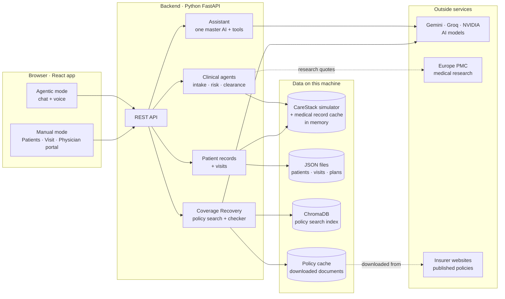

# Cross-Walk: how the project works, and why it is built this way

A plain-language guide to the whole project. Read this first; `MAO_PLATFORM.md` is the deep technical reference.

> **Names you will see.** The product is **Cross-Walk**. Older names survive in the code and docs: **MDIN**
> (Medical-Dental Interoperability Node, the original backend) and **MAO** (Multi-Agent Orchestrator, the agent layer).
> They are the same project.

---

## 1. What it is, in one paragraph

A dentist sees teeth. The things that make a dental procedure dangerous (a blood thinner, a recent heart stent, a bone
drug, a heart valve, an allergy) live in a hospital record the dental office never sees. Cross-Walk sits beside the
CareStack dental system and closes that gap: it brings the patient's medical history into the dental visit, warns about
risks **before** the procedure, gets the physician's clearance when needed, and afterwards answers the money question
honestly: bill the dental plan, or, if that cannot pay, is there a *genuine* medical-insurance route? Everything can be
done on screen or simply by chatting or talking to it.

## 2. The big picture



Two ways in, one brain behind them. **Agentic mode** is a chat window. **Manual mode** is three screens. Both call the
same backend, so anything you can click you can also ask for.

## 3. One visit, step by step

This is the path the whole product is built around.

| Step | What the person does | What happens inside |
| :-- | :--- | :--- |
| **1. Patient** | Adds a patient by form, by chat, by voice, or by uploading an old record (PDF or text) | The patient is created in the CareStack simulator and gets a linked medical record. Uploaded documents are read and the history is pulled out |
| **2. History** | Reviews conditions, medications, allergies, labs. Edits or removes anything | Each item is stored as a standard FHIR record with a standard code (ICD-10 for conditions, RxNorm for drugs) |
| **3. Risk check** | Types the procedure in plain words ("pull the tooth") and what they learned today | The words are matched to a dental procedure code. Fixed rules compare the procedure with the history and return hazards, precautions and real research quotes. **A visit is opened and remembers all of this** |
| **4. Clearance** | Nothing, unless the risk is critical | The Clearance agent finds the patient's physician, sends a request, chases after 48 hours, and turns the reply ("max 2 carpules of epinephrine, keep aspirin") into restrictions on the chart |
| **5. Procedure** | Clicks "the procedure has been carried out" | The visit moves on. What was said in step 3 is carried forward so nobody retypes it |
| **6. Insurance** | Picks the dental benefit status | **Active** → bill dental, done. **Expired / used up / denied** → the Coverage Recovery agent reads the insurer's published policy (and the patient's own plan document if uploaded) and answers *No pathway*, *Potential pathway* or *Needs human review*, quoting the exact wording |

The **visit** is just a small record: procedure, today's notes, risk findings, "done" flag, insurance outcome, documents.
It decides nothing. It exists so information flows forward.

## 4. The pieces

### 4.1 Frontend (what you see)
A single-page React app. Agentic mode is one chat screen with a mic and a paperclip; answers arrive with **cards**
(patient summary, risk, visit status, insurance result) drawn inside the conversation. Manual mode has a slim icon rail:
**Patients** (browse, edit everything, insurance, upload records), **Visit** (the six steps above as one guided page),
**Physician portal** (the doctor's side of a clearance request).

### 4.2 Backend (what does the work)
One Python server exposing a REST API, split by area: `/api/records` (patients and history), `/api/risk`,
`/api/visits`, `/api/coverage`, `/api/assistant` (chat, speech), `/api/agents` (the agent graph), plus the original
CareStack simulator, FHIR, CDS Hooks and clearance endpoints.

### 4.3 The clinical agents
Three small programs chained together: **Intake** (get the history into coded facts) → **Risk** (apply the rules) →
**Clearance** (only if the risk is critical). They are wired with LangGraph so the order and the "only if" are explicit.
**They contain no AI.** They are rules, which is the point: the same patient always gets the same warning, and every
warning names the rule that produced it.

### 4.4 The assistant (the chat)
One "master" AI model that cannot do anything by itself. It can only **call tools**: 24 functions the backend offers
(look up a patient, run the risk check, save insurance, mark the procedure done, and so on). The model decides *which*
tool to call and how to phrase the answer; the tool does the real work and returns real data. For a second opinion it can
ask a panel of other models **in parallel**; those have no tools at all.

### 4.5 Coverage Recovery (the insurance checker)
It does **not** try to turn dental claims into medical claims. It asks: what is actually wrong, and does this patient's
medical plan genuinely have a route for it? No insurance rule is written in the code. Instead it downloads the insurers'
**published policy documents**, searches them, and lets the AI *propose* which sentences apply. Then the server checks
every proposed quote really exists in the document, and works out the answer itself using fixed rules. It never says
"covered" (only an insurer can), never suggests a billing code, never shows a dollar figure.

### 4.6 Reading documents
Upload a PDF → if it has real text it is read **on this machine** (nothing leaves); if it is a scan, an AI model
transcribes it. Either way the text then goes through the rule-based reader, which understands "no history of diabetes",
"mother had cancer" and "stopped taking" and keeps those off the patient's problem list. The person ticks what to keep.

## 5. Where the data lives (the "which database?" answer)

**Short answer: there is no traditional database server.** This is a hackathon build around a *simulated* CareStack, so
data is kept in the simplest form that works. Here is everything the app stores, and where:

| What | Where it is kept | Kind of storage | Survives a restart? |
| :--- | :--- | :--- | :--- |
| Built-in demo patients and their medical records | `synthetic_ehr.json`, `carestack_mock.py`, loaded at startup | **In memory** (Python lists and dicts) | Reloaded fresh each start |
| Patients you add, history you add or edit, removals | `backend/app/data/runtime_registry.json` | **JSON file**, rewritten atomically after every change | Yes |
| Visits | `runtime_registry.json.visits.json` | **JSON file** | Yes |
| Each patient's insurance and uploaded plan document | `policy_cache/member_plans/<patient>.json` | **JSON file per patient** | Yes |
| Downloaded insurer policies (text + chunks + dates) | `backend/app/data/policy_cache/` | **Files on disk** (raw copy + parsed JSON) | Yes |
| The search index over those policies | `policy_cache/chroma/` | **ChromaDB**, an embedded **vector database** (SQLite underneath) | Yes |
| The agent graph's checkpoints | LangGraph `InMemorySaver` | In memory | No |
| The chat conversation | The browser's `sessionStorage` | In the browser | Until the tab closes |

**The one real database is ChromaDB, and it is a special kind: a vector database.** A normal database finds rows that
*equal* something. A vector database finds text that *means* something similar. Each policy paragraph is turned into a
list of 768 numbers (an "embedding") by an AI model; a question is turned into numbers the same way; ChromaDB returns the
paragraphs whose numbers are closest. That is how "wisdom tooth stuck in the jaw bone" finds a paragraph titled "Removal
of Impacted Teeth". It runs inside our own process: no server to install.

**Why JSON files and not PostgreSQL?** Because every piece of data here is either synthetic or a cache, there is one
user, and a hackathon judge should be able to clone the repo and run it with no database to set up. Medical data is kept
in **FHIR shape** (the hospital standard), so moving to a real database later means changing where it is saved, not what
it looks like. All of these files are git-ignored: nothing a user enters is ever committed.

**What a real deployment would use:** PostgreSQL for patients, visits and insurance (it needs transactions, multiple
users and an audit trail); a real FHIR server or the hospital's own FHIR API for medical records; CareStack's real API
instead of the simulator; ChromaDB could stay or become `pgvector` inside that same PostgreSQL.

## 6. Why each technology, and why not the alternatives

Honest note: two choices (**LangGraph** and **ChromaDB**) were named in the project brief. They are explained below
with the reasons they still hold up. The rest were chosen for the reasons given.

### Backend

| Chosen | Why | Alternatives, and why not |
| :--- | :--- | :--- |
| **Python** | Healthcare, AI and data tooling all live here (FHIR libraries, PDF readers, every AI SDK). One language for rules, AI and API | **Node.js**: fine for an API, but PDF and AI tooling is thinner and we would end up calling Python anyway. **Java**: the enterprise healthcare default, far too slow to build in for a hackathon |
| **FastAPI** | Async (the app spends its time *waiting* on AI and web calls, so async lets many waits overlap), automatic API docs at `/docs`, and request checking for free through Pydantic | **Flask**: no async or validation built in. **Django**: brings a database layer and admin site we do not use |
| **Pydantic** | Every request and every FHIR-shaped record is checked against a schema, so bad data is rejected at the door with a readable error | Hand-written checks: easy to forget one, and in healthcare a forgotten check is a wrong chart |
| **httpx** | One async HTTP client for everything outside: AI providers, Europe PMC, insurer sites. Easy to fake in tests, which is why 345 tests run with no network | **requests**: not async. **Provider SDKs** (Google, Groq, NVIDIA): three libraries with three styles and harder to test; all three providers speak plain HTTPS, so one client covers them |
| **LangGraph** | The clinical agents are a *graph with a condition* ("clearance only if critical"). LangGraph makes that order explicit and streams each step to the screen | **A plain loop**: works (we keep one as a fallback if LangGraph is missing) but hides the structure. **CrewAI / AutoGen**: built for AI agents chatting with each other, the opposite of what we want, since our agents are deliberately not AI |
| **pypdf + pypdfium2** | pypdf reads text out of a PDF locally, so patient documents do not leave the machine. pypdfium2 turns scanned pages into images for OCR and has a permissive licence | **PyMuPDF**: excellent but AGPL-licensed, a problem for a commercial product. **Tesseract OCR**: needs a system install and reads medical scans poorly. **Cloud OCR only**: would send every document out, even ones we can read locally |

### Frontend

| Chosen | Why | Alternatives, and why not |
| :--- | :--- | :--- |
| **React 18** | The screen is many small live pieces (chat cards, editable rows, a stepper). React is the most common way to build that, so any developer can pick it up | **Vue / Svelte**: equally capable, smaller talent pool. **Plain HTML + JS**: the chat cards and inline editing would become unmanageable |
| **Vite** | Starts in a second and updates the browser instantly on save | **Create React App**: deprecated and slow. **Next.js**: adds a server we do not need; this is an app behind a login, not a public website that needs search-engine pages |
| **Tailwind CSS** | One small set of design tokens (colours, radius, spacing) used everywhere, so the app looks like one product. Rebranding is a one-file change | **Bootstrap / Material UI**: faster to start, but everything looks like Bootstrap or Material, and fighting their defaults costs more than it saves. **Hand-written CSS**: drifts into inconsistency |
| **lucide-react** | One clean, consistent icon set, loaded per icon | **Font Awesome**: heavier and visually busier |
| **No Redux / no router library** | Three screens and one chat. React's own state is enough; the chat keeps its conversation in one small shared store | Adding them would be ceremony with no benefit at this size |

### AI

| Chosen | Why | Alternatives, and why not |
| :--- | :--- | :--- |
| **Gemini as the main model** | Reliable tool-calling, fast, a usable free tier, reads PDFs directly, and offers embeddings from the same key | **One provider only**: a single outage or rate limit kills a live demo |
| **Groq and NVIDIA as back-ups** | Both speak the common "OpenAI-style" API, so one piece of code covers both. If Gemini is down the chat fails over. Groq also gives fast speech-to-text (Whisper); NVIDIA gives a document-reading model (Nemotron Parse) | **OpenAI / Anthropic**: would work the same way; not used because the team had these keys. The design does not depend on any one vendor |
| **Rules for clinical risk, not AI** | A missed blood thinner is a patient-safety event. Rules give the same answer every time and can be audited line by line | **Asking an AI "is this safe?"**: answers vary between runs and can be confidently wrong. We saw this in testing on the *insurance* side and built guards because of it |
| **RAG for insurance (search the documents, then answer)** | Insurer policies change and differ by plan. Searching the real documents means answers carry a quote, a link and a date | **Hard-coding rules**: wrong the day a policy changes; an early version did this and was wrong (it let a heart stent justify medical billing; Aetna's own policy says otherwise), so it was deleted. **Fine-tuning a model**: expensive, goes stale, and cannot show its source |
| **ChromaDB** | Embedded, no server, keeps the index on disk | **Pinecone / Weaviate**: hosted services, overkill for ~600 paragraphs and they would put policy text on someone else's server. **FAISS**: fast but has no filtering by insurer and no storage of its own |
| **Three search signals together** (exact code match + meaning search + keyword search) | Insurers publish their own code tables, so an exact procedure-code match is the most precise signal. Keyword search keeps the feature working with **no AI key at all** | **Meaning search alone**: misses exact codes and dies without an embeddings key |
| **Europe PMC for research quotes** | Free, no key, peer-reviewed abstracts, and we quote sentences **verbatim** with a link | **Letting the AI "cite" studies**: models invent citations. **Web scraping**: fragile and legally grey |

### Standards (not our choice, the industry's, and that is the point)

| Standard | What it is | Why it matters here |
| :--- | :--- | :--- |
| **HL7 FHIR R4** | The format hospitals use to share records | Medical history arrives as coded facts, not scanned letters. US law already requires hospitals and insurers to offer it |
| **CDS Hooks** | How an outside service shows a warning inside a clinical system | How Cross-Walk would appear inside CareStack; also what the coming insurer prior-authorization APIs are built on |
| **ICD-10 · RxNorm · SNOMED · LOINC** | Codes for diagnoses · drugs · clinical terms · lab tests | "Warfarin", "Coumadin" and "blood thinner" all become one thing the rules can recognise |
| **CDT · CPT** | Dental procedure codes · medical procedure codes | CDT tells the risk rules what is planned. We deliberately never pick a CPT code: that is a certified coder's job |

## 7. Where the AI is, and the fences around it

| The AI does | The AI does **not** |
| :--- | :--- |
| Understand what you typed or said | Decide whether a procedure is risky (rules do) |
| Choose which tool to call | Invent a diagnosis, drug or code (the server checks every quote against the source; codes come from a dictionary) |
| Read a document and propose what is in it | Decide the insurance outcome (fixed rules do, from verified quotes) |
| Propose which policy sentences apply | Put anything on a chart unasked (attaching a file is not permission to chart it) |
| Phrase the answer | Delete anything unless your message asks for it and names the patient |

Each fence exists because live testing showed the failure: the model once filed an unnamed PDF under a patient it
guessed; once invented a procedure code; once claimed a step had succeeded when it had been refused. Each now has a
server-side guard and a test.

## 8. Outside services

| Service | Used for | Needs a key? | If it is unavailable |
| :--- | :--- | :--- | :--- |
| Google Gemini | Chat, reading documents, embeddings | Yes | Fails over to Groq / NVIDIA; rule-based features keep working |
| Groq | Back-up chat model, speech-to-text | Optional | Voice falls back to the browser's own dictation |
| NVIDIA NIM | Back-up chat model, scanned-PDF reading | Optional | Falls back to Gemini for scans |
| Europe PMC | Research quotes on risk findings | No | Findings still show, without quotes |
| Insurer websites (Aetna, Cigna, UnitedHealthcare, Blue Cross NC, Excellus, Medicare) | Downloading published policies | No | The cached copy keeps working; the failure is shown on screen |

## 9. Privacy and security, plainly

- **All patients are fictional.** CareStack, the hospital record and the physician inbox are simulators.
- **Secrets stay out of git:** API keys live in `backend/.env`, which is ignored. Keys are sent in headers, never in URLs.
- **Patient data stays local by default:** PDFs with real text are read on this machine. Plan documents and patient files
  are stored only on this machine and are git-ignored.
- **What does leave:** text sent to an AI model. For real patients that requires a signed agreement (a HIPAA "BAA") with
  each AI provider. This is the biggest gap between the demo and a real deployment.
- **Insurer policies are copyrighted**, so they are downloaded to your machine, never committed or redistributed; the
  screen shows short attributed quotes with a link.
- No login or user roles yet (see section 12).

## 10. Running and testing it

```bash
# backend  (Python 3.14; any 3.11+ works)
cd backend && pip install -r requirements.txt
cp .env.example .env          # add GEMINI_API_KEY; GROQ_API_KEY and NVIDIA_API_KEY are optional
python run.py                 # API docs at http://localhost:8000/docs

# frontend
cd frontend && npm install && npm run dev      # http://localhost:5173

# or both in containers
docker compose up --build

# tests: 345, no network or API key needed
cd backend && python -m pytest tests -q

# before a demo: one read-only health check
./docs/demo/preflight.sh
```

First time on a new machine: open a visit's **Insurance** step → **Policy library** → **Refresh sources**. Downloading
takes seconds; the search index builds in the background (about 6 minutes on the free tier) and search works meanwhile.

## 11. Finding your way around the code

```
backend/app/
  main.py                     starts the API and mounts every router
  routers/                    one file per API area (records, risk, visits, coverage, assistant, agents, ...)
  services/
    patient_registry.py       add / edit / remove patients and history; saves to JSON
    visits.py                 the visit record that carries context between steps
    risk_check.py             procedure + history + today's notes -> findings
    evidence.py               research quotes from Europe PMC
    document_ingest.py        PDF / text -> plain text (local first, OCR for scans)
    record_intelligence.py    AI reads a record; server verifies every item
    input_check.py            spell-fix and "is this even clinical?" for typed / dictated input
    agents/                   intake, risk, clearance (rules, no AI)
    agent_supervisor.py       LangGraph wiring + live streaming of agent steps
    assistant/                the chat: providers, tools, prompts, specialists, speech
    coverage/                 policy download, search index, analyst, documents
  data/                       seed data + everything saved at runtime (git-ignored)
  tests/                      345 tests

frontend/src/
  App.jsx                     the two modes and the icon rail
  components/assistant/       chat, voice, the cards shown in chat
  components/manual/          Patients screen, risk check, record importer
  components/visit/           the guided six-step Visit page
  components/coverage/        insurance card, coverage checker
docs/                         this guide, MAO_PLATFORM.md (deep reference), demo kit, pitch content
```

## 12. Honest limits, and what a real product needs

- **Simulated:** CareStack, the hospital EHR, the physician's inbox, the SMS nudge. Dental benefit status is typed in by
  staff; a real office would get it from an electronic eligibility check (X12 270/271).
- **Insurance answers can vary between runs** because an AI picks which sentences to quote. Every answer is grounded in
  verified text and nothing is invented, but rehearse a demo case before showing it.
- **US only.** The UK (NHS / private dental / private medical) and Australia (Medicare / hospital / extras cover) need
  different decision trees, and the app says "not supported" rather than guessing.
- **The risk rules are a focused demo set**, not a complete clinical knowledge base. They need clinical ownership.
- **Not built yet:** logins and roles, an audit trail, a real database, real CareStack and hospital connections,
  agreements with AI providers, submission of prior-authorization requests (the FHIR "Da Vinci" APIs US insurers must
  offer from 2027).

## 13. Glossary

| Term | Plain meaning |
| :--- | :--- |
| **Agent** | A small program with one job. Ours are rules, not AI |
| **Tool calling** | The AI asks the server to run a function and gets real data back, instead of answering from memory |
| **RAG** | "Retrieval-augmented generation": search real documents first, then answer from what was found |
| **Embedding** | Text turned into a list of numbers so that similar meanings are close together |
| **Vector database** | A database that finds text by similar meaning (ChromaDB) |
| **Grounding** | Checking that a quote the AI gives really exists in the source |
| **FHIR** | The standard format for sharing medical records |
| **CDT / CPT / ICD-10 / RxNorm** | Codes for dental procedures / medical procedures / diagnoses / drugs |
| **SBC** | Summary of Benefits and Coverage: the short document describing what a health plan covers |
| **DSO** | Dental Support Organization: a company running many dental practices; CareStack's main customers |
| **Pre-treatment estimate** | Asking the insurer, before treatment, whether and how much they will pay |
| **SSE** | Server-Sent Events: the server pushes updates to the browser as they happen |
